# Zakura CI/CD Architecture

Zakura is a fork of [Zebra](https://github.com/ZcashFoundation/zebra). This
document describes the fork's GitHub Actions setup. Zakura does **not** run the
upstream ZcashFoundation Google-Cloud integration infrastructure; those
workflows were removed (see [Removed from the fork](#removed-from-the-fork)).

## Workflow diagram

```mermaid
graph TB
  subgraph Triggers
    PR[Pull Request] & Push[Push to main] & MQ[Merge queue] & Nightly[Nightly cron] & Manual[Manual / dispatch]
  end

  subgraph "PR gate (required checks)"
    Lint[lint.yml -> lint success]
    Unit[tests-unit.yml -> test success]
    Crate[test-crates.yml -> test crate build success]
    E2E[zakura-e2e.yml -> zakura e2e success]
    Patch[status-checks.patch.yml]
  end

  subgraph "Other CI"
    Docs[docs-check.yml]
    Drafter[release-drafter.yml]
    Valarbook[gitbook.yml]
    Zizmor[zizmor.yml]
  end

  subgraph "On-demand / post-merge"
    TestDocker[test-docker.yml]
    Compat[zcashd-compat-regtest.yml]
    Deploy[deploy-zcashd-compat.yml]
    Bench[checkpoint-sync-bench.yml]
    Upstream[upstream-sync.yml]
  end

  PR --> Lint & Unit & Crate & E2E & Patch
  MQ --> Lint & Unit & Crate & E2E
  Nightly --> Lint & Unit & E2E & TestDocker
  Push --> Compat & Docs
  Manual --> Deploy & Bench & Upstream
```

## Required status checks

The `main` ruleset will require four aggregate checks before merge (enabled as a follow-up to this cleanup):

| Check | Workflow | Covers |
| --- | --- | --- |
| `lint success` | `lint.yml` | clippy, fmt, MSRV, cargo-deny / cargo-vet |
| `test success` | `tests-unit.yml` | workspace unit + property tests (incl. the ~14k lines of Zakura network tests) |
| `test crate build success` | `test-crates.yml` | per-crate build under default + no-default features |
| `zakura e2e success` | `zakura-e2e.yml` | 4-node Regtest dual-stack e2e (PR-gate lane) |

`status-checks.patch.yml` emits green `lint success` / `test success` /
`test crate build success` for PRs that touch **no** Rust/config files (mutual
exclusion via `paths-ignore`), so docs-only PRs still satisfy the required
checks. `zakura-e2e.yml` self-reports via an `alls-green` aggregate with
`allowed-skips`, so it needs no patch shim.

## Workflows

**PR gate** (path-filtered, also run unconditionally in the merge queue):

- `lint.yml` — clippy / fmt / MSRV / deny / vet. The heavy `docs` and
  `unused-deps` jobs run nightly only, off the PR critical path.
- `tests-unit.yml` — `cargo nextest` unit/property suite (debug on PR, release
  mode nightly).
- `test-crates.yml` — `cargo hack` per-crate build matrix.
- `zakura-e2e.yml` — the fork's flagship 4-node Regtest e2e. PR-gate lane runs on
  changed paths or the `run-zakura-e2e` label; the long-mode matrix runs nightly.
- `status-checks.patch.yml` — skipped-but-required shim (see above).

**Other CI:** `docs-check.yml` (spell + markdownlint), `release-drafter.yml`,
`gitbook.yml` (Valarbook docs), `zizmor.yml` (Actions security lint,
dispatch-only).

**On-demand / post-merge:**

- `zcashd-compat-regtest.yml` — managed zcashd <-> zebrad Regtest suite; runs
  post-merge on Rust/Cargo/Makefile changes.
- `deploy-zcashd-compat.yml` — manual SSH deploy of the zcashd-compat node.
- `checkpoint-sync-bench.yml` — checkpoint-sync benchmark on the self-hosted
  `zakura-bench` runner (dispatch-only).
- `test-docker.yml` — zebrad Docker image build + config validation
  (`A-release` label / push / nightly).
- `upstream-sync.yml` — upstream PR triage pilot. **Dispatch-only** until
  `CODEX_API_KEY` and the org Actions billing block are configured (previously an
  hourly cron — the fork's largest source of wasted CI minutes).

Dependency updates are handled by Dependabot (`.github/dependabot.yml`).

## Removed from the fork

The upstream ZcashFoundation Google-Cloud integration suite and other
upstream-only workflows were removed: they depend on ZFND-owned GCP projects,
Docker registries, and secrets the fork does not have, and either failed on
every run or sat inert.

`zfnd-ci-integration-tests-gcp.yml`, `zfnd-deploy-integration-tests-gcp.yml`,
`zfnd-deploy-nodes-gcp.yml`, `zfnd-find-cached-disks.yml`,
`zfnd-build-docker-image.yml`, `zfnd-delete-gcp-resources.yml`,
`trigger-integration-tests.yml` (dispatched a ZFND-owned repo),
`release-binaries.yml` (upstream release artifacts), `book.yml` (upstream mdBook
+ heavy all-features rustdoc), `checkpoint-update.yml` (triggered by the removed
GCP run), `coverage.yml` (fail-closed on a private fork), and `benchmarks.yml`
(dormant upstream benches).

If the fork later stands up its own integration infrastructure, port the
relevant pieces back from upstream Zebra.
