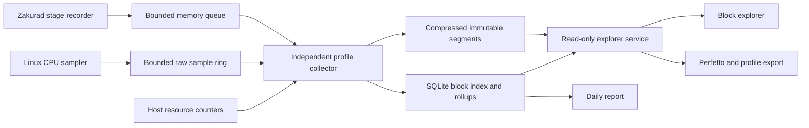

# Daily block profiling and explorer

Status: architecture accepted in principle on September 22, 2026, with a recent-blocks/outliers home page and on-demand DigitalOcean deployment. Design updated with those preferences. The initial implementation is available in draft PRs [#1111](https://github.com/zakura-core/zakura/pull/1111), [#1112](https://github.com/zakura-core/zakura/pull/1112), and [#1113](https://github.com/zakura-core/zakura/pull/1113). See [the operator runbook](../../deploy/block-profile/README.md) for implemented coverage, current limits, and canary gates. Deployment has not started.

Prepared September 22, 2026. Source inspection is pinned to Zakura [`d4997d9dd43f269008b85542d708344b9acbb54e`](https://github.com/zakura-core/zakura/tree/d4997d9dd43f269008b85542d708344b9acbb54e), fetched at approximately 15:54 UTC. The working checkout has an unrelated unfinished merge, so this proposal was grounded in a separate export of that revision.

## Recommendation

Build a block profile explorer backed by continuous, bounded recording while an on-demand DigitalOcean profiling session is running. Default to a pruned Linux node and a home page showing recent blocks and outliers from the last 24 hours. Add sampled CPU stacks, a daily report, and a repeatable semantic verification benchmark that can run daily during a profiling campaign. Keep existing weekly benchmarks unchanged until their replacement is explicitly deployed.

The question the explorer should answer is: **“This block took 700 ms on this node. What was it doing, what was it waiting for, and which functions were consuming CPU?”**

Use a small application recorder, an independent collector, compressed profile segments, and a SQLite index. Export detailed traces to Perfetto for deeper investigation. There is no need to operate a general distributed tracing or continuous profiling cluster for the initial 100 GB installation.

The 100 GB budget covers all profiler-owned storage on the initial host, including samples, indexes, temporary files, symbol files, and exports. It excludes the node's blockchain database, operating system, and existing unrelated observability systems. Use decimal GB, so the hard limit is 100,000,000,000 bytes. Provision and quota the volume accordingly, allowing for filesystem overhead.

Start on an on-demand DigitalOcean droplet using the target build and production verification/P2P settings, with pruned storage by default. Choose archive storage when matching an archive node's state/database behavior is the investigation's purpose. It measures that node's experience. It cannot retrospectively explain a 700 ms event on a different node. After overhead validation, the same recorder can be enabled on a particular serving node when that instance needs investigation. Additional hosts need explicit allocations within a revised total storage plan.

## What we already have

| Existing capability | Reuse | Missing piece |
| --- | --- | --- |
| [`zakura-perf-bench.yml`](https://github.com/zakura-core/zakura/blob/d4997d9dd43f269008b85542d708344b9acbb54e/.github/workflows/zakura-perf-bench.yml) runs weekly checkpoint and semantic CPU benchmarks, with optional historical A/B and live-head captures | Machine provisioning, build identity, workload gates, teardown, sampled CPU collection | Daily operation, searchable block records, persistent storage |
| Native block driver [`commit_start` / `commit_finish`](https://github.com/zakura-core/zakura/blob/d4997d9dd43f269008b85542d708344b9acbb54e/crates/zakurad/src/commands/start/zakura/block_sync_driver.rs#L1343-L1418) | Preserve these outer measurements and import old artifacts with their original definitions | Child stages and common coverage across ingress paths |
| Legacy sync [`sync.block.verify.duration_seconds`](https://github.com/zakura-core/zakura/blob/d4997d9dd43f269008b85542d708344b9acbb54e/crates/zakurad/src/components/sync/downloads.rs#L835-L892) | Map the existing verification interval into the new profile | It begins after verifier readiness, unlike an interval that includes that wait |
| State writer [queue and contextual timings](https://github.com/zakura-core/zakura/blob/d4997d9dd43f269008b85542d708344b9acbb54e/crates/zakura-state/src/service/write.rs#L2900-L3005), [parallel contextual work](https://github.com/zakura-core/zakura/blob/d4997d9dd43f269008b85542d708344b9acbb54e/crates/zakura-state/src/service/non_finalized_state.rs#L676-L866), and feature-gated finalized write timings | Instrument the existing boundaries rather than inventing a second stage taxonomy | Histograms do not tell us which stages occurred in a particular block |
| [`zakura-jsonl-trace`](https://github.com/zakura-core/zakura/blob/d4997d9dd43f269008b85542d708344b9acbb54e/crates/zakura-jsonl-trace/src/lib.rs#L158-L180) reserves a bounded queue slot before building an event | Typed events, process identity, disabled fast path, nonblocking collection pattern | Current queue is bounded by events, serialization occurs at emission, and emitter clocks have separate origins. New high-volume profiling needs byte limits, one clock, loss accounting, and native rotation |
| [`zakura-bench-digest.py`](https://github.com/zakura-core/zakura/blob/d4997d9dd43f269008b85542d708344b9acbb54e/scripts/zakura-bench-digest.py) produces latency reports and folded CPU stacks | Report formatting and legacy import | Folded stacks discard sample timestamps and thread identity. They cannot reconstruct a selected block's CPU window |
| [Continuous-sync retention](https://github.com/zakura-core/zakura/blob/d4997d9dd43f269008b85542d708344b9acbb54e/deploy/continuous-sync/README.md#L450-L470) | Operational experience with trace volume and failures | It uses copy/truncate and protected runs may exceed its target. This proposal requires a separate strict quota |

These are source observations, not a live audit of fleet configuration or evidence that any particular 700 ms block had a specific bottleneck. The new recorder must work with ordinary release logging. Release builds can compile out debug tracing, so adding debug spans alone is insufficient.

## User experience

The explorer opens on a live overview and has four supporting views.

**Home page.** Put the latest 10 observed accepted blocks first, newest first, with height, short hash, observation age, response time, a compact stage breakdown, and evidence completeness. Group repeated attempts under the block row and make each attempt accessible. Label forks and the last known canonical status. A separate “Outliers · last 24 hours” list shows the slowest 20 successful attempts above the configurable 500 ms threshold, highest latency first, plus the total qualifying count and a link to all matches. Put errors, timeouts and unfinished attempts in a separate compact section rather than mixing their durations into successful block latency. Both main lists lead directly to the block timeline.

The outlier window is rolling `[now − 24 hours, now]` by response timestamp, independent of the calendar-day report. Default to the selected node/session and live-head semantic mode. Display build and storage mode, and separate catch-up/checkpoint cohorts. A block may appear in both recent and outlier lists, with both links resolving to the same attempt. If there are no outliers, say so for the observed coverage only.

Refresh every five seconds while visible, with a pause control that preserves a selected row and keyboard focus. Show collector state, last update, and actual capture coverage within the window, such as “recorded 6 of the last 24 hours”. Show gaps or expired detail explicitly. When a session stops, recent rows remain with their real ages and the collector is marked stopped. Do not silently shift the rolling outlier window backwards to make it look populated. A separate session-history selection can open the last session's fixed time range.

1. **Daily report.** Number of observed attempts and accepted blocks, recording coverage, latency distribution, slow blocks, stage distributions, CPU hotspots, and changes against comparable earlier days. Every interesting row links to block evidence.
2. **Block list.** Filter by date, height or full hash, node, build, verification mode, ingress path, result, latency, and collection completeness. Sort by latency or a measured stage. Height searches show competing hashes and repeated attempts separately.
3. **Block detail.** Show the named elapsed interval, a timeline of work and waits, parallel worker lanes, shared batches, writer activity, host context, and CPU samples. Links navigate to preceding/following attempts and related work that blocked this block.
4. **Comparison and storage.** Compare the same block/range across compatible runs. Show retained coverage by data type, bytes used, pruning history, capture degradation, and bounded pins.

The first view for a block is its timeline. A CPU flamegraph is one drill-down, not the definition of block processing time. Selecting an interval filters samples and resource context to that interval. Each metric carries a unit and a scope such as “block response”, “worker elapsed”, “shared batch”, or “process CPU samples”.

### Example block

The following is an invented example, not a diagnosis of an observed block.

| Part of the measured response path | Time |
| --- | ---: |
| Body decoding and initial checks | 20 ms |
| Waiting for a verifier slot | 80 ms |
| Transaction verification envelope | 300 ms |
| Waiting for the state writer | 180 ms |
| Contextual checks and state application | 100 ms |
| Publication and response handoff | 20 ms |
| **Complete body received → verifier response** | **700 ms** |

Expanding the 300 ms verification envelope could show proof checks lasting 280 ms and scripts lasting 90 ms, partly in parallel. The envelope is still 300 ms. Their durations are not added to the 700 ms total. Expanding the writer wait could identify finalization of an older block occupying the writer.

Before this system, the observation is just “700 ms”. Afterwards, we can distinguish a verification issue from a queue delay and follow the relevant function stacks or blocking operation. Improving script execution by 50 ms does not necessarily reduce this block's response time by 50 ms if proof work finishes later.

## Timing contract

Agree on these definitions before adding instrumentation. Store a `measurement_version` so a later definition change cannot silently corrupt comparisons.

| Name | Start and end | Interpretation |
| --- | --- | --- |
| Delivery | Request/announcement boundary → complete body bytes available | Network and ingress context, separate from processing. Optional when the adapter cannot observe both boundaries |
| Processing response | Complete body bytes available → caller observes verifier result | Primary explorer measure. Includes decoding, admission waits, verification, state work, and response scheduling |
| Verifier request | Entry into the verifier service call → its response | Comparable to an explicitly matching existing timer. Readiness before the call is separate |
| State response | State request submission → caller observes state response | Contains state queueing and contextual application, plus any response handoff |
| Writer occupied | Writer starts a request → writer becomes available for its next request | Can extend beyond the response and include older-block finalization |
| Finalized persistence | Entry/exit of the actual finalized database write operation | An implementation write interval. It is not an fsync durability guarantee unless the specific write contract establishes that |
| Observed CPU | Samples or thread CPU counters within a supported execution scope | Separate from elapsed time and potentially summed across cores |

Where a path starts with an already decoded block, label the primary interval “decoded block admitted → response”. Never fill missing ingress time with zero or present it as the complete-body interval. Record `root_boundary_kind` and filter comparisons accordingly. The first instrumentation exercise maps the user's existing 700 ms observation to its actual log or metric boundaries.

At chain tip, accepting a block into non-finalized state is different from persisting it as a finalized block. In the inspected writer, [the response is sent before the finalization loop](https://github.com/zakura-core/zakura/blob/d4997d9dd43f269008b85542d708344b9acbb54e/crates/zakura-state/src/service/write.rs#L3060-L3133). Record both operations and their relationship. Do not move either boundary or delay the response for profiling.

### Parallelism and attribution

Store start/end timestamps, parent spans, and explicit dependency links. A dependency link says, for example, that verification cannot finish until this proof batch completes, or that a queued writer request is behind a named writer operation.

Top-level response stages must form a non-overlapping partition of the measured root interval. Any gap becomes “unattributed”. Nested and parallel stages are shown in separate lanes and cannot be summed as independent contributions. For joins, mark the last required dependency only when the recorded handoff identifies it. Otherwise show overlapping work and an unknown dependency, without asserting a critical path.

Construct the top-level partition from explicit root-operation state transitions, such as admission wait, verification envelope, and state response. Do not obtain it by summing child spans or choosing the longest child at each timestamp. Where operations overlap across those boundaries, keep the containing envelope and expose children separately. Assert that partition durations plus unattributed time equal the root duration within timestamp resolution.

“Worker elapsed” does not mean CPU time. A synchronous operation can be descheduled or wait in a library. Thread CPU clocks may be read around coarse synchronous jobs where useful, with nesting rules that avoid counting the same thread twice. They must not be read across an async await that can move between threads. Exact off-CPU causes such as scheduler delay, locks, or storage need additional evidence. Unmeasured time remains unknown.

Cryptographic batches may include work for several blocks or mempool requests. Give each execution a batch ID and links to its members. Show its measured execution once and each block's dependency wait separately. Do not charge the entire batch's CPU to every member or divide it evenly as if that allocation were measured. Truncated batch membership is explicitly marked.

## Recording architecture



Initial deployment is one on-demand DigitalOcean Linux profiling node and its collector on the same host, with the profiler files on a separate persistent, quota-controlled volume from disposable chain state. This avoids cross-host clock attribution and an upload queue in the first release. The read-only explorer and expensive symbolization run in separate resource-controlled processes. They cannot call node control endpoints or write its database.

### Node storage mode

**Pruned is the default for live-head sessions.** Zakura's [storage configuration](https://github.com/zakura-core/zakura/blob/d4997d9dd43f269008b85542d708344b9acbb54e/crates/zakura-state/src/config.rs#L169-L182) keeps the state required to validate future blocks while removing old raw transaction data outside its retention window. The existing [live-head profiler](https://github.com/zakura-core/zakura/blob/d4997d9dd43f269008b85542d708344b9acbb54e/.github/workflows/scripts/perf-bench-run.sh#L81-L96) already selects the pruned tip snapshot. Profiles are self-contained records on another volume, so later pruning of chain data does not erase a retained block's timing evidence.

Pruned and archive nodes can have different database sizes, cache behavior, writes, pruning and compaction work. Store `storage_mode`, pruning retention, state size, snapshot identity and database settings in run metadata. Include pruning work in the writer/background tracks, and never combine pruned and archive latency baselines as equivalent workloads.

Use archive mode when measuring an archive deployment's database behavior, serving historical RPCs, or accessing historical bodies that the pruned snapshot no longer retains. A fixed-range replay can also use an appropriate pre-range snapshot plus an external pinned block corpus. Merely owning an archive database does not recreate the earlier parent state or concurrency conditions. Pruned mode is one-way for a database that has discarded data. An archive session must use a separate compatible archive state restore or resync, not flip the existing pruned database's setting.

### On-demand droplet lifecycle

Create a dedicated CPU droplet for a bounded session, restore the compatible pruned tip snapshot, attach the persistent profiling volume, and catch up before marking live-head data eligible for the main dashboard. Prefer the same machine class across comparable sessions and record exact hardware. A typical session is 24 hours after catch-up, with shorter investigations supported. Capture boundaries and wall-time caps are explicit per run. The retention/failure soak can request a longer session.

At session end, stop recording, drain within a deadline, seal files, checkpoint the index, and generate a partial-day/session report. Unmount and detach the profiling volume before deleting the disposable droplet and its disposable chain-state volume. DigitalOcean [supports retaining a detached volume for later attachment](https://docs.digitalocean.com/products/volumes/how-to/delete-detach/). Put the persistent volume outside all ephemeral-volume teardown and reaper lists. Teardown must identify disposable resources by the recorded session manifest, with a test proving the retained volume is excluded.

The 100 GB profiler data limit persists across sessions. Do not take automatic additional snapshots or copies of that volume outside the stated budget. Retained volume storage remains provisioned between runs. Delete disposable compute when finished rather than merely powering it off, because DigitalOcean [still bills powered-off bundled-plan droplets](https://docs.digitalocean.com/products/droplets/details/pricing/).

The simplest initial explorer runs on the profiling droplet and is available during sessions. Between sessions, the data is retained and the explorer can be brought up in read-only mode on an on-demand viewer droplet attached to the same volume, with a single attachment owner at a time. A permanently reachable explorer is a later hosting choice, not an implicit requirement for an always-running full node. While observation is stopped there is no collection, and report/session views label that gap. Reports due while the droplet was absent are generated on the next start or session end without pretending data was captured.

### Application recorder

Add a synchronous `block_profile` module to the existing `zakura-jsonl-trace` support crate containing an opaque profile handle, stage IDs, guards, clock access, and bounded event transport. Keep it independent of domain types and higher-level crates. It must not add Tokio to `zakura-chain`. Add instrumentation around chain helpers in their callers where possible.

Default configuration is disabled. When enabled, reserve a slot and byte budget before recording any variable-size data. Hot-path events use fixed-width IDs and bounded fields. Format hashes, serialize, compress, and write files outside verification workers. No disk writes, exporter calls, blocking send, or contended global registry lock is allowed on the block-processing path.

Use an in-process drain to a bounded nonblocking local IPC channel consumed by the collector. If the collector disappears or stops reading, discard profiler events and increment loss counters. Do not start an unbounded spool in `zakurad`. The recorder must not make node startup depend on an available profiler volume or collector.

The profile handle follows service requests, async jobs, Rayon jobs, and writer messages explicitly. Capture it before spawning and re-enter the relevant scope when work runs. Instrument Tower buffers and readiness boundaries so a queued request does not lose its identity. If request types need a profiling carrier, preserve existing constructors with a disabled/default context and document the library API change. Never put profiling metadata into consensus serialization, hashes, equality of consensus objects, or persisted chain state.

Use local guards to finish stages on early returns. Cancellation, caller timeout, verification rejection, duplicate, and process interruption have distinct outcomes. A caller timeout does not imply that already submitted writer work stopped. Keep that work ID alive and link any later result to the original attempt. Expiry of profiling metadata must never cancel real work.

### Identity and clocks

The primary key is `(network_id, node_id, process_run_id, attempt_id)`. Attach block hash, claimed/validated height, parent hash, ingress path, verification mode, and optional native apply token. Attempt IDs are not heights. Duplicate requests get separate attempts linked to the existing work. A reorg updates a separate canonical-status observation and does not rewrite original timing evidence.

Use one process-wide monotonic epoch for all new recorder events. Existing emitter-local `ts` values cannot be joined across emitters without an explicit clock mapping. On Linux, record a calibrated mapping to the CPU sampler's selected monotonic clock. Persist mapping bounds and boot identity, refresh the mapping periodically, and reject sample attribution where uncertainty exceeds the relevant interval. UTC anchors support display and daily grouping, not elapsed durations. Restarts create new process identities even if the PID is reused.

Every stream has sequence numbers. Missing sequences, dropped counts, malformed records, incomplete spans, and late arrivals become coverage metadata. A summary is emitted through separately reserved capacity and contains outer durations even if detail was dropped. Summaries are also best effort, so independent aggregate counters provide the denominator needed to report missing attempts.

### First instrumentation map

| Area | Proposed recorded stages and links |
| --- | --- |
| Legacy sync, native block sync, gossip and RPC/mined ingress | Available body boundary, decoding, admission/readiness, verifier call and response. Separate proposal/preparation from real block acceptance |
| Consensus router and checkpoint verifier | Route selection, checkpoint range residence, missing predecessor/range dependencies, range validation, finalized commit. Never classify range-fill waiting as proof execution |
| Semantic block verifier | Initial state/duplicate lookup, header and structural checks, parent-information wait, transaction fanout/join, prepared-work cache hit or miss |
| Transaction verification | Transparent input lookup and scripts, transaction structural checks, pool-specific proof/signature dependencies, cache hits, async check join. Aggregate ordinary transactions and cap detailed transaction spans |
| Crypto worker wrappers and batch control | Enqueue, batch collection, flush reason, worker dispatch, worker start/end, completion delivery, shared member IDs, fallback verification |
| State service and writer | Service readiness, admission, parent wait, writer enqueue/dequeue, contextual checks, snapshots, parallel tree/commitment work, header-state transition, publication, response, writer availability |
| Finalized database writes | Tree preparation, write-batch construction, database write, pruning/finalization when present. Identify the actual block being finalized and the request that triggered it |
| Host and background work | Process CPU, runnable load, memory pressure, disk latency/throughput, and available RocksDB stall/compaction counters at modest cadence. These are contextual observations unless linked to a measured blocking operation |

Use bounded stage IDs rather than arbitrary span names. New metrics remain under existing prefixes, for example `sync.profile.events_dropped` and `state.profile.queue_overflow`. Block hashes, attempt IDs, and transaction identifiers belong in profile records, never Prometheus labels.

## CPU sampling

Reuse the current Linux `perf` capture tooling, with a new timestamp-preserving ingestion path. Keep timestamp, PID/TID, process identity, sample event, sample period/weight, stack ID, build ID, and loss/throttle metadata. Whole-run folded output remains a derived export.

Start the canary experiment with 19 Hz user-space CPU sampling continuously and 49 Hz for the scheduled benchmark. These are proposed settings, subject to the overhead gate below. Use frame-pointer stacks only if the actual shipped executable and native dependencies produce validated stacks. Otherwise use bounded DWARF capture, as the existing workflow does. Do not silently change release code generation or compare differently built binaries as though they were equivalent. [Perf documentation](https://www.man7.org/linux/man-pages/man1/perf-record.1.html) describes these unwind modes and its default 8 KiB DWARF stack dump.

Continuous sampling supplies evidence from before a slow block completes. Starting a profiler only after detecting 700 ms cannot recover that block's CPU history. A short capture at higher frequency after an outlier can help diagnose recurrence, but is labeled as a later capture. Automatic rate increases have a time limit, cooldown, and daily byte budget.

CPU views have three attribution levels:

1. **Process window.** All node samples during the selected interval. Always labeled as including unrelated work.
2. **Attributed execution.** Samples match a thread's explicitly recorded execution slice for a block or job. Async execution scopes are entered only during a future's poll and exited before it yields. Task lifetime is never treated as exclusive thread ownership.
3. **Shared work.** Samples belong to a batch or background operation. Links explain which blocks depended on it, without duplicating its CPU cost.

On workers that execute nested or stolen jobs, use a nested execution context and assign the sample to the innermost recorded owner. Missing scope events invalidate attribution for the affected range. Uninstrumented threads and incomplete context stay in the process view. Add fine async poll attribution only where overhead tests justify it. The first useful release can show accurate block stage timings with coarse worker attribution and explicitly scoped process samples.

A 700 ms single-core interval at 19 Hz contains roughly 13 samples in an idealized continuously busy case. That is weak evidence for a precise function percentage. Display sample count, unknown-stack fraction, event and weight units, and whether the capture was throttled. Below 100 attributable samples, flag sparse evidence and show counts rather than a precise ranked percentage claim. Aggregate similar slow blocks for more useful CPU analysis. Hardware-cycle weights are cycles, not CPU milliseconds. Do not multiply a sampled share by the block's wall time.

### Raw data and symbols

Keep a rolling raw ring, targeting ten minutes with a strict 8 GB cap. Rotate capture files natively and preserve the mapping/build metadata required to decode each segment independently. Seal a segment at least every minute or earlier at its byte threshold. Treat `perf` rotation sizes as approximate. A filesystem quota is the final bound.

Decode completed segments asynchronously into timestamped, stack-deduplicated samples. Promote the raw interval surrounding an outlier into retained storage when budget permits. Merge overlapping windows. Preserve build-ID-matched symbol files and module mappings under the same quota. Do not substitute symbols from the latest executable.

Track shared chunk references in the catalog. Multiple blocks can point to one retained CPU window without making extra copies. The chunk inherits the strongest unexpired retention lease, while all physical bytes count once. If promotion requires copying from the raw ring, reserve space for both copies until the source is released. Ring overwrite must not silently invalidate a promoted reference.

DWARF raw stack bytes are large. At 19 samples/s × 8,192 bytes × 16 continuously busy cores, stack payload alone is about **215 GB/day** before metadata. Ten minutes is about **1.49 GB**. These are sizing examples, not predictions of this node's load. Raw DWARF capture is a short ring, not a month-long archive. Symbolization must keep up within its CPU budget or the ring will overwrite evidence. Show the actual available lookback and any gaps.

If continuous CPU capture exceeds the overhead budget, automatically reduce its frequency or disable it, preserving the per-block timeline and marking CPU evidence unavailable. V1 acceptance does not promise a function-level flamegraph for every historical block. It does require an honest stage breakdown for normally recorded attempts.

## Capture and retention policy

Record a compact summary for every admitted attempt while resources permit. At live head, record the standard stage timeline for all such attempts. Keep detailed transaction/worker events in bounded buffers, then retain them based on completion time and outcome. Choosing a block only after it finishes must select already recorded detail, not start recording after the event.

Initial retention priorities:

| Data | Selection |
| --- | --- |
| Block summaries and stage envelopes | All recorded attempts, including failures and repeated work |
| Ordinary fine detail | All live-head detail for the recent working set. During bulk catch-up, deterministic 1% baseline sampling plus bounded outliers |
| Slow/error detail | Prefer attempts above 500 ms processing response, failures, timeouts, and major unexplained gaps. Treat checkpoint residence separately |
| CPU samples | Recent timestamped samples, plus promoted outlier windows and daily benchmark profiles |
| Daily aggregates | Keep longer than raw evidence. Clearly separate retained statistics from available drill-down data |

The 500 ms threshold is a starting choice that captures the user's 700 ms example. It is not a protocol requirement or a conclusion about normal latency. In a broad slowdown, every block may exceed it. Admission and retention remain bounded. Keep slowest examples per hour/stage, a random baseline, and a count of omitted outliers, rather than promising to retain every outlier indefinitely.

Use a process-wide 64 MiB application recorder budget, including active block detail, fixed event storage, and output queue. Starting bounds are 32 KiB fine detail per attempt and at most 1,024 simultaneous detail buffers, leaving capacity for summaries, context, and transport. Variable batch membership and transaction detail count against these limits. If limits are reached, omit fine detail first. Saturation must never reject, delay, or cancel a real block.

The collector and symbolizer have a separate combined initial 1 GiB memory limit and a CPU ceiling equivalent to one core. These are canary values to tune with evidence. Export and decompression sizes are bounded. Kernel perf buffers have a separately configured and recorded memory cap. Active-profile expiry, abandoned attempts, and idle connections cannot retain unbounded memory.

### Storage budget

| Allocation | Decimal GB | Includes |
| --- | ---: | --- |
| Stage timelines and fine detail | 45 | Compressed immutable chunks, including preferred slow/error evidence |
| Retained CPU profiles | 20 | Timestamped samples, stack dictionaries, selected raw captures |
| Raw CPU ring | 8 | Open and closed rotating capture files |
| Catalog, block summaries, daily aggregates | 8 | SQLite databases, indexes, WAL and SHM files |
| Working space | 9 | Compression overlap, imports, symbol cache, exports, bounded profiler logs |
| Free reserve | 10 | Accounting lag, filesystem metadata and recovery headroom |
| **Total** | **100** | All profiler-owned storage |

These are initial soft allocations inside one hard total. Unused space may be borrowed through one quota coordinator. Begin pruning at 85 GB and return toward 75 GB. At 90 GB stop admitting optional data until usage falls. The remaining 10 GB is a safety reserve, not permission for routine writes to grow indefinitely. The OS-enforced limit remains authoritative if a process crashes or ignores the coordinator.

Count allocated disk blocks, including temporary files and SQLite WAL. Budget source and destination simultaneously before compression, import, or export. Reserve the worst allowed expansion for an operation before beginning it. No unbounded in-place compaction or `VACUUM` is allowed near the limit. A small physically reserved emergency file can be released to finish deletion bookkeeping, and counts within the reserve.

Retention is by actual bytes rather than a guaranteed number of days. For illustration, 45 GB of detailed data holds about 45 days at 1 GB/day or 4.5 days at 10 GB/day. The explorer shows measured growth and separate oldest-available dates for summaries, detail, and CPU. It never displays one retention date implying all three have equal coverage.

### Pruning order

1. Expired exports, interrupted scratch files, and unused symbols.
2. Old raw ring segments and ordinary fine detail outside the recent working set.
3. Older routine CPU samples and routine detailed blocks.
4. Older slow/error detail and benchmark profiles, retaining bounded representative examples where possible.
5. Old summary partitions, then old daily aggregate partitions if necessary.

Pins are bounded leases. Proposed default is seven days, with a combined maximum of 5 GB included in the allocations above. An explicit pin can last longer only while space is reserved within that cap. Refuse new pins that exceed it. Pins do not override the hard limit. If pinned evidence and minimum metadata leave no room, suspend incoming detail and report degraded capture rather than exceed quota.

## Files and data model

Use independently compressed chunks with checksummed manifests. Seal on time or byte limit so a block lookup does not decompress an entire day. Index `(segment_id, chunk_offset, record_range)` and cap the uncompressed size of any chunk. A useful starting point is 4 MiB uncompressed chunks within segments no larger than 64 MiB on disk.

SQLite is the catalog and searchable summary index, not storage for every CPU sample or individual span. Partition high-volume summary rows by hour or size, retaining an immutable summary shard beside related manifests. Keep the small mutable catalog for runs, segment location, retention state, and rollups. Index block hash, height, process/attempt, finish time, latency, result, and build. Query only the relevant bounded partitions. Store larger timelines and timestamped samples in the compressed chunks.

Core entities:

| Entity | Required fields |
| --- | --- |
| Run | Node/network/process/boot identity, session ID, exact commit and executable build ID, config fingerprint without secrets, hardware, kernel, compiler/build features, verification and storage modes, pruning retention, snapshot identity, state size, start/end, clock mapping |
| Attempt summary | Attempt/work IDs, hash and height, parent hash, ingress path, root boundary kind, timestamps, result, stage envelope durations, block byte/transaction/proof/action counts, cache mode, completeness and loss counts |
| Span/dependency | Span ID, parent ID, attempt or shared-work owner, stage, begin/end, queue and worker IDs, explicit dependency edges, outcome and truncation flags |
| CPU sample | Monotonic timestamp, PID/TID, event and period/weight, stack ID, mapped execution owner when proven, quality flags |
| Resource sample | Timestamp, process and host counters, writer/worker occupancy, storage counters, counter reset flags |
| Segment | Schema/version, time bounds, checksum, stored and expanded bytes, index location, completeness, retention class, pin expiry, deletion state |
| Daily rollup | Cohort keys, denominator and captured counts, mergeable latency histogram, stage aggregates, slow exemplars, report revision |

Daily histograms use documented fixed/logarithmic buckets with exported count and bounds. Derive percentiles from the merged histogram. Do not average per-node percentiles or calculate overall distributions from the outlier sample. Keep rejected/cancelled attempts distinct from successful block latency. Report partial time windows and counter resets.

### Lifecycle and crash recovery

Write to a temporary segment, flush and seal it, rename atomically, then commit its manifest/index transaction. On restart, scan bounded manifest locations for sealed but unindexed segments and reconcile idempotently. Discard or salvage incomplete chunks with an explicit gap marker. Deduplicate imports by run, segment, and sequence identity.

Deletion is two-phase: mark a segment deleting, stop new readers, expire bounded reader leases, unlink its payload and indexes, then remove its catalog reference. Recovery resumes either side of an interrupted deletion. A reader racing pruning receives “profile expired” and retries against the catalog. It must not keep deleted files open indefinitely, because unlinked open files still consume space.

SQLite reads have deadlines and writes use short transactions. Limit WAL bytes and checkpoint with backoff. Cancel long profiler queries when necessary to reclaim space. SQLite documents that long readers can prevent checkpoint progress and allow WAL growth, so WAL files are part of quota accounting. See [SQLite WAL](https://www.sqlite.org/wal.html). Avoid copying a live database as an export. Export through a consistent reader or backup API into reserved space.

If the profiler filesystem is full, read-only, or corrupt, recording degrades or stops and the node continues. A collector restart must not restart `zakurad`. A node restart creates a new run and incomplete previous attempts remain visibly incomplete.

## Explorer service

Implement a small Rust HTTP service with SQLite reads and bounded chunk decoding, serving a bundled TypeScript UI. Use existing workspace HTTP/runtime libraries where appropriate. Ship it separately from the node binary and give it read-only access to finalized profile payloads. The collector owns ingestion and deletion.

Proposed endpoints:

```text
GET /api/v1/days/{date}
GET /api/v1/overview?node=...&mode=live_head&window=24h
GET /api/v1/blocks?node=...&from=...&to=...&min_ms=...&cursor=...
GET /api/v1/attempts/{run_id}/{attempt_id}
GET /api/v1/attempts/{run_id}/{attempt_id}/timeline
GET /api/v1/attempts/{run_id}/{attempt_id}/cpu?scope=process|attributed|shared
GET /api/v1/storage
GET /api/v1/health
```

Use paginated queries with a maximum page size, query deadline, response byte cap, and bounded parallel decoders. Default to a single day. Long comparisons and exports are separately scheduled, cancelable jobs with reserved storage and TTLs. Do not expose arbitrary SQL, filesystem paths, executable commands, or user-supplied symbol servers.

The overview endpoint returns recent blocks, qualifying outliers, error/in-progress counts, actual coverage intervals, server time and collector freshness in one bounded response. Apply the same node/mode filters and window end to all lists. Recent blocks may predate the window when a session is stopped, but their age and stopped state remain visible. Outlier selection always uses the requested window.

The profile page exposes “complete”, “sampled detail”, “truncated”, “CPU unavailable”, and “expired” states. Missing evidence does not render as a fast block or an empty flamegraph. Hash and attempt identities remain visible when a payload expires, for as long as its summary is retained.

Offer a selected-block or bounded-neighborhood Perfetto export, with separate tracks for async stages, workers, shared batches, and counters. Perfetto's [tracks and flows](https://perfetto.dev/docs/instrumentation/track-events) fit these relationships, and its [trace conversion format](https://perfetto.dev/docs/getting-started/converting) supports generating such exports from our records. Keep the canonical storage schema independent of the viewer. Use a locally hosted viewer or a deliberate download/open action. Do not automatically upload traces to an external service.

Begin with a purpose-built block list and detail screen rather than a fork of Perfetto. Retain folded-stack export for the existing flamegraph tools. A custom flamegraph widget is optional for the first release if a compatible local viewer provides the needed drill-down.

## Daily operation

### Continuous observation

Run the recorder whenever an on-demand profiling session is active. Record whether it is following the tip, catching up, checkpoint-verifying, or recovering. Do not blend those modes in a daily “normal block latency” number. Preserve a ring of surrounding writer/resource activity so a slow block can be explained by preceding work. Starting a session today cannot explain a slow block that occurred while no recorder was running.

The first node follows the production P2P choice and verification configuration, with pruned storage selected explicitly. Experimental P2P and archive runs are separate cohorts. If a deployment changes the executable or configuration, start a new cohort automatically. At startup perform profiler capability, disk quota, symbol, and clock checks. A failed check becomes a visible collection limitation, without preventing normal node operation.

### Daily report

During active sessions, at 00:10 UTC generate the previous UTC day's report. Also generate a session report at teardown and reconcile outstanding partial-day reports at the next startup. This is a proposed service timer, not a Codex automation. Record daily job identity, make generation idempotent, and revise the report if bounded late ingestion arrives. Missing runs appear as gaps. Display local time as a UI preference without changing aggregation boundaries.

Assign completed attempts to their response day. Show attempts still open at the boundary separately and link their later completion. Writer operations extending past the response keep their own timestamps. Their work must not be counted twice when daily windows are combined.

Include:

- Actual observation window, mode/build/hardware, attempts versus captured summaries, and detail/CPU coverage.
- p50/p90/p95/p99/max response time and counts above 500 ms and 1 s, with links to the slowest 20 retained attempts.
- Distributions for readiness, proof/script envelope, parent/batch wait, writer queue, contextual application, and unexplained time. Avoid a chart that sums stage medians into a fictitious median block.
- CPU hotspots with scope, sample counts and units, plus absolute process CPU per accepted block where a run-level counter permits it.
- Most changed stages against the previous seven compatible days. Segment by block workload as well as size. A larger proof/action count can change cost independently of byte size.
- Disk use, projected retention from recent measured growth, dropped events, unknown stacks, profiler CPU, and collection gaps.

Proposed regression marker: a stage p95 rises by both 20% and 20 ms against a compatible baseline, with at least 200 successful observations per cohort. This is a triage threshold, not proof of a code regression. When workload or sample counts do not support comparison, show “insufficient comparable data”. Observational live-head differences must not claim a causal speedup.

The report is available in the explorer and as a Markdown/JSON artifact. No Slack or email delivery is included in initial approval. That can be connected to a specifically chosen destination later.

### Daily repeatable benchmark

Extend the existing perf workflow instead of creating a second provisioning system. Support manual benchmark runs and an explicit campaign with semantic verification daily at 06:47 UTC for its configured start/end dates. Campaign expiry disables new runs. The existing weekly checkpoint benchmark stays unchanged unless explicitly replaced. The on-demand explorer does not itself require daily infrastructure provisioning. Resolve the target ref to an exact SHA at job start, keep one concurrent scheduled run, use bounded runtime and cleanup, and publish a missed/failed status if an expected campaign job does not complete.

The current baked historical range is useful for continuity but does not represent every current network upgrade. Keep its results named as that corpus. Add a separately versioned recent semantic corpus before using the benchmark to support present-day pool or upgrade conclusions. Store an immutable pre-range chain-state snapshot and a bounded block corpus with exact hashes and parent state, outside the 100 GB profiler budget as benchmark infrastructure. Never restore or mutate a serving node's database for a benchmark.

Compare the same corpus, state snapshot, configuration, compiler/build features, hardware class, worker limits, and cache warmness. Replaying from pinned local block input removes public-peer variance from a CPU/state benchmark. Until that input path is implemented and validated, retain the existing network-fed run and label its delivery variability. Use concurrent A/B and repeated controls when investigating a suspected change. Replaying only a slow block without its parent state, preceding writer work, and relevant cache conditions is not a reproduction of the original queue delay.

New daily outputs should upload directly to the budgeted profile store using bounded, idempotent ingestion, or be reduced to manifests and summaries if the store is unavailable. Temporary files on ephemeral runners need their own hard per-job cap and expire at teardown. The initial 100 GB guarantee applies to the persistent installation, not the existing GitHub artifact service or transient benchmark machines. Do not add a second indefinite archive under the claim that total retained profiling history is 100 GB.

## Operational controls

Expose the explorer on localhost initially, through an authenticated tunnel or the team's existing authenticated access layer. Bind neither the profiler control socket nor an unauthenticated explorer to the public network. Separate read access from pin/delete/capture controls. Remote capture requests have fixed permitted settings and cannot supply a PID or shell command.

Run sampling under the least privilege the actual kernel requires, attached to the verified node process and its threads. Identify it using its executable, process start identity, and supervisor rather than an unrestricted name match. Do not lower host-wide kernel security settings silently. Raw DWARF captures include stack memory, so keep raw files private, short-lived, and out of default share exports. Store no block/transaction payloads, peer addresses, credentials, or arbitrary log strings in the profile schema. Public block hashes and bounded workload counts are sufficient for most navigation.

Throttle symbolization, compression, and queries before reducing stage collection. Track recorder drops, IPC disconnects, raw ring overruns, sampler loss, capture frequency, index lag, quota usage, oldest coverage, and report freshness. A green node health signal does not imply that profiling succeeded. The explorer must show collector failure prominently.

Profiler startup, failure, or shutdown must not change consensus acceptance, batching deadlines, scheduling priorities of verification, database durability, or cancellation semantics. The protocol reference used for this design is the integrity-checked Zcash specification snapshot `v2026.7.0-191-g0fae78`, commit `0fae783d424039a09759a69ff993317ded72b97d`, labeled NU6.3 proposal. No new protocol rule or activation assumption is introduced here.

## Validation and acceptance

All numerical overhead limits below are approval targets, not measurements already achieved.

| Requirement | Acceptance evidence |
| --- | --- |
| Explain a slow block | A scripted 700 ms example with known waits/work produces the correct root interval, nesting, and dependency links |
| Avoid double counting | Parallel checks of 280 ms and 90 ms remain within the 300 ms verification envelope. Shared batch CPU appears once |
| Preserve identity | Same height on two forks, duplicate requests, retry after timeout, and restart/PID reuse never merge attempts |
| Trace async ownership | Futures moving between threads, Rayon nested/stolen work, and shared batches keep valid attribution or explicitly become unknown |
| Cover real paths | Legacy and native ingress, live semantic verification, checkpoint ranges, mined/prepared reuse, failures, cancellations, and recovery all have explicit coverage |
| Respect writer semantics | Caller response and subsequent older-block finalization are distinct. The following request's queue delay can link to that finalization |
| Preserve node behavior | Recorder absent, blocked collector, full queue, disk full, index corruption, and killed sampler do not block or change verification results |
| Enforce storage | Sustained input, incompressible data, slow reader, concurrent export, pinned records, WAL growth, interrupted deletion and compression stay within the hard quota |
| Report honest coverage | Inject event/sample loss and clock uncertainty. Affected spans/samples are marked incomplete and comparisons exclude invalid attribution |
| Bound resources | Adversarial attempts cannot exceed configured memory, event, membership, decompression, export, or CPU budgets |
| Keep overhead low | Compare instrumentation disabled, timelines enabled, and timelines plus CPU on identical binaries/workloads. Initial targets: ≤1% disabled throughput change, ≤2% timeline throughput cost, ≤5% combined cost, and ≤max(10 ms, 5%) p95 latency increase |
| Make evidence usable | A retained block detail opens within 2 s and a daily report within 5 s on the approved hardware with a near-full 100 GB store. No query monopolizes the collector |
| Make the home page useful | Recent 10 blocks and top 20 rolling-24-hour outliers resolve to the correct attempts. Test window boundaries, duplicates, reorgs, no outliers, stale collectors, partial coverage and expired detail |
| Support on-demand operation | Session teardown preserves the profile volume, a later droplet reopens its index, missed observation is labeled, and an expired campaign creates no new droplets |
| Keep storage modes comparable | Pruned and archive runs remain separate cohorts, pruning work is visible, and opening a retained profile never requires old raw chain data |

Use fixed-input A/A repetitions first to quantify normal variation, then paired instrumentation on/off runs. A noisy result is inconclusive, not a passed gate. Include both a steady live-head canary and a saturated historical workload. A 24-hour recording run plus a 72-hour retention/failure soak precedes serving-node rollout. No broad rebuild or production experiment has been run for this design document.

## Implementation plan

Deliver the work as separate cohesive draft PRs, keeping relevant tests with each component.

| Step | Deliverable | Exit condition |
| --- | --- | --- |
| 1. Timing schema and recorder | Versioned identities/clocks, bounded handles and transport, common outer stages, loss counters | Small synthetic traces demonstrate exact boundaries and no blocking under saturation |
| 2. Processing stages | Consensus, worker/batch, state writer and finalization detail across both P2P paths | Real slow-block traces explain work versus waits with bounded unknowns |
| 3. Collector and retention | Compressed chunks, summary partitions, catalog, hard quota, crash recovery | Near-full-store and fault-injection tests pass |
| 4. Explorer | Recent-blocks/24-hour-outliers home page, daily/block list, timeline, comparisons, evidence quality and storage views, export | A recent or slow block can be found and explained without downloading an entire run |
| 5. CPU correlation and daily jobs | Timestamp-preserving sampler, build-ID symbols, scope attribution, report timer and workflow extension | Honest CPU views and daily report available within overhead/storage targets |
| 6. Canary rollout | On-demand pruned DO droplet, retained profile volume, bounded session/campaign lifecycle, collection health, soak results, operator runbook | Teardown preserves evidence and recorded overhead supports additional selected nodes |

Indicative effort for one engineer familiar with these paths is 4–6 weeks, with a useful timeline/collector slice after roughly two weeks. Async CPU attribution and symbolization are the largest uncertainties. These estimates assume an existing suitable node and benchmark infrastructure. Fleet deployment and any new infrastructure spend remain a separate concrete rollout approval.

Update operator docs, the profiler schema/API documentation, configuration examples, and Unreleased notes when implementation changes ship. Preserve old trace import behavior and mark unavailable fields rather than rewriting historical meaning.

## Alternatives considered

| Option | Decision |
| --- | --- |
| Daily flamegraph only | Useful aggregate CPU signal, but usually misses the particular slow block and cannot explain queue waits |
| Existing Prometheus histograms only | Keep for fleet trends. They cannot reconstruct a single block or concurrent dependencies |
| Full tracing/profiling backend stack | Reconsider when several nodes or broader service tracing justify it. More operational pieces than the initial bounded installation needs |
| Record every function/span indefinitely | Too much data and overhead. Use explicit stages, sampled stacks and bounded detail instead |
| Reproduce every slow block later | Useful follow-up, but cache state, parent state, concurrency and background work can differ |
| Browser-only trace files | Useful export format. A small searchable index and daily rollups make repeated investigation much easier |

## Agreed direction

The user accepted the architecture in principle and requested a recent-blocks/outliers front page, on-demand DigitalOcean operation, and pruned storage where appropriate. This revision makes those the defaults. The architecture, timing contract, initial 100 GB persistent budget and staged implementation remain the design baseline. No infrastructure has been provisioned, serving nodes changed, notifications sent, or schedules enabled as part of the design work.

Recommended defaults are one on-demand pruned Linux droplet, latest 10 blocks plus top 20 outliers over a rolling 24 hours, complete standard stage coverage at tip, 500 ms outlier selection, 19 Hz CPU sampling throughout active sessions subject to measured overhead, a 100 GB persistent hard profiler quota, seven-day bounded pins, and daily/session reports. Archive mode is selected for archive-specific investigations. Exact droplet size, region and operational cost are finalized in the rollout PR using measured resource needs.
