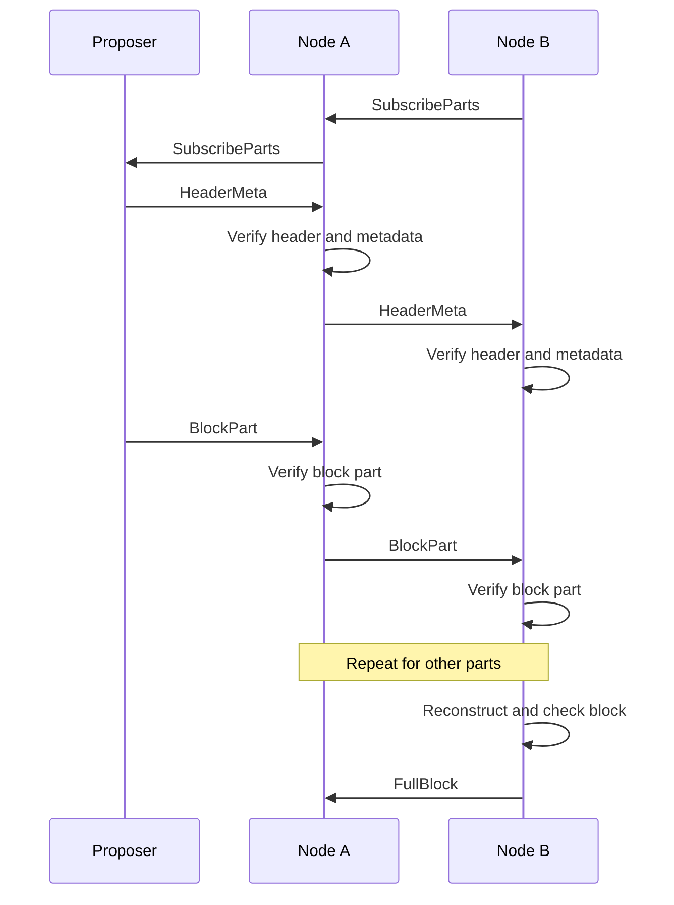

# Dogwood: block propagation for Zcash

Proof of work makes the next block's entry point unpredictable. Propagation
delay increases the orphan rate. We need low latency from any proposer across
peers with unequal bandwidth.

Dogwood pushes block parts along subscriptions established before the block
exists. Each node requests different parts from different peers and forwards
verified parts to its subscribers. It shifts subscriptions toward faster peers.
Parity lets it reconstruct the block without waiting for every part.

The tradeoff is bandwidth: standing routes avoid request latency, but stale
routes need redundancy and recovery. The [protocol specification](../specs/dogwood.md)
defines the rules. This document explains the design.
The [experiment report](dogwood-experiments.md) records the local codec and
congestion-control estimates and connected-relay tests. They do not establish
overlay convergence or sustained throughput at the planning target.

## Throughput target

Assume an initial post-Tachyon workload of 50,000 TPS with every transaction
aggregated to 2 KiB. We need 102.4 MB/s (819.2 Mbps) of block-body throughput,
or roughly 1 Gbps after 25% parity: 1.024 Gbps before proofs, transport,
challenges, and recovery. This is a planning assumption, not a consensus limit.

For body rate `R`, requested parity/data ratio `r`, additional traffic fraction
`h` relative to body plus parity, and usable-link utilization target `u`:

```text
required usable bandwidth >= R * (1 + r) * (1 + h) / u
```

For example, 25% parity, a provisional 5% traffic allowance, and 80% utilization
require about 1.344 Gbps of usable ingress. The allowance and utilization are
experiment inputs, not measured production values. Canceling unneeded parity
can reduce delivered bytes, but capacity planning should reserve the requested
load. Every forwarding copy also consumes upload capacity.
Duplicate-heavy policies need a larger allowance; use their measured total
wire/body ratio in the capacity budget.
The concurrent experiment's busiest relay averaged about three body copies
per body with two-supplier startup routes: roughly 2.46 Gbps before additional
overhead and headroom. A network-wide average does not size that relay.

Average throughput does not set block latency. At a block interval of `T`
seconds, this workload produces about `102.4 * T` MB per body. Delivering that
body within `D` seconds needs at least `819.2 * T / D` Mbps before redundancy.
The present GF(2^16) profile also limits one codeword to 65,535 parts.
At 64 KiB and 25% parity, at most 52,428 data parts hold about 3.2 GiB.
This workload reaches that bound in about 33.55 seconds. A larger body would
require a revised profile, such as multiple committed stripes, and new tests.

These example burst budgets separate the missing sizing decisions. They assume
that body propagation starts after block release and that the proposer seeds
one codeword. They exclude framing, integer padding, CPU, and relay delay.
The intervals and deadlines are examples, not proposed consensus parameters.

| Block interval | Body bytes | Propagation deadline | Minimum receiver body ingress | Proposer upload for 25% parity | Fits W1 field bound |
| --- | --- | --- | --- | --- | --- |
| 1 s | 102.4 MB | 1 s | 0.8192 Gbps | 1.024 Gbps | Yes |
| 10 s | 1.024 GB | 1 s | 8.192 Gbps | 10.24 Gbps | Yes |
| 30 s | 3.072 GB | 1 s | 24.576 Gbps | 30.72 Gbps | Yes |
| 75 s | 7.68 GB | 5 s | 12.288 Gbps | 15.36 Gbps | No |
| 75 s | 7.68 GB | 1 s | 61.44 Gbps | 76.8 Gbps | No |

A 1.344 Gbps proposer needs at least 57.14 seconds to send the 75-second
example's codeword. That link can satisfy the average source budget but cannot
satisfy a five-second propagation deadline. Stripes remove the single-codeword
field limit; they do not reduce the source's byte count. Fitting the field
limit also does not establish an affordable decoder.

The design needs a selected block interval and propagation deadline before it
can select the large-body profile and a meaningful burst experiment. The
50,000 TPS assumption fixes neither value. The synthetic 2 MiB releases in the
concurrent experiment cannot substitute for that decision. Until those values
are selected, this document claims capacity bounds and measured reference
behavior, not a complete post-Tachyon performance design.

Peers will have widely different usable upload rates after other traffic.
The controller must allocate against observed delivery and aggregate receiver
capacity. A high advertised link rate does not establish either quantity.
Full nodes below the required sustained ingress rate cannot keep up through
congestion control alone.

## Tradeoffs

### Topology and the normal propagation path

The throughput design assumes that participating relay nodes remain connected
after removing the proposer. The intended network has multiple relay paths
and enough aggregate upload to carry standing subscriptions. A star whose
leaves can communicate only through the proposer falls outside this operating
assumption. Its source-cut cost remains a useful failure test, not a reason to
budget several body copies for normal proposer seeding.

Physical connectivity does not ensure that every per-part subscription graph
has a path from its seed. Normal propagation must establish useful standing
routes and distribute seeds within the initial source budget. Experiments must
measure completion before repair on connected relay graphs, including unfamiliar
proposers. They must not use successful repair to claim that those routes work.

`FullBlock`-triggered requests for missing parts form a strict fallback.
A stalled receiver can request enough distinct missing indices from a peer
that advertises completion. That peer serves retained or regenerated parts
through bounded block-scoped subscriptions. Normal forwarding continues to
push verified parts without requests or reconstruction delays.

Fallback pays a request delay and additional upload. Frequent fallback would
make the system behave like pull-based block distribution and defeat the
throughput goal. Reports must separate normal completion, fallback frequency,
fallback bytes, and eventual completion. Attackers and topology failures must
not turn fallback into unlimited grants or unbounded proposer reseeding.

### Latency, throughput, and robustness

Block propagation balances latency, throughput, and robustness.

We include scalability under robustness: a larger network should not require
each node to serve more peers. Like
[Gossipsub](https://github.com/libp2p/specs/blob/master/pubsub/gossipsub/gossipsub-v1.0.md#gossipsub-the-gossiping-mesh-router),
Dogwood uses bounded local forwarding, with a separate subscription graph for
each part.

[Rotor](https://www.anza.xyz/blog/alpenglow-a-new-consensus-for-solana) uses
erasure coding and a single relay layer to reduce the proposer's upload burden
and propagation hops. Its routes depend on a known proposer and validator set.

Celestia's Pull-Based Broadcast Tree
([PBBT](https://github.com/celestiaorg/celestia-app/blob/9c1e04d1dfd090531252f16f34293242d04b1157/specs/src/recovery.md))
discovers routes as parts propagate. It pipelines authenticated `Have` and
`Want` messages with data transfer. Congestion affects route selection through
FIFO scheduling, but the first transfer still waits for a request.

Dogwood moves that request before the block. Like
[DOG](https://github.com/cometbft/cometbft/issues/3263), it uses local delivery
measurements to adjust push routes. It starts with selected suppliers, not the
whole block from every peer. Subscriptions divide the traffic across connections
and adapt separately for each proposer.

Each node retains learned routes for each proposer. Switching between known proposers
does not discard those routes. An unfamiliar proposer uses default routes until
measurements support its own assignments. Congestion or a change in a proposer's
entry point can still make its routes stale. Recovery handles missing parts
while the controller adapts.

## Parts and subscriptions

The proposer splits the block body into `k` data parts, with 64 KiB payloads
by default. Systematic Reed–Solomon over GF(2¹⁶) adds `ceil(k / 4)` parity parts.
Any `k` distinct correctly encoded parts reconstruct the body.

`HeaderMeta` wraps the consensus header with coding parameters, a Merkle root
over the parts, and proposer authentication. Each `BlockPart` carries a proof
against that root. Nodes verify parts before forwarding or decoding them.

A subscription selects parts. For future blocks, it uses a fixed-width part
mask that maps to indices once the block size and hash are known. Each enabled
bit selects a share of the encoded parts. For an announced block, a subscription
can name exact indices. A part always means one payload, not a group of payloads.

Each node chooses its suppliers independently. These choices form overlapping
directed graphs: different parts follow different paths through the same
peers. A node can forward a part as soon as it verifies it. Once it reconstructs
and checks the encoded body, it can regenerate parts that never reached it.

### Block-part lifecycle

The nodes subscribe before the block exists. The diagram then follows one part.
Both nodes collect other parts through their own subscriptions.



`FullBlock` stops further parts for that block toward its sender. Node A cancels
queued sends to Node B, but in-flight parts may still arrive. Node B continues
serving its own subscribers. Future subscriptions remain active.
Reconstruction checks do not replace consensus block validation.

### Messages

| Message | Purpose |
| --- | --- |
| `HeaderMeta` | Announce the header and authenticated commitment to its encoded body. |
| `BlockPart` | Send one part with its proof and subscription authorization. |
| `SubscribeParts` | Request parts of future blocks or specific parts of an active block. |
| `UnsubscribeParts` | Stop a route or restore inherited subscriptions. |
| `FullBlock` | Report reconstruction and stop receiving parts for this block. |

Subscriptions grant finite part and byte credit over a bounded height range.
Each part identifies its grant. Canceling a route stops future sends without
making an authorized in-flight part a protocol violation.

## Subscription state

Each node keeps incoming and outgoing part masks per peer and proposer.
Incoming masks record what it requests. Outgoing masks record what peers
request from it. When a block arrives, the node resolves these masks into
peer-by-part bitmaps.

Default masks serve unfamiliar proposers. The steady-state throughput model
uses one supplier per part. The draft retains bounded two-supplier startup
coverage until routes demonstrate delivery. Startup traffic must fit its own
byte budget. Here, each checkmark shows a steady-state request for an announced
block:

| Incoming peer | Part 0 | Part 1 | Part 2 | Part 3 |
| --- | --- | --- | --- | --- |
| A | ✓ | — | ✓ | — |
| B | — | ✓ | — | — |
| C | — | — | — | ✓ |
| D | — | — | — | — |

The node learns separate routes for each authenticated proposer. A nearby peer
may provide most of one proposer's block without being the best supplier for
another. For example, learned primary assignments could look like this:

| Proposer | Part 0 | Part 1 | Part 2 | Part 3 |
| --- | --- | --- | --- | --- |
| X | A | A | A | B |
| Y | C | C | C | A |

Backup subscriptions supplement these assignments where failure coverage
requires them. Changing X's routes does not change Y's routes. All routes share
the connection's byte budget.

Outgoing demand is independent. A can request a part from B while B requests
it from A. Either node might receive a part elsewhere first or reconstruct it.
A node suppresses an echo to the peer that supplied the part. Reciprocal
subscriptions do not prove that either peer has the data.

Block-specific subscriptions request missing parts during recovery without
changing the learned routes for future blocks. The spec defines how these
subscriptions override persistent state.

## Routing and congestion control

The receiver chooses suppliers. Transport congestion control paces each
connection. The subscription controller decides how much traffic to assign
to that connection.

Arrival times alone cannot reveal unused capacity: a peer might be slow because
it received the part late, or because its connection is congested. The receiver
instead tests an alternative under load. It requests the same parts from two
peers and compares verified arrivals on its own clock. No sender timestamp or
RTT estimate is needed for that comparison.
Ordinary deliveries help select candidates. Different-part comparisons alone
can confuse peer performance with upstream part availability.

### Delivery feedback and sender timestamps

We should test ordinary-delivery feedback as a way to reduce challenge traffic.
A candidate negotiated extension attaches a connection-local sequence and a
monotonic send timestamp to each `BlockPart`. The sender records the timestamp
when it submits the part to the transport. The receiver records local receipt
time. The sender regenerates
these fields at each hop outside the immutable part commitment.

Subtracting a remote timestamp from local arrival time does not give one-way
delay without a clock-offset estimate. Clock error affects one-way measurement
as described in [RFC 7679](https://www.rfc-editor.org/rfc/rfc7679.html#section-3.7).
Differences within one connection cancel a constant offset, but drift, batching,
and queueing remain. A timestamp at transport submission also precedes actual
packet transmission. It measures neither upstream propagation nor unused
capacity. A peer can lie about any timestamp it supplies.

For a contiguous sample of delivered bytes, compare the sender span and the
receiver span. Dividing bytes by the larger span provides a conservative
delivery-rate sample under honest timing. Exclude the first part's bytes when
the span starts at that part's arrival. Keep sample age and application-limited
state. This estimates achieved delivery, not total available bandwidth.
Transport ACK, RTT, loss, ECN, and pacing measurements provide stronger local
signals where the transport exposes them; see
[RFC 9002](https://www.rfc-editor.org/rfc/rfc9002.html#section-7).

The receiver can use a filtered delivery rate to distribute unique parts and
bound outstanding bytes across active blocks. Test bounded increases under
load to discover additional capacity. Reduce future assignments when queue
delay grows or eligible deliveries miss their deadline. Keep a node-wide
ingress budget so several peers do not overload the same receiver. Expose the
sample window, utilization target, queue-delay target, and maximum assignment
change as local experiment parameters. Finite grants remain the hard limit.

The local experiment compares this allocation direction with the existing
challenge baseline. Its timestamps mark idealized link service, so its estimate
is more favorable than application submission timestamps may be in practice.
It does not justify replacing all challenges. Ordinary deliveries measure
active routes; bounded exploration still tests unused routes and changed
upstream availability. Holding the allocator fixed and using only receiver
arrival spans gave almost the same latency in the local traces. The experiment
therefore supports testing delivery-aware allocation, but does not establish
that sender timestamps are worth their wire cost. The subsequent real TCP
experiment also found no consistent benefit from sender spans. Keep sender
timestamps out of the baseline wire profile. Receiver-local delivery feedback
still needs joint tests with the full subscription controller.

The [submission-timestamp and nonce-echo experiment](dogwood-experiments.md#submission-timestamps-nonce-echoes-and-shared-credit)
adds separate proposer routes and shared connection credit over real TCP.
It improves one upstream-delay case but shows no consistent advantage during
capacity drops. Echo calibration rejects a large future timestamp shift while
accepting an 8 ms shift. Deliberately delayed echoes also inflate the learned
credit. Treat remote timing as optional telemetry. Require actual delivery for
credit increases and retain hard limits independently of clock calibration.

### Baseline challenge controller

The controller follows five rules:

1. **Compare like with like.** Add a random challenger for selected parts within
   a traffic-funded exploration budget. Compare the same parts from the same
   proposer under similar block size and concurrent load.
2. **Move gradually.** Require repeated wins. Keep the old supplier until the
   replacement delivers. Preserve failure coverage.
3. **Budget bytes across blocks.** Count active blocks, proposers, backups, and
   challenges together per connection. Limit each move and measure its effect
   before adding more demand.
4. **Adjust the budget from delivery.** Raise it gradually after success under
   increased load. Lower it after repeated uncanceled deadline misses.
   Idle time does not establish spare capacity.
5. **Recover independently.** Repair a stalled block within a bounded reserve.
   Do not wait for route learning. Do not count canceled copies as failures.

For selected parts, a successful challenge changes the route as follows.
Arrows show pushed data; subscription requests travel in the opposite direction.

```text
Before:       A ──> Receiver
Challenge:    A ──> Receiver <── B
After:             Receiver <── B
```

The receiver keeps A if it still needs A for failure coverage. Random challenges
continue so peers can recover from past losses.

Local coverage does not protect global delivery paths. Several nodes can prune
different supplier edges and strand parts that previously reached them. The
connected-relay experiments reproduce this failure despite local coverage
checks. Treat the challenge controller as experimental. Retain startup routes
until a pruning policy demonstrates normal delivery under concurrent changes.

A part mask's byte cost grows with block size and concurrent block count.
Selecting a quarter of a 40-part block costs 640 KiB at 64 KiB per part.
Two such blocks cost 1.25 MiB. A win at the first load does not establish capacity
for the second.

Challenge frequency follows block traffic, not just a timer. The receiver funds
extra copies from the encoded size of completed, validated blocks. It spaces trial
starts, shares opportunities across active proposers, and bounds each trial's
lifetime. Idle time adds no budget. Existing backup deliveries can provide
comparisons without adding traffic.

Standing subscriptions use an estimated workload. When `HeaderMeta` arrives,
the receiver checks actual demand and coverage. Corrections take control-message
latency. The learned budget guides allocation; finite grants and queue limits
bound resource use.

[Section 7 of the spec](../specs/dogwood.md#7-redundancy-and-route-control)
defines the measurements and update rules. The
[standing-route experiment](dogwood-experiments.md#feedback-driven-standing-routes)
now tests paired route changes and occasional probes of unassigned peers.
At 1,250 Mbps relay upload and 819.2 Mbps body load, adaptation raises completion
within 400 ms from 12.53% to 100% in the tested traces. It does so partly by
removing duplicate routes, which reduces failure coverage. The experiment does
not implement the shared connection-budget controller. That controller and
coverage-preserving route changes still need an integrated test.

## Proposer subscriptions and seeding

Proposer upload is a separate scheduling problem. A receiver may request all
parts, but that does not tell the proposer which subset to seed there first.
Sending the whole codeword to every direct peer can multiply proposer upload.
Sending disjoint subsets can strand peers that cannot exchange those subsets.
We need both an authorized seeding policy and a delivery path after seeding.

### Let the proposer choose a bounded subset

The candidate is a negotiated `SeedOffer` selection within `SubscribeParts`.
The receiver permits any subset of the selected parts up to its existing part
and byte credits. The proposer chooses the actual indices. This is permission
to receive seeds, not a promise that every selected index will arrive. Ordinary
subscriptions continue to request specific coverage. Candidate payload profile
W1 encodes separate ordinary and seed selections and cancellation actions. The
[spec rules](../specs/dogwood.md#proposer-seeding-candidate-extension) define the
remaining requirements before enabling it.

The proposer keeps one upload budget across seed transfers, ordinary
subscriptions, repairs, and concurrent blocks. It tracks indices already seeded
or in flight so the initial pass favors new distinct parts. It schedules against
measured service and receiver credit, not advertised bandwidth. A receiver
verifies and forwards each seed immediately through its normal subscriptions.
The proposer retains bounded repair service after the initial pass.

Seed offers should identify parts the receiver can forward through outgoing
subscriptions. A receiver can also offer a decodable subset for local bootstrap.
The proposer should prefer eligible recipients with useful outgoing demand.
This local hint improved static startup in the connected-relay experiment, but
does not prove downstream reachability. Missing eligible credit must appear as
degraded seeding, not unsolicited sends or hidden normal-path repair.

### What can be optimal locally

For equal-size parts, fixed known peer rates, sufficient any-index seed credit,
and a shared proposer upload limit, we can minimize the time to seed a chosen
number of parts. Select the earliest available per-peer service slots, then
pace their aggregate rate under the proposer limit. The
[local proof and exhaustive check](dogwood-experiments.md#proposer-seeding-checks)
establish this limited optimum. It does not minimize network-wide reconstruction
time or infer changing bandwidth.

| Proposer's peers | Seeding direction | Delivery constraint |
| --- | --- | --- |
| One peer | Send enough distinct parts for that peer to decode; test whether to send remaining parity before cancellation. | That peer is the only exit. No routing or parity choice protects against its loss. |
| Equal-rate peers | Divide the first pass evenly when peers have comparable credit and relay reachability. | Disjoint seeds work only if each downstream group can collect enough distinct parts. |
| A few fast peers and many slow peers | Assign more seed parts to the fast peers; a slow peer need not receive an initial seed. | Seed recipients still need useful outgoing part routes. Separate relay components are outside the normal topology assumption. |

The 2 MiB local example seeds 40 parts through a 1 Gbps proposer in a minimum
21.1 ms including the model's framing allowance. With peer rates of
800/400/200/100/20/5 Mbps, one optimal allocation is 22/11/5/2/0/0 parts.
Equal assignment takes 632.8 ms to seed every assigned part because it waits
for the slowest peer. Neither number includes downstream delivery. The source
can spend more time or bytes to establish a usable path for every receiver.

### A delivery condition and its limits

Assume honest peers, an arbitrary body with no prior body information,
one valid codeword, retained data, adequate credit, fair
eventual service, and subscriptions to every part on every relay edge. Remove
the proposer from that relay graph. Every remaining connected component must
receive at least `k` distinct seeded indices. This condition is necessary and
sufficient for eventual reconstruction in this model: fewer than `k` cannot
create the missing information; `k` distinct parts can spread through the
component and let every member reconstruct.

Giving each peer some parity does not satisfy that condition. In a star with
four isolated leaves and `k=4, n=8`, each leaf can receive one data part and one
parity part yet remain unable to decode. The proposer must supply additional
parts. More generally, `c` isolated downstream components need at least
`c*k*S` payload bytes across the proposer cut, even if they request the same
indices. A seeding budget of one codeword cannot meet every such topology.

Real sparse subscriptions have different graphs for different parts. The
proposer also does not know global relay connectivity. The normal design assumes
one connected relay component and tests standing routes within it. A stalled
receiver uses bounded `FullBlock`-based pull repair as a fallback. The earlier
parent-tree repair experiment is not the selected normal propagation path.
Fixed byte caps, deadlines, failed suppliers, and correlated paths still bound
what fallback can recover. The receiver must report degraded service
when it cannot meet them. All-part relay subscriptions are a correctness
baseline, not a selected production fanout policy.

### Large-body stripe candidate

The whole-body codeword remains the current profile. A separate large-body
candidate uses equal-shape coding stripes. Nodes retain the incoming suppliers
that delivered one shared reference stripe before reconstruction. They keep
the part-mask mapping and seed recipients fixed for subsequent stripes of that
body. Under unchanged availability, adequate credit, and fair service, these
retained paths can reproduce the reference's delivery. The local paired sweep
reduced relay upload by 45.8–52.5% without fallback in the tested static cases.

This candidate needs authenticated stripe commitments and identifiers, bounded
pipeline state, stripe completion semantics, and failure recovery. It cannot
reuse `FullBlock` for individual stripes. A changed mapping, shape, seed plan,
or unavailable supplier invalidates the reference argument. The experiment
does not establish concurrent throughput or single-supplier failure coverage.
Do not enable stripe pruning under the present profile.

The [reference codec scaling test](dogwood-experiments.md#reference-codec-scaling)
compares the same 64 MiB body at different stripe sizes. With 2 MiB stripes,
source encoding/root work takes about 179 ms and receiver work takes 382 ms
under parity-first reception. One 64 MiB codeword takes about 4.46 seconds and
9.13 seconds respectively. These are serial reference-kernel measurements.
They support testing 2 MiB stripes and show why the field bound alone cannot
select a practical codeword size. They do not implement an authenticated
stripe profile or establish production throughput.

The concurrent follow-up preserves normal delivery at the synthetic 819.2 Mbps
body rate in its steady cases. Temporary upload changes still cause misses.
Restoring startup suppliers after a miss does not consistently restore timely
delivery. The candidate therefore does not complete the adaptive controller.

### Small blocks and portions

More parity for small blocks is worth testing because its absolute proposer
cost can be small while a repair round trip remains expensive. The actual
ratio includes rounding: the current `ceil(k/4)` rule already adds 100% parity
at `k=1` and 50% at `k=2`. A candidate experiment uses 100% parity for `k<=8`
and 25% above that threshold. This is not a selected profile. It must beat
duplicate forwarding after accounting for padding, encoding, proposer upload,
and cancellation. At `k=1`, each parity part repeats the same information.

We can also group several block parts into a local scheduling portion. This
changes assignment granularity, not the coding unit. Every part still has its
own index, proof, grant charge, and send-once state. Larger portions may reduce
scheduling work but place more load on one peer at a time. The experiment starts
with one part per scheduling portion. A portion that changes coding stripes,
Merkle commitments, or wire messages requires a separate profile design.

## Redundancy and recovery

One supplier per part is a useful traffic baseline. Duplicate subscriptions
remain a design option for failure coverage and latency. Parity covers missing
parts without requiring a duplicate of each part, but the proposer must first
upload the parity it seeds.

For body size `B`, parity/data ratio `r`, and proposer upload rate `U`, seeding
each encoded part once takes at least `8*B*(1+r)/U` seconds when `U` is in bits
per second. This assumes the proposer seeds the entire codeword. Direct
duplicate sends, headers, and framing increase that cost. Relays can forward
parts during seeding, but pipelining does not remove the proposer upload work.

Duplicate subscriptions can instead place redundancy on relays after they
receive the part. That can save proposer upload compared with more parity.
Duplicates requested directly from the proposer still cost proposer upload.
We must measure proposer bytes, proposer encode/root time, receiver bytes,
relay upload, and completion latency together. The local
[parity comparison](dogwood-experiments.md#parity-versus-duplicate-subscriptions)
isolates receiver allocation and calculates the proposer seeding lower bound;
it does not yet model that seeding path.

For a block with 32 data parts and eight parity parts, any eight parts can be
unavailable. But if one peer supplies more than eight parts exclusively, losing
that peer can prevent reconstruction. The default coverage target therefore
keeps at least 32 distinct parts available after losing any one supplier.

A fast connection can carry most of the block, provided other peers cover
enough distinct parts. This costs duplicate traffic. The receiver can reduce
that cost only by accepting recovery latency when the fast peer fails.
Distinct peers also need not represent independent physical paths.

Committed parity and subscribed redundancy are separate choices. Encoding more
parity provides no additional failure coverage unless the receiver requests
enough distinct parts. The draft's 25% parity schedule is not a measured optimum.

With exactly one supplier per subscribed part, let `m` be the number of distinct
subscribed parts and `a_max` the largest supplier assignment. Surviving that
supplier's loss without repair requires `m - a_max >= k`. If its share is
`f = a_max / m`, the required subscribed parity/data ratio is at least
`f / (1 - f)`, before integer rounding and any additional safety margin.

| Largest supplier share | Minimum parity/data | Encoded rate at 50,000 TPS |
| --- | --- | --- |
| 20% | 25% | 1.024 Gbps |
| 25% | 33⅓% | 1.092 Gbps |
| ⅓ | 50% | 1.229 Gbps |
| 50% | 100% | 1.638 Gbps |

These rates exclude proof and transport overhead. With equal assignments to
`d` suppliers, the exact test is `m - ceil(m/d) >= k`. Thus `k=32, m=40`
works with five suppliers carrying eight parts each, but not with four carrying
ten each. Wider bandwidth variation can make equal assignment waste the fast
peers' capacity. Concentrating half the parts on a fast peer instead requires
100% parity to survive its loss without duplicate subscriptions or repair.
Any ratio other than the draft's 25% requires an agreed coding profile.

For multiple failed peers or a correlated failure group, apply the same test
to their combined exclusive assignment. For late parts, budget the observed
tail of the missing-part count, not just its average. A receiver must choose
between more parity, less concentration, and accepting bounded repair latency.
Congestion control cannot remove this coverage constraint. These bounds apply
to one subscription per part; they do not establish that more parity is better
than duplicate subscriptions.

Coverage describes assignments, not guaranteed availability. A subscription
cycle may have no source for its parts. When progress stalls, the receiver
requests missing parts from additional peers. Existing full-block download
provides final recovery. Sparse subscriptions alone do not guarantee delivery
from every entry point.
The first authenticated header supplier is one repair candidate, not proof of
part availability. Learned routes avoid request latency; unfamiliar entry
points may still pay discovery or repair latency.

## Encoding and verification

The codec uses the systematic Reed–Solomon construction from
[RFC 5510, section 8](https://www.rfc-editor.org/rfc/rfc5510.html#section-8).
The decoder processes each verified part as an equation as it arrives.
It can also reduce existing equations with each new pivot to shorten the final
decode step. The reference benchmarks support testing this eager schedule
without switching to RLNC. Re-encoding and root verification still remain.
Forwarding never waits for decoding.

For example, take four data parts and one parity part. An eager decoder can
consume the following sequence while the network continues delivering:

| Verified arrival | Rank afterward | Action |
| --- | --- | --- |
| Parity part 4 | 1 | Normalize and retain its equation. |
| Data part 1 | 2 | Eliminate its pivot from the retained equation. |
| Part 4 again | 2 | Ignore the duplicate index. |
| Data part 3 | 3 | Eliminate its pivot from retained equations. |
| Data part 0 | 4 | Recover missing data part 2. |

Each pivot operation transforms the payload alongside its coefficient row.
The receiver then re-encodes all five parts and checks the committed root.
The [worked example](../specs/dogwood.md#on-arrival-decoding-example) shows the
field equations. The local runnable example uses the same eager kernel as the
benchmarks and checks recovery with nonzero high bytes.

A body change requires new parity and a new Merkle tree. A header-only change
does not. After mining, the proposer signs the final block hash and coding metadata.

A Merkle proof establishes membership in the signed root, not correct encoding.
After reconstruction, the receiver checks padding and re-encodes the body to
verify the root. It combines the body with the admitted header and submits the
block for consensus validation.

## Param Tuning

The [spec parameter registry](../specs/dogwood.md#parameter-registry) owns the
definitions, starting values, and change rules. These values make experiments
comparable; they are not tuned production defaults. We should select a joint
operating point against proposer upload, receiver throughput, latency, and
failure recovery. Optimizing one parameter in isolation can move cost elsewhere.

| Parameter group | Starting point and rationale | What could change it |
| --- | --- | --- |
| Workload and utilization | 50,000 TPS at 2 KiB; 80% usable-link utilization and 5% extra traffic are planning inputs. | Measured transaction sizes, forwarding fanout, transport overhead, and burst size. |
| Part size and mask width | 64 KiB parts; 16 mask bits in experiments bound proof work and route state. | Smaller parts or more bits permit smaller assignment changes but increase overhead. |
| Codec, parity, and subscribed coverage | Systematic GF(2^16) Reed–Solomon with 25% parity; compare 12.5–100% and duplicate subscriptions. | Proposer seeding time, encoding cost, receiver bytes, and recovery latency jointly determine the ratio. A codec change requires a profile revision. |
| Proposer seed budget, peers, and portions | Compare one-codeword seeding with repair and ordinary demand; one part per scheduling portion. | Receiver credit, proposer upload, and downstream component coverage can require more copies or a different assignment. |
| Small-block parity | Keep `ceil(k/4)` in the draft; test 100% parity at `k<=8`. | Absolute upload cost, rounding, and avoided repair delay determine whether a new deterministic profile is useful. |
| Failure model and startup copies | Test any one supplier loss; zero extra safety parts in the experiment; two selected startup copies where affordable. | Correlated failures and cold-route measurements can justify more coverage. Learned routes may use one copy or retain duplicates. |
| Decode schedule | Eager on-arrival elimination is a candidate; verify every part before use. | CPU backlog and memory measurements may favor another equivalent schedule. |
| Delivery and recovery deadlines | 400 ms and 1,200 ms for the 2 MiB reference experiment. | Body size, burst concurrency, and achievable service determine production deadlines. |
| Assignment budget | Start at 20 parts; test additive steps of one part and a 0.75 decrease factor. | Loaded delivery, queue delay, and eligible misses guide changes across all blocks on a connection. |
| Observation and migration | Require three race votes and a two-thirds win share; move at most four parts per trial. | Noise, part-mask granularity, and measured settling time constrain faster adaptation. |
| Challenge funding | Fund extra traffic at 1/32 of completed encoded bytes; use one mask bit per trial. | Ordinary-delivery telemetry or existing duplicates may reduce the needed challenge traffic. |
| Challenge cadence and retention | Start no faster than 250 ms plus jitter; retain at most two trials, 12 blocks, or 20 seconds. | Rare proposers need a longer bounded opportunity window, not faster empty trials. |
| Candidate delivery-rate estimator | Test 100 ms samples, at least four deliveries, and an EWMA weight of 0.5. | Application-limited traffic, transport batching, clock drift, and shared ingress require further tests. |
| Queue and recovery reserves | Test 256 queued parts per link and at most `2k` repair copies per block. | Production needs aggregate byte/work caps and fair service under concurrent assemblies. |
| History, grants, and retained work | Keep finite height, byte, state, and time limits; production values remain open. | Resource measurements set these caps before interoperability. Idle time or new proposer keys must not reset budgets. |
| Wire and authentication | Hashes, mapping hash, signature, chain binding, frame caps, and optional telemetry format remain open. | These choices require an agreed profile; a receiver cannot tune them unilaterally. |

Local policies can evolve within the spec's bounds as observations accumulate.
They must record parameter versions with results and avoid interpreting stale
samples across material workload changes. Wire parameters require negotiation
before use. Existing grants retain their original authority during a policy
change. No automatic parity tuner or timestamp extension is selected yet.

## Open problems and TODOs

The [bounded-recovery follow-up](dogwood-experiments.md#bounded-recovery-follow-up)
tests sparse routes, failed parents, source caps, small-block parity, and
scheduling portions. Its star and bridge cuts test behavior outside the normal
topology assumption. Its repair-heavy completion results do not establish the
normal throughput path. The [connected-network follow-up](dogwood-experiments.md#connected-network-and-transport-follow-up)
measures completion before fallback and tests local pruning. Its failures keep
the complete adaptive controller open. The design is not ready for interoperable
implementation until transport negotiation, chain admission, and production
resource bounds are selected. W1 fixes candidate payload bytes and signatures.

- [x] Test finite single-block recovery on single-peer, star, bridge, and mesh
  topologies with equal and mixed relay upload rates.
- [x] Sweep 25%/100% parity, 16/64 KiB parts, and 1/2/4-part service portions;
  measure reference encoding costs for small codewords.
- [x] Specify that repair retries cannot reset credit or the total deadline;
  require separate per-part accounting inside a scheduling portion.
- [x] Test sparse connected relay graphs with finite ingress, assumed CPU
  queues, one-codeword seeding, and separately accounted `FullBlock` fallback.
- [x] Test simultaneous local pruning and forwardable seed eligibility;
  identify failures that local coverage does not prevent.
- [x] Test a fixed-reference stripe pruning candidate under static conditions.
- [x] Run real TCP allocation tests with shared capacity, a capacity drop,
  application stalls, loss, and ECN; retain receiver-local feedback as a candidate.
- [x] Exhaust a finite grant model and test cancellation, exploration funding,
  loaded cohorts, settling gates, and migration coverage.
- [x] Test concurrent synthetic bodies with shared upload, ingress, encoding,
  and reconstruction queues; reject simple restoration as a complete controller.
- [x] Specify and probe a coinbase-output key commitment for transparent-only
  V5 transactions; exclude input-script keys backed only by a txid proof.
- [ ] **Proposer grants:** specify and test `SeedOffer` negotiation, eligibility,
  credit consumption, expiry, cancellation, and coexistence with ordinary demand.
  Lifecycle rules, candidate wire encoding, and a finite grant model exist;
  negotiation and concurrent grant validation remain.
- [ ] **Proposer scheduling:** test learned bandwidth against the static optimum
  with changing rates, shared bottlenecks, pending work, and insufficient credit.
- [ ] **Bootstrap coverage:** test one peer, equal peers, mixed peers, star cuts,
  bridge peers, and failed header parents under bounded source upload and repair.
  The finite single-block sweep is complete; add concurrent blocks, changing
  failures, and measured coding work in the connected push model.
- [ ] **Overlay delivery:** select and validate a pruning policy that preserves
  delivery when several receivers adapt. Local coverage and majority wins failed
  this gate; the fixed-reference stripe candidate needs a separate profile.
- [ ] **Parity versus copies:** measure proposer encoding and upload, relay
  upload, receiver bytes, and reconstruction latency under the same failure model.
- [ ] **Small blocks and portions:** sweep size-dependent parity, part size,
  scheduling group size, and systematic-first versus parity-first seeding.
  The initial sweep is complete; test correlated loss and joint CPU/network
  costs before selecting a body-size threshold or changing the profile.
- [ ] **Congestion feedback:** integrate receiver-local feedback with standing
  push, grants, and receiver-wide queue control. The bounded TCP experiment is
  complete. Sender timestamps remain omitted; adopting them would require
  separate clock-drift and dishonest-sender tests.
- [ ] **Controller completeness:** implement settling, migration, stale-history,
  grant, and cancellation rules omitted by the reduced simulations.
- [x] Measure equal-body reference codec scaling from 2 MiB stripes to one
  64 MiB codeword; separate the field bound from practical CPU cost.
- [ ] **Large bodies:** obtain the intended block interval and propagation
  deadline; select the committed-stripe profile and test the resulting burst
  with measured coding work, bounded memory, and separately measured fallback.
- [x] Specify W1 payload encoding, tagged hashes, Merkle proofs, signatures,
  and separate seed cancellation; test bounds and signature context binding.
- [ ] **Wire and authentication:** finish the production chain adapter,
  transport negotiation, and aggregate resource limits in the registry.

## Headerchain integration

Headerchain remains responsible for header validation, fork choice, and header
recovery. The node admits the complete header, including proof of work and
contextual difficulty, before authenticating metadata or allocating assembly
state. It then pushes `HeaderMeta` through header gossip without a per-hop
request exchange. Peers without part subscriptions also receive metadata.

The current header does not commit to the part root or directly identify a
Dogwood proposer key. The proposed wrapper carries a signature from a key bound
to the mined block. The candidate binds a 32-byte key in a zero-value coinbase
output and proves its txid membership at index zero. The
[spec](../specs/dogwood.md#bind-the-proposer-to-the-proof-of-work) fixes the
candidate script. A txid proof alone cannot authenticate a key in the V5
coinbase input script. W1 selects Ed25519 and a chain-bound signature
transcript. The post-Tachyon adapter remains open. A self-chosen wrapper key would let anyone attach conflicting roots to
someone else's proof of work.

Nodes accept at most one authenticated metadata variant per block. An
authenticated conflict stops coded propagation for that block and triggers
ordinary block recovery.

The [W1 payload profile](../specs/dogwood.md#candidate-payload-profile-w1) fixes
canonical bytes and cryptographic commitments. The spec leaves the production
chain adapter, service negotiation, and aggregate resource limits open. Controller simulations and codec measurements must establish the
latency and throughput this design can achieve.
