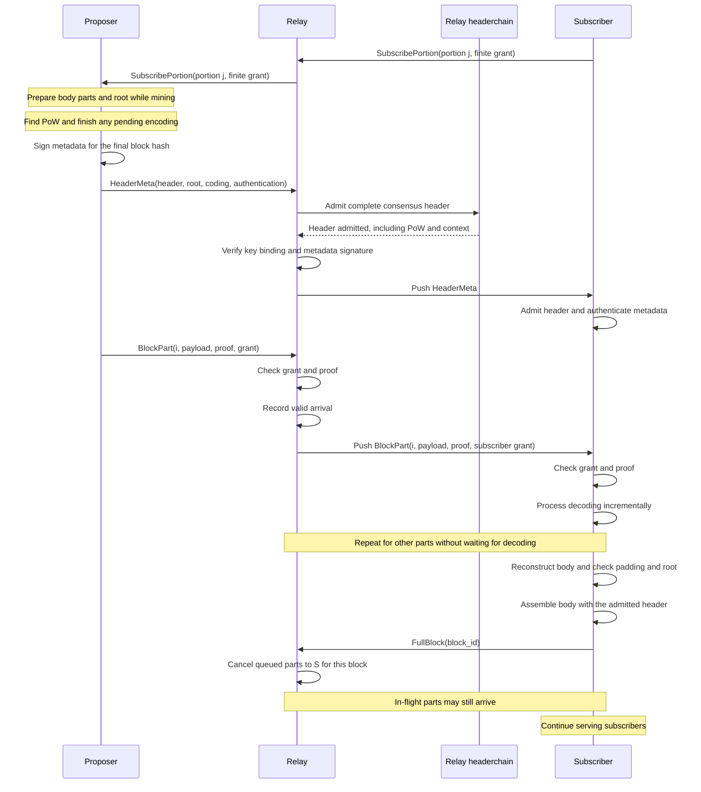

# Dogwood: block propagation for Zcash

Proof of work makes the next block's entry point unpredictable. Propagation
delay increases the orphan rate. We therefore need low-latency propagation from
any proposer across peers with unequal bandwidth.

Dogwood minimizes latency by pushing block parts along existing subscriptions.
Each receiver splits its subscriptions across peers to use their bandwidth.
Upon receiving a valid block part, a peer pushes it to its subscribers.

Each receiver adjusts its subscriptions using local delivery measurements,
using a similar approach to
[DOG](https://github.com/cometbft/cometbft/issues/3263). These local decisions
adapt the propagation graph to the proposer and current network conditions.
Dogwood starts with selected suppliers for each portion, not every portion
from every peer. It adds routes for coverage, measurement, or recovery.

To increase throughput, receivers subscribe to different portions of the block
from different peers. The subscription controller shifts portions between
connections to use available bandwidth. Parity and alternate suppliers provide
redundancy while routes adapt.

This document explains the proposal. [protocol specification](../specs/dogwood.md) defines its rules.
The proposer authentication and exact wire profile still need concrete choices.
The subscription controller needs simulation and measurement.

## Constraints, comparisons, and tradeoffs

Block propagation balances throughput, latency, and robustness. Pull protocols
use current availability to request missing data without excess duplication.
Push protocols avoid request latency but need redundancy when routes fail or
become congested. A protocol can also organize routes around a known proposer
and participant set, which imposes different topology assumptions.

[Rotor](https://www.anza.xyz/blog/alpenglow-a-new-consensus-for-solana) uses
erasure coding and a single relay layer, with bandwidth assigned according to
stake. This reduces the proposer's upload burden and the number of network
hops. Its routing model depends on a known proposer and validator set.

Celestia's Pull-Based Broadcast Tree
([PBBT](https://github.com/celestiaorg/celestia-app/blob/9c1e04d1dfd090531252f16f34293242d04b1157/specs/src/recovery.md))
discovers routes as block parts propagate. It pipelines authenticated `Have`
and `Want` messages with data transfer. FIFO scheduling makes congestion affect
route selection. This favors throughput and adaptation to current conditions,
but the first data transfer still waits for a request.

Dogwood moves the request before the next block. Its subscriptions reflect
previous observations, so route adaptation lags changes in congestion or block
entry point. Redundancy compensates for some stale routes at a cost to bandwidth
efficiency and throughput. Recovery handles cases where that redundancy is
insufficient. The protocol permits any block entry point, but propagation
latency can increase until subscriptions adapt to it.

## Protocol

### Parts and subscriptions

A block body contains `k` data parts and `n - k` parity parts. Payloads default to
64 KiB. The draft uses systematic Reed–Solomon over GF(2¹⁶).
Any `k` distinct correctly encoded parts reconstruct the body.
The receiver combines it with the admitted header to reconstruct the block.
A Merkle proof authenticates each part before a relay forwards it.

Subscriptions must exist before the next block's size is known. We divide the
part index space into a fixed number of portions. A permutation derived from
the block hash spreads data and parity parts across portions. One portion can
contain several parts of a large block.

Each node keeps incoming and outgoing peer-by-portion bitmaps. Incoming cells
record our requests. Outgoing cells record peers' requests. A default bitmap
serves unfamiliar proposers. A learned bitmap can replace it for a particular
authenticated proposer.

Together, these subscriptions form overlapping directed graphs. Different
parts cross different paths. A node that reconstructs the block can regenerate
missing parts and feed paths that have not received them yet. Each receiver
shapes its own incoming traffic without needing a map of the network.

### State examples

Each table describes state at receiver R. `P` marks a primary subscription,
`R` marks a redundant subscription, and `C` marks a challenge. All three are
enabled bits on the wire. Peers do not receive these local labels.

An unfamiliar proposer uses the default incoming matrix. R distributes portions
across peers and selects a second supplier for each portion during startup.
It does not request the whole block from every peer.

| Default incoming | Portion 0 | Portion 1 | Portion 2 | Portion 3 |
| --- | --- | --- | --- | --- |
| A | P | — | R | — |
| B | R | P | — | — |
| C | — | R | P | R |
| D | — | — | — | P |

Learned routes differ by proposer. Here A supplies most portions for proposer X,
while C supplies most portions for proposer Y. These tables show primary routes
and one challenge; the coverage rule may require additional redundant routes.

| Proposer / incoming peer | Portion 0 | Portion 1 | Portion 2 | Portion 3 |
| --- | --- | --- | --- | --- |
| X / A | P | P | P | — |
| X / B | — | — | C | P |
| X / C | — | — | — | — |
| Y / A | — | — | — | P |
| Y / B | — | — | — | — |
| Y / C | P | P | P | — |

If B repeatedly beats A for X's portion 2, R promotes B and then removes A's
subscription for that portion. R leaves Y's routes unchanged. Proposer rows
override default rows per peer, not per cell: an explicit empty row disables
that peer, while an absent row inherits the default.

Outgoing state records independent demand. R can receive portion 0 from A
while A also requests it from R.

| X / outgoing peer | Portion 0 | Portion 1 | Portion 2 | Portion 3 |
| --- | --- | --- | --- | --- |
| A | P | — | — | — |
| D | P | P | — | — |
| E | — | — | P | P |

If A supplies part `i` in portion 0, R forwards it to D and suppresses the echo
to A. If R obtains `i` elsewhere first, R can forward it to both A and D.

For repair, a block-specific peer-by-part row overrides that peer's persistent
row. Creating the row first copies inherited demand. For example, if B's
inherited indices are `{3, 7}`, adding missing index `5` produces `{3, 5, 7}`.
The new grant must cover index `5`; the inherited indices still need credit.

### Redundancy and recovery

The steady-state target is one supplier per portion, including parity portions.
For example, `k = 32, n = 40` costs 25% extra payload before duplicates and
padding. It tolerates eight unavailable parts.

This protection depends on where parts travel. If one peer supplies more than
eight parts, losing it can prevent immediate decoding. A receiver can favor a
nearby proposer for speed, but it must retain enough distinct parts elsewhere
to meet its chosen failure target. Parity and duplicate routes share this
budget; they are not interchangeable guarantees.

For the same `32/40` block, A could supply indices `0..31`, B could supply
`0..7` and `32..39`, and C could supply `8..23`. Losing any one peer leaves
at least 32 distinct indices. A supplies the entire data set, but the alternate
coverage raises assigned payload to 64 parts: twice the unpadded body size.
The receiver can use less redundancy only by accepting recovery latency after
A fails. A fast datacenter connection does not remove that tradeoff.

Parity cannot repair an isolated subscription cycle. Two peers may request the
same portion from each other while neither has it. We allow reciprocal
subscriptions because either peer may obtain the part elsewhere or reconstruct
it. We suppress echoes and never treat reciprocity as evidence of availability.

Receivers start with extra suppliers, retain a small exploration budget, and
add suppliers when decoding stalls. They can request specific parts of the
current block using the subscription message. Existing full-block download
provides final recovery. Sparse subscriptions alone do not guarantee delivery
from every entry point.

### Routing and congestion control

The receiver moves demand toward peers that deliver sooner under the assigned
load. It compares arrival times on its own clock, not RTT or sender timestamps.
Transport congestion control paces bytes; this controller chooses suppliers.

The core rules are:

1. Start with selected suppliers per portion. Use one primary plus routes needed
   for startup or failure coverage. Do not subscribe to everything from everyone.
2. Occasionally add a random challenger for one portion. Race the same parts
   from the same proposer under comparable block size and concurrent load.
3. Move that portion only after repeated wins. Keep the old supplier until the
   replacement delivers, and preserve enough distinct parts to decode after
   the failures we intend to tolerate.
4. Limit each move in bytes. Count all active blocks, proposers, backups, and
   challenges against the connection's shared budget. Allow only one unsettled
   move into a connection, then measure again at the new load.
5. Raise the budget a little after successful delivery under increased load.
   Lower it after repeated uncanceled deadline misses. Idle time is not evidence
   of spare capacity. Continued bounded challenges let weak peers recover.
6. Repair stalls immediately within a separate bounded reserve. Do not wait for
   the learning loop. On reconstruction, send `FullBlock` and stop measuring
   missing copies as failures because we have told their senders to stop.

For proposer X and portion 2, the subscriptions evolve as follows.
Arrows show pushed data; R sends subscription updates in the reverse direction.
Other portions and required backup routes remain unchanged.

```text
Before:       A ---- portion 2 ----> R

Challenge:    A ---- portion 2 ----> R <---- portion 2 ---- B
              Add B within budget and compare the same parts.

After:        B ---- portion 2 ----> R
              Remove A after repeated B wins and successful replacement delivery.
              Keep A if failure coverage still requires it.
              Measure again before adding more load to B.
```

The budget counts outstanding assigned bytes, not subscriptions. At 64 KiB per
part and four portions, one portion of a 40-part block costs 640 KiB.
Two concurrent blocks cost 1.25 MiB. One portion of a 400-part block costs
6.25 MiB, so a small-block win cannot justify that move without a larger trial.

Standing routes use an estimated workload because the next block is unknown.
On `HeaderMeta`, the receiver checks actual byte demand and coverage. Corrections
use block-specific subscriptions and incur control latency. The budget guides
allocation; finite grants and queue bounds enforce hard limits.

Randomized comparison follows the idea in
[power of two choices](https://brooker.co.za/blog/2012/01/17/two-random.html).
These rules do not establish convergence or guarantee delivery from an isolated
subscription cycle. [Section 7 of the spec](../specs/dogwood.md#7-redundancy-and-route-control)
defines the measurements, limits, and recovery rules we need to test.

### Encoding

Use systematic Reed–Solomon over GF(2¹⁶), with the generator from
[RFC 5510, section 8](https://www.rfc-editor.org/rfc/rfc5510.html#section-8).
Add `ceil(k / 4)` parity parts. Any `k` distinct correctly encoded parts suffice.
The spec fixes the field representation and part layout.

Decode incrementally: treat each verified part as an equation and eliminate
known terms as it arrives. Finish solving after `k` parts, then re-encode and
check the committed root. This overlaps decoding with transfer without RLNC's
rank uncertainty. Relays forward verified parts without waiting for decoding.
We still need to measure the remaining decode and root-verification latency.

Encode only the body because `HeaderMeta` carries the header. The proposer
prepares parity and the Merkle tree while mining, then signs the root with the
final block hash. A body change invalidates that work; a header-only change does
not. The root must be ready before the proposer publishes `HeaderMeta`.

### Messages

| Message | Purpose |
| --- | --- |
| `HeaderMeta` | Header, coding parameters, part root, and proposer authentication. |
| `BlockPart` | One part, its Merkle proof, and subscription authorization. |
| `SubscribePortion` | Enable future portions or request parts of an active block. |
| `UnsubscribePortion` | Stop a route or restore the default route. |
| `FullBlock` | Report reconstruction and stop further parts for this block. |

`FullBlock` is terminal on that connection. It stops queued sends toward its
sender while leaving future subscriptions active. Its sender continues serving
subscribers. Bytes already in flight can still arrive.

Bitmaps describe routes but do not bound hostile traffic. Subscriptions also
grant finite part and byte credit over a bounded height range. Receivers issue
credit ahead of time. Parts name their grants, so an unsubscribe does not turn
an honest in-flight response into a violation. Repair uses the same machinery.

### Block-part lifecycle

The subscriptions below precede the block. The diagram follows one part through
a relay; each receiver gathers the other parts through its own subscriptions.



### Authentication

The current header lacks this part root, parity layout, and proposer
authentication. `HeaderMeta` adds them. Headerchain must validate the entire
header, including proof of work and contextual difficulty, before the node
relays metadata or allocates assembly state.

A signature is insufficient if anyone can choose the signing key. The proposed
binding commits the proposer key in the mined block and proves that commitment
against the header. The proposer then signs the final block hash and coding
metadata. A coinbase commitment and inclusion proof are one candidate; the
exact chain-compatible encoding remains open.

This avoids making the block contain its own encoded root. The signer can still
equivocate, so nodes admit at most one metadata variant per block and use
ordinary block recovery after authenticated conflicts. A Merkle proof proves
membership in the signed root, not correct parity. Reconstruction must check
the codeword and validate the block.

## Headerchain integration

Headerchain owns header validation, fork choice, and header recovery.
The propagation service submits the header from `HeaderMeta` to that admission
path, then pushes the admitted wrapper to eligible peers. Peers without part
subscriptions still receive metadata as a recovery starting point.

The current header-sync wire has `Status`, `GetHeaders`, `Headers`, and
`HeadersOutcome`. `HeaderMeta` needs negotiated service integration. Its push
must not wait for a status-and-request exchange on every hop.

The implementation authenticates parts, schedules bounded per-peer sends,
reconstructs blocks, and adjusts subscriptions. Completed blocks enter existing
block validation. One slow peer must not block another.

[protocol specification](../specs/dogwood.md) separates these rules from the remaining choices:
proposer-key binding, proof formats, wire limits, and measured
controller parameters. Simulation must test arbitrary ingress, correlated
failures, and changing congestion before we claim the desired tail latency.
