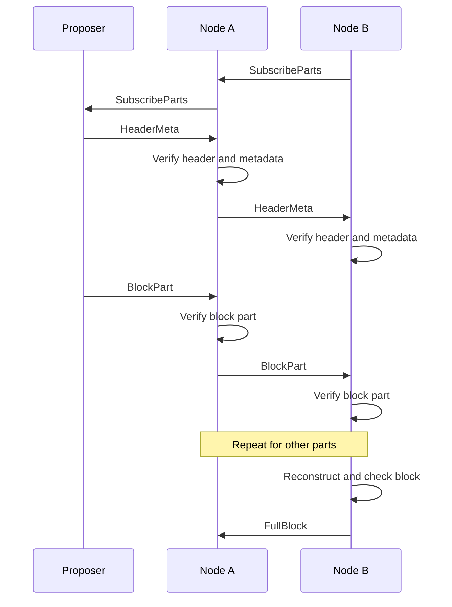

# Dogwood: block propagation for Zcash

Proof of work makes the next block's entry point unpredictable. Propagation
delay increases the orphan rate. We need low latency from any proposer across
peers with unequal bandwidth.

Dogwood pushes block parts along subscriptions established before the block
exists. Each node requests different parts from different peers and forwards
verified parts to its subscribers. It shifts subscriptions toward faster peers.
Parity lets it reconstruct the block without waiting for every part.

The tradeoff is bandwidth: standing routes avoid request latency, but stale
routes need redundancy and recovery. The [protocol specification](../specs/dogwood.md)
defines the rules. This document explains the design.

## Tradeoffs

Block propagation balances latency, throughput, and robustness.

[Rotor](https://www.anza.xyz/blog/alpenglow-a-new-consensus-for-solana) uses
erasure coding and a single relay layer to reduce the proposer's upload burden
and propagation hops. Its routes depend on a known proposer and validator set.

Celestia's Pull-Based Broadcast Tree
([PBBT](https://github.com/celestiaorg/celestia-app/blob/9c1e04d1dfd090531252f16f34293242d04b1157/specs/src/recovery.md))
discovers routes as parts propagate. It pipelines authenticated `Have` and
`Want` messages with data transfer. Congestion affects route selection through
FIFO scheduling, but the first transfer still waits for a request.

Dogwood moves that request before the block. Like
[DOG](https://github.com/cometbft/cometbft/issues/3263), it uses local delivery
measurements to adjust push routes. It starts with selected suppliers, not the
whole block from every peer. Subscriptions divide the traffic across connections
and adapt separately for each proposer.

Each node retains learned routes for each proposer. Switching between known proposers
does not discard those routes. An unfamiliar proposer uses default routes until
measurements support its own assignments. Congestion or a change in a proposer's
entry point can still make its routes stale. Recovery handles missing parts
while the controller adapts.

## Parts and subscriptions

The proposer splits the block body into `k` data parts, with 64 KiB payloads
by default. Systematic Reed–Solomon over GF(2¹⁶) adds `ceil(k / 4)` parity parts.
Any `k` distinct correctly encoded parts reconstruct the body.

`HeaderMeta` wraps the consensus header with coding parameters, a Merkle root
over the parts, and proposer authentication. Each `BlockPart` carries a proof
against that root. Nodes verify parts before forwarding or decoding them.

A subscription selects parts. For future blocks, it uses a fixed-width part
mask that maps to indices once the block size and hash are known. Each enabled
bit selects a share of the encoded parts. For an announced block, a subscription
can name exact indices. A part always means one payload, not a group of payloads.

Each node chooses its suppliers independently. These choices form overlapping
directed graphs: different parts follow different paths through the same
peers. A node can forward a part as soon as it verifies it. Once it reconstructs
and checks the encoded body, it can regenerate parts that never reached it.

### Block-part lifecycle

The nodes subscribe before the block exists. The diagram then follows one part.
Both nodes collect other parts through their own subscriptions.



`FullBlock` stops further parts for that block toward its sender. Node A cancels
queued sends to Node B, but in-flight parts may still arrive. Node B continues
serving its own subscribers. Future subscriptions remain active.
Reconstruction checks do not replace consensus block validation.

### Messages

| Message | Purpose |
| --- | --- |
| `HeaderMeta` | Announce the header and authenticated commitment to its encoded body. |
| `BlockPart` | Send one part with its proof and subscription authorization. |
| `SubscribeParts` | Request parts of future blocks or specific parts of an active block. |
| `UnsubscribeParts` | Stop a route or restore inherited subscriptions. |
| `FullBlock` | Report reconstruction and stop receiving parts for this block. |

Subscriptions grant finite part and byte credit over a bounded height range.
Each part identifies its grant. Canceling a route stops future sends without
making an authorized in-flight part a protocol violation.

## Subscription state

Each node keeps incoming and outgoing part masks per peer and proposer.
Incoming masks record what it requests. Outgoing masks record what peers
request from it. When a block arrives, the node resolves these masks into
peer-by-part bitmaps.

Default masks serve unfamiliar proposers. At startup, the node selects two
suppliers per part where available and distributes them across peers.
Here, each checkmark shows a requested part of an announced block:

| Incoming peer | Part 0 | Part 1 | Part 2 | Part 3 |
| --- | --- | --- | --- | --- |
| A | ✓ | — | ✓ | — |
| B | ✓ | ✓ | — | — |
| C | — | ✓ | ✓ | ✓ |
| D | — | — | — | ✓ |

The node learns separate routes for each authenticated proposer. A nearby peer
may provide most of one proposer's block without being the best supplier for
another. For example, learned primary assignments could look like this:

| Proposer | Part 0 | Part 1 | Part 2 | Part 3 |
| --- | --- | --- | --- | --- |
| X | A | A | A | B |
| Y | C | C | C | A |

Backup subscriptions supplement these assignments where failure coverage
requires them. Changing X's routes does not change Y's routes. All routes share
the connection's byte budget.

Outgoing demand is independent. A can request a part from B while B requests
it from A. Either node might receive a part elsewhere first or reconstruct it.
A node suppresses an echo to the peer that supplied the part. Reciprocal
subscriptions do not prove that either peer has the data.

Block-specific subscriptions request missing parts during recovery without
changing the learned routes for future blocks. The spec defines how these
subscriptions override persistent state.

## Routing and congestion control

The receiver chooses suppliers. Transport congestion control paces each
connection. The subscription controller decides how much traffic to assign
to that connection.

Arrival times alone cannot reveal unused capacity: a peer might be slow because
it received the part late, or because its connection is congested. The receiver
instead tests an alternative under load. It requests the same parts from two
peers and compares verified arrivals on its own clock. No sender timestamp or
RTT estimate is needed.

The controller follows five rules:

1. **Compare like with like.** Add a random challenger for selected parts within
   a traffic-funded exploration budget. Compare the same parts from the same
   proposer under similar block size and concurrent load.
2. **Move gradually.** Require repeated wins. Keep the old supplier until the
   replacement delivers. Preserve failure coverage.
3. **Budget bytes across blocks.** Count active blocks, proposers, backups, and
   challenges together per connection. Limit each move and measure its effect
   before adding more demand.
4. **Adjust the budget from delivery.** Raise it gradually after success under
   increased load. Lower it after repeated uncanceled deadline misses.
   Idle time does not establish spare capacity.
5. **Recover independently.** Repair a stalled block within a bounded reserve.
   Do not wait for route learning. Do not count canceled copies as failures.

For selected parts, a successful challenge changes the route as follows.
Arrows show pushed data; subscription requests travel in the opposite direction.

```text
Before:       A ──> Receiver
Challenge:    A ──> Receiver <── B
After:             Receiver <── B
```

The receiver keeps A if it still needs A for failure coverage. Random challenges
continue so peers can recover from past losses.

A part mask's byte cost grows with block size and concurrent block count.
Selecting a quarter of a 40-part block costs 640 KiB at 64 KiB per part.
Two such blocks cost 1.25 MiB. A win at the first load does not establish capacity
for the second.

Challenge frequency follows block traffic, not just a timer. The receiver funds
extra copies from the encoded size of completed, validated blocks. It spaces trial
starts, shares opportunities across active proposers, and bounds each trial's
lifetime. Idle time adds no budget. Existing backup deliveries can provide
comparisons without adding traffic.

Standing subscriptions use an estimated workload. When `HeaderMeta` arrives,
the receiver checks actual demand and coverage. Corrections take control-message
latency. The learned budget guides allocation; finite grants and queue limits
bound resource use.

[Section 7 of the spec](../specs/dogwood.md#7-redundancy-and-route-control)
defines the measurements and update rules. We still need simulation to test
whether this controller adapts quickly without oscillating.

## Redundancy and recovery

The steady-state target is one supplier per part, plus routes needed for
failure coverage and challenges. Parity covers missing parts without requiring
a duplicate of each part.

For a block with 32 data parts and eight parity parts, any eight parts can be
unavailable. But if one peer supplies more than eight parts exclusively, losing
that peer can prevent reconstruction. The default coverage target therefore
keeps at least 32 distinct parts available after losing any one supplier.

A fast connection can carry most of the block, provided other peers cover
enough distinct parts. This costs duplicate traffic. The receiver can reduce
that cost only by accepting recovery latency when the fast peer fails.
Distinct peers also need not represent independent physical paths.

Coverage describes assignments, not guaranteed availability. A subscription
cycle may have no source for its parts. When progress stalls, the receiver
requests missing parts from additional peers. Existing full-block download
provides final recovery. Sparse subscriptions alone do not guarantee delivery
from every entry point.

## Encoding and verification

The codec uses the systematic Reed–Solomon construction from
[RFC 5510, section 8](https://www.rfc-editor.org/rfc/rfc5510.html#section-8).
The decoder processes each verified part as an equation as it arrives.
This overlaps decoding with transfer without requiring RLNC.
Forwarding never waits for decoding.

The proposer can prepare parity and the Merkle tree while mining. A body change
invalidates that work; a header-only change does not. After mining, the proposer
signs the final block hash and coding metadata.

A Merkle proof establishes membership in the signed root, not correct encoding.
After reconstruction, the receiver checks padding and re-encodes the body to
verify the root. It combines the body with the admitted header and submits the
block for consensus validation.

## Headerchain integration

Headerchain remains responsible for header validation, fork choice, and header
recovery. The node admits the complete header, including proof of work and
contextual difficulty, before authenticating metadata or allocating assembly
state. It then pushes `HeaderMeta` through header gossip without a per-hop
request exchange. Peers without part subscriptions also receive metadata.

The current header does not commit to the part root or authenticate a proposer
key. The proposed wrapper carries a signature from a key bound to the mined
block. A coinbase commitment with an inclusion proof is one candidate.
The chain-compatible binding remains open. A self-chosen signing key would
let anyone attach conflicting roots to someone else's proof of work.

Nodes accept at most one authenticated metadata variant per block. An
authenticated conflict stops coded propagation for that block and triggers
ordinary block recovery.

The spec leaves proposer-key binding, wire formats, and resource limits to be
finalized. Controller simulations and codec measurements must establish the
latency and throughput this design can achieve.
