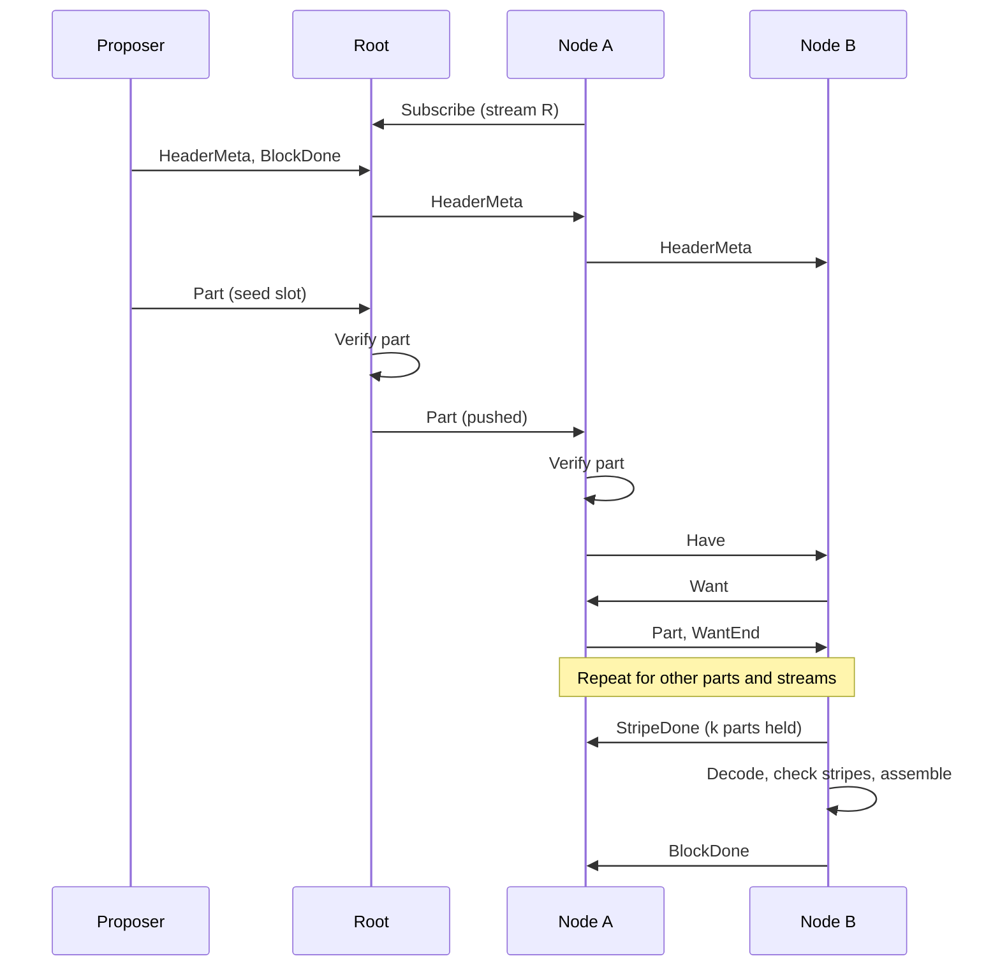

# Dogwood: block propagation for Zcash

Proof of work makes the next block's entry point unpredictable. Propagation
delay increases the orphan rate. We need low latency from any proposer across
peers with unequal bandwidth.

Dogwood splits each block body into erasure-coded stripes. The proposer sends
each part once, to one of a few nearby peers called roots. Every part rooted at
the same peer forms a stream. Each node first pulls the parts its neighbours
announce, and learns from their timing which neighbour delivers each stream
first. It then asks that neighbour to push the stream, but only where pushing is
cheap. Parity lets a node stop after any `k` parts of a stripe, so it can skip
slow neighbours instead of waiting for them.

The tradeoff is state: pushed streams avoid a request round trip, but they need
learning, loop avoidance, and a way to stop. The
[protocol specification](../specs/dogwood.md) defines the rules. This document
explains the design. The [experiment report](dogwood-experiments.md) records
the local codec and controller experiments behind the first draft.

## Performance targets

These planning targets need network testing and do not set consensus parameters.

**Throughput:** At 2 KiB per aggregated transaction after Tachyon, 50,000 TPS
requires 819.2 Mbps (97.7 MiB/s) of block-body traffic before parity, transport
overhead, and recovery. Delivering a block accumulated over `T` seconds in `D`
seconds requires at least `819.2 × T / D` Mbps of body ingress. Relays also need
upload capacity for each forwarding copy.

**Latency:** Aim to reach 90% of nodes in about 400 ms, with a target below
500 ms. We provisionally allow 150 ms for three roughly 10,000 km fiber hops
and 250 ms for indirect routes, serialization, queueing, verification, and
reconstruction. Actual geography, topology, and block size determine feasibility.

**Robustness:** Support any proposer within the available capacity and paths.
Nodes adapt their routes as bandwidth and topology change. Pulls, repair, and
block download preserve delivery while routes adapt.

### Current evidence

A test bench ran the `flow` prototype on 80 DigitalOcean nodes with 8 vCPUs
each, spread over 11 regions, in a random 28-regular overlay. The nodes had
synchronized clocks, no chain, and no Byzantine peers. `t90` is the time by
which 90% of non-proposer nodes assembled the block.

| Workload | Router | `t90` |
| --- | --- | --- |
| 32 MiB, one block at a time, rotating proposers | Push after learning | 0.40 s |
| 64 MiB, one block at a time, rotating proposers | Push after learning | 0.59–0.61 s |
| 32 MiB blocks streamed at 110 MiB/s, one or many proposers | Push after learning | 0.40–0.48 s per block; 0.77 s for the worst-placed proposer |
| 128 MiB, random proposers, parity 1/3 | Pull only; push with a child budget | 1.03 s; 0.91 s |
| 256 MiB, random proposers, parity 1/3 | Pull only; learned push at parity 0.1 | 1.59 s; 2.16 s |
| Two 256 MiB blocks at once | Pull only; learned push at parity 0.1 | 2.73 s; 3.85 s |

Every block reached every node in every trial. At 32 MiB the fleet meets the
latency target and sustains the planning throughput. At 256 MiB, transport
queueing dominates: the busiest pushing relay uploads about four times the
block. Pulling with parity keeps each node's received bytes at
1.02–1.05 times the body and needs no repair. These results motivate this
revision's pull-first design.

## Tradeoffs

### Protocol comparison

Each node limits its forwarding peers as the network grows. Like
[Gossipsub](https://github.com/libp2p/specs/blob/master/pubsub/gossipsub/gossipsub-v1.0.md#gossipsub-the-gossiping-mesh-router),
Dogwood uses bounded local forwarding. It forwards per stream rather than per
message.

[Rotor](https://www.anza.xyz/blog/alpenglow-a-new-consensus-for-solana) uses
erasure coding and a single relay layer to reduce the proposer's upload burden
and propagation hops. Dogwood's roots play the role of that relay layer: the
proposer uploads each part once. Rotor's routes depend on a known proposer and
validator set; Dogwood's roots are simply the proposer's nearest peers.

Celestia's Pull-Based Broadcast Tree
([PBBT](https://github.com/celestiaorg/celestia-app/blob/9c1e04d1dfd090531252f16f34293242d04b1157/specs/src/recovery.md))
discovers routes as parts propagate. It pipelines authenticated `Have` and
`Want` messages with data transfer. Dogwood starts the same way: every stream
begins in pull mode. The `Have` timing then trains a learner.

Like [DOG](https://github.com/cometbft/cometbft/issues/3263), Dogwood uses local
delivery measurements to set push routes. The receiver alone decides to push a
stream, and it returns the stream to pull when a pull would be faster. The
network therefore fades between pull and push per stream.

### Pull, push, and parity

A push saves the request round trip, but a pushing parent sends every part of
its stream, including parity the child does not need. Across a network,
learned push also concentrates load on the fastest relays. A pull costs one
round trip, but it asks only for parts the node still needs and lets the node
stop at `k` per stripe.

Parity changes that balance. With one third extra parity, a pulling node can
ignore its slowest announcers and still decode. At 256 MiB, pull only beat
learned push by about 25% and received about a fifth fewer bytes. At 128 MiB, push
with a child budget still won by about 10%. Dogwood therefore keeps push where
it is cheap: the child chose it, the parent advertises a short forwarding wait,
and the parent's budget has room. Everything else stays pull.

## Parts, stripes, and streams

The proposer splits the block body into 64 KiB source parts. It groups them
into stripes of at most 64 parts and encodes each stripe with systematic
Reed–Solomon over GF(2¹⁶), adding `ceil(k / 3)` parity parts. Any `k` distinct
correctly encoded parts of a stripe reconstruct it. A 128 MiB body has 32
stripes of 64 source and 86 coded parts.

`HeaderMeta` wraps the consensus header with the coding parameters, a Merkle
root over every part, the proposer's roots, and proposer authentication. Each
`Part` carries a proof against that root. Nodes verify parts before forwarding
or decoding them. A verified proof also yields the stripe's own subtree root,
so a node can check each stripe as soon as it decodes.

The root list assigns part `i` to root `roots[i mod R]`. The parts rooted at one
peer form that peer's stream. A stream is named by the root alone, so two
proposers that share a root feed the same stream, and routes learned under one
proposer serve the next. In the two-proposer experiments, keying streams by
proposer lost on every dataset.

### Block-part lifecycle

This diagram follows one part of one stream. A has already promoted the
stream to push at R; B still pulls it.


```mermaid
sequenceDiagram
    participant P as Proposer
    participant R as Root
    participant A as Node A
    participant B as Node B
    A->>R: Subscribe (stream R)
    P->>R: HeaderMeta, BlockDone
    R->>A: HeaderMeta
    A->>B: HeaderMeta
    P->>R: Part (seed slot)
    R->>R: Verify part
    R->>A: Part (pushed)
    A->>A: Verify part
    A->>B: Have
    B->>A: Want
    A->>B: Part, WantEnd
    Note over A,B: Repeat for other parts and streams
    B->>A: StripeDone (k parts held)
    B->>B: Decode, check stripes, assemble
    B->>A: BlockDone
```

`StripeDone` and `BlockDone` travel on the control stream, so they overtake
queued parts and stop the sender early. Parts already in flight still arrive and
count as surplus. Reconstruction checks do not replace consensus block
validation.

### Messages

| Message | Purpose |
| --- | --- |
| `HeaderMeta` | Announce the header, the coded body's commitment, and the roots. |
| `Subscribe` | Ask a peer to push a stream, for all future blocks or one block. |
| `Unsubscribe` | Stop a pushed stream. |
| `Refuse` | Decline a subscription, or stop pushing one. |
| `Want` | Ask for up to `count` parts of one stripe from an allowed set. |
| `StripeDone` | Report `k` parts of a stripe; stop sending that stripe. |
| `BlockDone` | Report an assembled block; stop sending that block. |
| `Advert` | Share per-stream arrival potentials and the forwarding wait. |
| `Part` | Send one part with its proof. |
| `Have` | Announce verified parts, in band behind queued parts. |
| `WantEnd` | End a `Want`, behind its parts. |
| `StreamEnd` | Answer `Unsubscribe` and end the subscription, behind its parts. |

## Pull first, then push

Every stream starts in pull mode. When a neighbour announces a part the node
lacks, the node asks that neighbour for it, unless the stripe already has
enough parts on the way. A `Want` names a stripe, a count, and an allowed set,
so any server can answer with any parts it holds. A node that asks two servers
gives them disjoint allowed sets, so they never send the same part.

Each node samples a quarter of the parts by hash. For each sampled part, it
measures every neighbour's lag: when that neighbour's copy or `Have` arrived,
relative to the part's first arrival. `Have`s travel on the data stream behind
queued parts, so a neighbour's lag includes its queue. After each block, the
node ranks each stream's candidates by an EWMA of these lags.

When the same candidate leads a step and advertises a short forwarding wait,
the node subscribes to it. The parent then pushes the stream for every future
block. When a parent falls behind the best alternative by more than a round
trip for three steps, the node unsubscribes, and the stream returns to pull.
In the 256 MiB experiments, the first block, pulled everywhere, arrived about
twice as fast as the pushed blocks that followed.

```text
Pull:       A ··Have··> Node ──Want──> A ──Part──> Node
Promote:    Node ──Subscribe──> A
Push:       A ──Part──> Node
Demote:     Node ──Unsubscribe──> A ... A ──StreamEnd──> Node
```

**Loop freedom.** Each node advertises, per stream and block, its potential: the
median delay of the stream's parts after the block's creation time. A node
accepts a new parent only if the parent's potential for that block is lower
than its own. Every node compares advertised numbers, so no cycle can pass this
filter within one block. A second rule breaks cycles that form across blocks:
when a node's own parent subscribes to it for the same stream, it leaves that
parent. Clock skew between nodes can bias the ranking, but it cannot create a
cycle.

**Falling behind.** A node that runs several blocks behind still learns. It
keeps each neighbour's adverts for the last 64 blocks and compares against the
learned block's entry. An earlier prototype kept only the newest advert; a node
that fell behind then found no candidates and kept a slow parent.

**Push where cheap.** A parent bounds its children with a budget measured in
blocks: each accepted stream costs `1/R` of a block. A parent at its budget
refuses new subscriptions, and the child keeps pulling. Because streams are
shared across proposers, the budget binds per node. A budget of about 1.4
blocks cut the busiest relay's upload to 2.7 blocks and won at 128 MiB. The
production value is still open.

## Proposer roots

Sending a whole block to every direct peer multiplies proposer upload. Dogwood
instead has the proposer send each part once, to one root, and lets the roots'
streams spread from there. The proposer chooses as roots its neighbours whose
minimum round-trip time is at most twice the median. Far roots delayed whole
stripes in the experiments: when a European proposer rooted parts in Sydney,
every other node waited for those parts to come back.

The signed metadata names the roots and the proposer's transport identity. A
root therefore accepts seed parts only from that identity, and no relay can
rewrite which peer roots which stream. The proposer also sends `BlockDone` right
after `HeaderMeta`, so no neighbour forwards the block's parts back to it.

The root list reveals the proposer's nearest peers. A miner that wants to hide
its topology can propose through a relay it controls.

A proposer with many distant neighbours still roots its parts far away. The
worst-placed proposer in the experiments had nine slow neighbours out of 28 and
stayed the slowest. Excluding slow peers from the root median, or capping root
round-trip time, remains untested.

## Bounding what peers can send

The first draft bounded incoming traffic with immutable grants of part and byte
credit. The prototype dropped credit because the QUIC send window already
queues honest traffic. QUIC's receive window does not bound a dishonest peer,
though: the node reads and drops each part, so the window refills at once.

Dogwood now bounds receive traffic with a wanted set. Per connection, a node
wants a part from a peer only if it subscribed to the part's stream there, sent
that peer a `Want` that allows the part, or the peer is the block's proposer
and the node is the part's root. Each wanted part is wanted once from each
peer. An unwanted part or a second copy from the same peer disconnects the peer
before proof verification. Any peer can therefore send at most one copy of each
part the node asked for, and total receive bytes follow the node's own
subscriptions and `Want`s. A byte budget adds nothing to that bound.

Ends make the bound exact under crossings. An `Unsubscribe` cannot recall
parts the parent already queued, so the stream stays wanted until the parent's
`StreamEnd` arrives. `StreamEnd` and `WantEnd` travel on the data stream behind
every part they authorized, so nothing of an ended exchange can follow them.
Every subscription ends the same way: the subscriber sends one `Unsubscribe`,
and the publisher answers with one `StreamEnd`. A publisher that declines or
stops pushing sends `Refuse`, which asks for that `Unsubscribe`. `Refuse` shares
the data stream with `StreamEnd`, so it never arrives after the end. No timer
ends a subscription or a `Want`, so a slow peer never looks like a lying one.

Messages name a block by its metadata variant, not its consensus hash. A
proposer can sign two variants of one header. A node holding the other variant
then sees an unknown block, never a bad proof, so equivocation cannot make
honest peers disconnect each other. Messages about unknown blocks wait in a
small per-peer early record until the metadata arrives. When that record fills,
the node stops reading the peer's data stream, so unknown-block parts cost at
most the record's size per age bound. The control stream never pauses, because
the metadata that resolves the block travels on it. Coded propagation covers only the last 16
blocks, which lets a node remember every block it retired and reject repeats.

Every Dogwood message follows the
[peer message regulation](peer-message-regulation.md) model: a frame cap, bounded
decoding, a reservation check before expensive work, then verification. A node
disconnects only on an event no conformant peer can cause. Crossings, local
eviction, and local capacity produce `Drop` and a bounded trace. The spec lists,
for each message, the checks and the sender obligation behind each disconnect.

## Recovery

Parity makes the normal path forgiving: a node needs any `k` parts of each
stripe, from any mix of pushes and pulls. When no new part arrives for two
seconds, the node enters repair. It asks peers that reported `StripeDone` or
`BlockDone` for the missing parts, in bounded rounds. A monotonic deadline from
metadata admission caps the whole attempt, and the node then downloads the full
block. A failed re-encode check or conflicting metadata skips straight to block
download. Recovery never moves backward.

In the 128 and 256 MiB experiments, repair fetched 5.7–9.4% of new parts under
learned push with low parity. With a child budget it fetched 0–1.1%, and with
pull only none.

## Encoding and verification

A part's Merkle proof establishes membership in the committed codeword. After a
stripe decodes, the node re-encodes it and checks the stripe's subtree root.
After every stripe passes, it assembles the block and submits it for consensus
validation. Forwarding verified parts never waits for decoding. Changing the body
requires new parity and a new Merkle tree. Changing only the header preserves
both.

Stripes bound each decode to 64 parts, and decoding overlaps the transfer. In
the fleet traces, the tail after the last part was 115–180 ms at `p90`. Coding
a 256 MiB body as one codeword instead took about 2 seconds to decode. The
stripes' shared tree keeps one root in the header while letting each stripe be
checked alone.

The proposer still encodes the whole body before it signs the root. A future
profile could commit per-stripe roots so the proposer can send each stripe as
soon as it is encoded.

## Headerchain integration

Headerchain handles header validation, fork choice, and header recovery. The
node checks the complete header, including proof of work and contextual
difficulty, before authenticating metadata or allocating assembly state. It
then forwards `HeaderMeta` to every peer, including peers without
subscriptions.

The header does not commit to the part root, the roots, or a Dogwood proposer
key. The wrapper therefore needs a signature from a key bound to the mined
block; an arbitrary wrapper key would let anyone attach conflicting roots to
someone else's proof of work. The
[candidate binding](../specs/dogwood.md#bind-the-proposer-to-the-proof-of-work)
commits a key in a coinbase output and proves its transaction's membership in
the block. A txid proof alone cannot authenticate a key in the V5 coinbase input
script. The post-Tachyon adapter remains open.

Nodes accept at most one authenticated metadata variant per block. An
authenticated conflict stops coded propagation for that block and triggers
block download. The
[W2 payload profile](../specs/dogwood.md#candidate-payload-profile-w2) defines
candidate bytes, commitments, and signatures.

## What changed from the first draft

| First draft | This revision | Evidence |
| --- | --- | --- |
| One codeword over the whole body, 25% parity | Stripes of 64 source parts, one-third parity | One codeword takes about 2 s to decode at 256 MiB; parity 1/3 cut the 256 MiB `t90` by a quarter. |
| Receivers subscribe to the proposer; `SeedOffer` candidate | The proposer sends each part once to a signed list of roots | Roots near the proposer removed the far-root detour. |
| Part masks with proposer and block scopes | Streams keyed by root, with standing and block scopes | Routes keyed by proposer lost in replay; per-root streams carry across proposers. |
| Two suppliers per part and a coverage margin | One parent per stream, plus pulls | Pulls fill gaps at 1.02–1.05 times the body. |
| Byte-budgeted pairwise races with AIMD | Pull first, EWMA lag ranking, promote and demote | The pairwise controller did not consistently beat static allocation; pull-first reached 90% push within two to five blocks. |
| Immutable grants of part and byte credit | The wanted set, with in-band ends | Application credit windows lost throughput; the wanted set bounds dishonest peers without them. |
| `FullBlock` | `StripeDone` and `BlockDone` | Stopping per stripe avoids about 9% of bytes that were parity sent after decoding was possible. |
| `Continue`, `Drop`, `Delay`, `Disconnect`, `LocalFault` | The regulation model's four results | Capacity waits belong to the serving loop. |

The first draft's headerchain admission, key binding, variant rule, send-once
rule, no-echo rule, and block-download fallback remain unchanged.

## Parameter tuning

The [spec parameter registry](../specs/dogwood.md#parameter-registry) owns
starting values and change rules. They reproduce the fleet experiments and
still need production tuning. Three tradeoffs matter most:

- **Parity:** more parity lets pulls skip more slow neighbours but raises
  proposer upload and every push. One third helped at 256 MiB; one half added
  little.
- **Push threshold:** promoting sooner saves round trips but builds hubs.
  The child budget and the advertised wait decide where push is cheap.
- **Stripe size:** smaller stripes decode sooner and narrow the tail. They also
  deepen proofs and multiply per-stripe messages. Sixteen stripes beat eight at
  64 MiB.

Local policy can change within the spec's bounds. Record parameter versions
with results. Wire changes require negotiation.

## Open work

- **Choose the child budget.** Set its default and test it with pull-first at
  every block size.
- **Settle per-proposer state.** Streams, parents, and pull windows are shared
  across proposers by design. Measure whether any of them should split.
- **Place roots for poorly placed proposers.** Test excluding slow peers from
  the root median and capping root round-trip time.
- **Pipeline the proposer.** Commit per-stripe roots so the proposer sends each
  stripe once it is encoded.
- **Complete interoperability.** Select the codec construction and vectors,
  the production chain adapter, transport negotiation, and aggregate resource
  limits. W2 payload encoding alone does not complete these choices.
- **Test without a friendly lab.** The fleet had synchronized clocks, no chain,
  and no Byzantine peers. Measure normal delivery and fallback separately under
  realistic geography, workloads, changing capacity, and adversarial peers.
