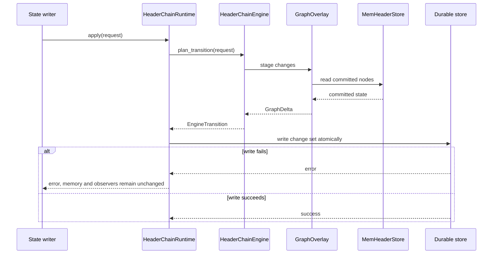
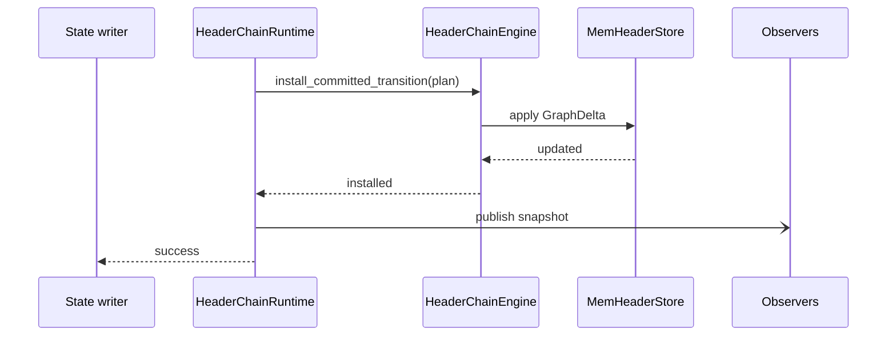
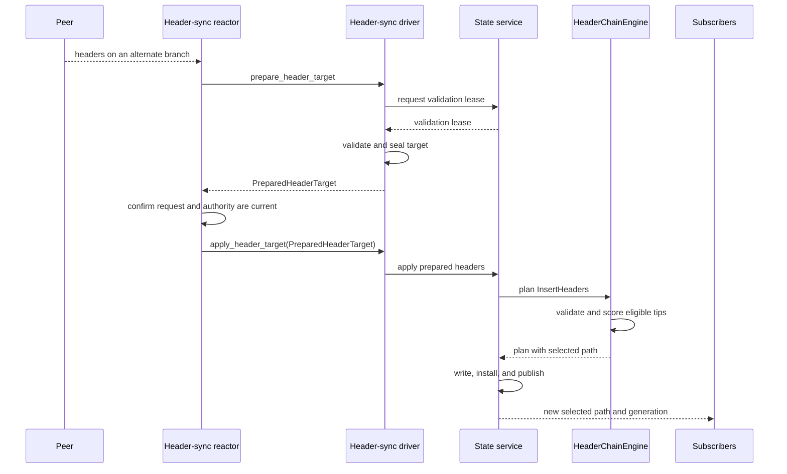
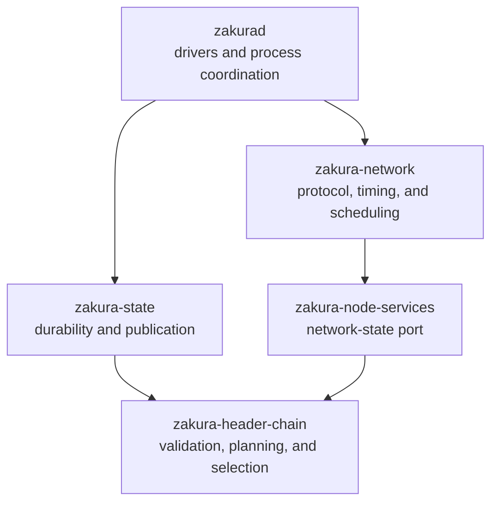

# Fork-aware header-chain implementation

This guide explains how PR #586 implements the
[fork-aware header-chain specification](../../specs/fork-aware-header-chain-engine.md).
Each linked property names the behavior that the code implements. The specification
remains authoritative.

## Engine modes

[`EngineMode`](../../../crates/zakura-header-chain/src/config.rs) has two values. A
deployment picks one, and the durable store records it. Startup fails closed when the
configured mode disagrees with the stored mode.

**Integrated** is the mode `zakurad` runs. Full state downloads and validates block
bodies. Only that evidence advances the verified path and finality.

**Headers-only** is the mode a deployment runs when it validates headers but never
downloads bodies. It has no body evidence, so it has no verified path to advance and no
proof to finalize with. It instead finalizes the selected header 1,000 blocks behind the
tip. That depth rule is a local trust decision, not a consensus rule: an eclipsed node
can pin the wrong branch, and it then rejects the real one. See
[headers-only finality disclosure (`LC-SCOPE-08`)](../../specs/fork-aware-header-chain-engine.md#lc-scope-08).

The mode changes two things: what advances the verified path, and what advances
finality. The rest of this document applies to both. Migrating a headers-only store to
integrated mode imports its pins as header trust anchors only, and the
[migration guide](../../header-chain-v1.4-migration.md) covers that path.

## Single-planner fork choice

Several inputs can change the selected header chain. New headers extend the DAG.
Validation results and explicit block exclusions change which headers are eligible.
Finalization changes the root from which the engine selects a chain.

The engine sends every input through one planner. Independent fork-choice updates could
select different tips. A late result could also overwrite a newer result. Each path
reports what it observed to the planner. The planner selects the best eligible tip.

`invalidateblock` makes the named block and its descendants ineligible for selection.
It does not delete them. `reconsiderblock` removes that exclusion, so the branch can
become eligible again unless another reason still excludes it. The code represents
these calls as `OperatorInvalidate` and `OperatorReconsider` events.

## Header-chain state

[`MemHeaderStore`](../../../crates/zakura-header-chain/src/graph/mod.rs) holds every retained
header in a directed acyclic graph (DAG). Each `HeaderNode` is keyed by its consensus
hash and names its parent. The finalized `Frontier` is the graph root. A `Frontier`
contains both height and hash, so it identifies one position on one branch.

The engine keeps two paths through the DAG. The selected path ends at the best eligible
header tip. The verified path ends at the tip whose blocks full state has accepted.
Each path is stored as an ordered list of frontiers, so readers can answer height queries
without walking the graph.

The two paths can end on different branches:

```text
finalized ── A ── B ── C          verified path (bodies already applied)
              ╲
               D ── E ── F        selected path (more work, headers only)
```

Header sync follows the selected path. Full state verifies bodies along that path, and
the verified path advances behind it. In headers-only mode the verified path holds only
the finalized frontier, because full state never verifies a body.

A node is eligible when its header is valid, it has no direct exclusion reason, and its
ancestors are eligible. The graph stores a set of
[`EligibilityReason`](../../../crates/zakura-header-chain/src/graph/header_node.rs) values
per node instead of one boolean flag:

- `SettledUpgradeConflict`: the header contradicts a compiled settled-upgrade pin.
- `CheckpointConflict`: the header contradicts an authenticated local checkpoint.
- `FinalityConflict`: the header contradicts the current finality anchor.
- `ConsensusBodyInvalid`: a full-state verifier proved that the body failed a consensus
  rule.
- `OperatorInvalid`: an `invalidateblock` call excluded the header.

Only `OperatorInvalid` is reversible. A set lets independent causes coexist, so
`reconsiderblock` removes one manual exclusion without removing a consensus-invalid body
result that also excludes the same header.

Selection takes the maximum score over all eligible tips. This implements
[deterministic selection (`LC-SELECT-04`)](../../specs/fork-aware-header-chain-engine.md#lc-select-04):
the same eligible DAG selects the same tip regardless of header arrival order.

When finality advances, the engine removes old ancestors and competing sibling subtrees.
It rebases retained work onto the new root.

## Header admission and validation

The header-sync driver prepares a downloaded batch before it takes the state writer
lock. It first asks state for a validation lease.

A validation lease is the durable header context, sealed. `zakura-header-chain` performs
no I/O, so it cannot read that context itself. State reads it once and hands it over as a
[`ValidationLease`](../../../crates/zakura-header-chain/src/transition/types/preparation.rs):
the exact parent frontier, up to 28 headers in reverse height order beginning with the
parent, the network parameters, and a digest of the trust anchors, with one context
digest binding all of it. Twenty-eight is the span that the difficulty and median-time
rules need.

The lease reserves nothing and blocks nobody. It is a consistency token, not a lock. The
driver uses it to run contextual checks off the writer lock. The planner accepts it as a
substitute for predecessor context that retention has already pruned from the graph, but
only when the lease is internally consistent, meaning each fact hash-links to the next
and the context digest recomputes, and when the state writer vouches for it through
`authorizes_validation_lease`. A caller therefore cannot supply its own ancestry. A lease
whose context has moved fails preparation as `InvalidLease`, and the caller prepares the
batch again. The separate retained-path lease that the driver holds over a download range
is a different mechanism with the same word in its name.

The driver then checks properties that need no candidate ancestry, including encoding,
proof of work, and commitment format. CPU-heavy checks run on a blocking thread.

The full-block and checkpoint verifiers call the same context-free checks. This prevents
an in-memory or locally constructed block from bypassing header-version and timestamp
checks. Only an authenticated custom network can disable proof-of-work verification.

A header whose time is more than two hours ahead of the local clock waits until that
time becomes valid. It does not become permanently invalid. This implements
[future-header deferral (`LC-VAL-08`)](../../specs/fork-aware-header-chain-engine.md#lc-val-08).
The state write loop schedules reevaluation, so the peer does not need to send the
header again.

Under the writer lock, `HeaderChainRuntime` reads the parent and finality context from
the durable store. The runtime does not trust ancestry supplied by the caller. It also
checks that the prepared batch still belongs to the current network, trust anchor, and
parent context.

The planner then checks parent linkage, height, work, difficulty, and time against the
staged graph. It admits a header only after every required check passes. This implements
[validation before admission (`LC-VAL-11`)](../../specs/fork-aware-header-chain-engine.md#lc-val-11).
The engine calculates cumulative work with full 256-bit values and rejects cumulative
overflow. Its difficulty calculation requires the complete predecessor window. It caps
target scaling before multiplication can overflow.

After planning,
[`verify_candidate`](../../../crates/zakura-header-chain/src/transition/invariants/mod.rs)
independently checks the resulting graph, projections, generation changes, and protected
nodes before the runtime writes anything.

## Transition commit order

`MemHeaderStore` contains the committed graph.
[`GraphOverlay`](../../../crates/zakura-header-chain/src/graph/overlay.rs) reads that graph
and records staged changes without mutating it.
[`HeaderChainEngine`](../../../crates/zakura-header-chain/src/transition/engine/mod.rs)
extracts those changes as a `GraphDelta`. The runtime applies the delta to
`MemHeaderStore` only after the durable write succeeds.

The overlay exists because the engine cannot know whether the durable write will succeed.
A single mutable in-memory graph would have to change before that write. Undoing a
partial change after a RocksDB failure needs a second, inverse mutation path, and that
path would run exactly when something has already gone wrong. Staging removes the
problem. `MemHeaderStore` stays untouched until the write returns success, so a failed
write leaves memory identical to what disk still holds. Recovery keeps what it has
instead of rolling anything back.

Staging also gives the engine a complete result to check before it commits anything.
`verify_candidate` runs against the staged graph, so an invalid plan reaches neither disk
nor memory. The extracted `GraphDelta` records the graph revision it was staged against,
and `MemHeaderStore` rejects a delta whose base revision no longer matches. That check
makes the gap between planning and installation safe.



After the durable write succeeds, the runtime installs the same plan in memory. It then
publishes the resulting snapshot:



The runtime updates disk first, memory second, and observers last. After a crash,
startup can rebuild memory from disk. Publishing before the write would expose state
that the next restart cannot recover.

A frontier-changing transition follows
[atomic frontier mutation (`LC-TXN-01`)](../../specs/fork-aware-header-chain-engine.md#lc-txn-01):
the runtime commits the DAG changes, metadata, projections, and related indexes in one
RocksDB batch before it publishes the new snapshot.

Startup uses
[`audit_store`](../../../crates/zakura-header-chain/src/transition/recovery/mod.rs) while
publication is disabled. The audit rejects contradictions in authoritative rows. It
repairs only indexes, projections, alarms, and other values that it can derive from those
rows.

During a live transition, the graph reuses header hashes that admission already verified.
Recovery recomputes canonical hashes from durable rows. This avoids repeated hashing
without weakening the startup audit.

### Write paths

`apply` commits a header-chain change without a block-state change. Header downloads,
deferred-header reevaluation, and body evidence use this path.

`apply_combined` commits a block-state change and its related header-chain change in one
RocksDB batch. This prevents block state and header metadata from disagreeing.
`apply_combined_expected` adds the expected-state guard used by normal block
verification.

`apply_aux_then_checkpoint_combined` commits verified commitment tree (VCT)
authentication, a dependent checkpoint advance, and the block-state change in one
batch.

A no-change plan still commits the caller's block-state batch when one exists, but it
does not install or publish a header-chain change. A `ResourceStalled` result means that
retention cannot make room without deleting protected state. It discards the caller's
block-state rows and writes a changed header-chain alarm when needed.

An auxiliary-evidence limit rejects the event before any change and does not raise the
resource alarm. A limit failure from the independent invariant check returns no plan.

## Fork switching

A fork switch changes the selected path. It does not roll back the header DAG.



If the new branch has the best eligible score, the plan replaces the selected path and
records a new header generation. The old branch remains in the DAG with its own tip.
Header-sync and block-sync subscribers read the new path from the published snapshot.
Their completion gates reject late work from the old generation.

Full state then verifies blocks on the new path. It reports a verified-chain reset when
the verified path must move to the other branch. `SyncCoordinator` holds the process-wide
apply permit during that handoff, so the native and legacy block-apply paths cannot run
at the same time.

When full state rejects a body as consensus-invalid, the block-sync driver waits for
state to commit that evidence. It refreshes a stale state version and retries a bounded
number of times. If state cannot persist the evidence, the driver shuts down instead of
continuing while the branch remains eligible.

## VCT evidence and authentication

Peers can provide commitment-tree roots before the node downloads the corresponding
block body. The engine stores each delivery against a header hash instead of a height.
Deliveries from competing branches therefore remain separate.

A delivery starts unauthenticated. The
[state VCT code](../../../crates/zakura-state/src/service/finalized_state/vct.rs) checks it
against the commitment in the next header. The planner accepts the resulting evidence
only when that next header directly follows the target on the same owned branch and the
delivery provenance has not changed. The exact transition checks live in
[`auxiliary_authentication.rs`](../../../crates/zakura-header-chain/src/transition/planner/event_effects/auxiliary_authentication.rs).

The DAG can retain an unauthenticated delivery while the check is pending. State exposes
a peer-supplied root through the authoritative commitment-root index only after that root
passes authentication. A root derived from an accepted block body can also enter that
index. This replaces the former height-keyed authentication frontier.

Unauthenticated evidence does not affect header validity or fork choice. The
[repair scheduler](../../../crates/zakura-network/src/zakura/header_sync/scheduler/repair.rs)
fetches missing evidence separately for each branch and generation. The full tree design
lives in [Verified commitment trees](../verified-commitment-trees.md).

## Stale work rejection

Serialized events require an exact `state_version`. The planner rejects an event as stale
when that version does not match.

Header requests can finish after the selected branch has changed. `BranchId` identifies
the anchor and tip that a request belongs to. It deliberately omits height because a
fork switch can replace a branch without changing its height.

When a result returns, `Gate` in
[`completion.rs`](../../../crates/zakura-header-chain/src/work/completion.rs) compares its branch
and generation with the current snapshot. It accepts current work and rejects stale
work. It ignores `state_version` because unrelated transitions increment that counter
and would cancel valid requests. The scheduler uses the same branch and generation to
retire stale work.

The engine keeps four monotonic counters in
[`counters.rs`](../../../crates/zakura-header-chain/src/identity/counters.rs). Each one
answers a different question about whether work is still current, and each fails closed
at `u64::MAX` instead of wrapping.

- `state_version` versions the complete durable header-chain state.
- `header_generation` advances when a change makes selected-header work stale.
- `verified_generation` advances when a verified-path or finality change makes
  body-forward work stale.
- `finality_epoch` counts irreversible finality advances.
  `headers_only_migration_epoch` records the last epoch that a headers-only to integrated
  migration imported, so the startup audit can separate imported trust pins from
  full-state finality.

Two more values answer the same question about position instead of time. `GraphRevision`
identifies one committed in-memory graph, so a staged delta cannot apply to a graph that
has moved underneath it. `WorkCoordinate` is cumulative work measured from an immutable
origin, and finality rebases every retained coordinate onto the new root rather than
advancing a counter.

Prepared headers have a separate stale result when their durable validation context
changes. The caller must prepare and validate those headers again.

Finality can advance while a header request is active. The planner can remove an
already-finalized prefix and bind the remaining headers to the new root. It rejects the
result when durable finality history cannot prove that rebase.

For replay-protected events, the engine saves the fingerprint of the latest state change.
An exact repeat produces a verified no-change plan even if its serialized version is old.
Normal authority and ownership checks still apply. Reusing the same evidence key with
different content fails as a conflicting replay.

## Component boundaries



### `zakura-header-chain`: validation and selection

This crate is synchronous and performs no disk or network I/O. Its
[`transition` package](../../../crates/zakura-header-chain/src/transition/) admits an
event, applies it to staged state, settles finality and retention, derives the write set,
and verifies the result. This boundary implements
[block-sync concerns excluded (`LC-SCOPE-06`)](../../specs/fork-aware-header-chain-engine.md#lc-scope-06):
unrelated block-sync policy cannot affect header fork choice.

[`retention.rs`](../../../crates/zakura-header-chain/src/transition/planner/retention.rs) protects the
selected path, the verified path, the path to every retained body that full state has
verified, and nodes that active work still references. When protected state fills the
node limit, the engine refuses admission. The
[fork and node limits rule (`LC-RETAIN-01`)](../../specs/fork-aware-header-chain-engine.md#lc-retain-01)
requires the engine to preserve protected state.

[`conformance.toml`](../../../crates/zakura-header-chain/conformance.toml) lists the
machine-checked rules. The
[`header_conformance` checker](../../../crates/xtask/src/header_conformance.rs) enforces
that manifest.

### `zakura-node-services`: the network-state port

[`header_chain.rs`](../../../crates/zakura-node-services/src/header_chain.rs) defines the
port between the network reactor and state. The port prevents `zakura-network` from
reaching the database. `AdapterKey` seals prepared header work so no caller can replace
it between preparation and application.

### `zakura-state`: durability and recovery

[`HeaderChainRuntime`](../../../crates/zakura-state/src/service/finalized_state/header_chain.rs)
is the sole header-chain writer and publisher. The runtime builds one durable batch,
installs the committed transition, and publishes the new snapshot in that order.

The [header-chain schema](../../../crates/zakura-state/src/service/finalized_state.rs)
uses a `_v1` suffix for each header-chain column family. A future incompatible encoding
can use a new family instead of reinterpreting existing data. The
[`migration`](../../../crates/zakura-state/src/service/finalized_state/header_chain/migration.rs)
builds an initial DAG from authenticated full-state facts when the database contains no
predecessor header-overlay rows. It downloads headers above the verified block tip again.
Startup rejects a database that contains predecessor header-overlay rows before it
publishes the new DAG. That cutover requires a fresh state database and resynchronization.
The [migration guide](../../header-chain-v1.4-migration.md) also covers removed
configuration and the status interface.

### `zakura-network`: protocol timing and branch-owned work

The network component decides when to request data, which peer to ask, and how much work
to keep in flight. It cannot validate headers or select a chain. The
[`scheduler`](../../../crates/zakura-network/src/zakura/header_sync/scheduler/) keys work
by branch and generation, so a fork switch retires only stale work.

The header-sync stream uses its version as a compatibility boundary. This implements
[immutable schema evolution (`LC-WIRE-15`)](../../specs/fork-aware-header-chain-engine.md#lc-wire-15):
changing a message schema requires a new schema identifier or stream version. The
[`pipe`](../../../crates/zakura-network/src/zakura/header_sync/pipe.rs) briefly remembers
cancelled request IDs, so a late valid response does not count as peer misbehavior.

### `zakurad`: process coordination

`zakurad` implements the state-service adapter and uses
[`SyncCoordinator`](../../../crates/zakurad/src/commands/start/zakura/coordinator.rs) to
prevent the native and legacy block-apply paths from running at the same time.
