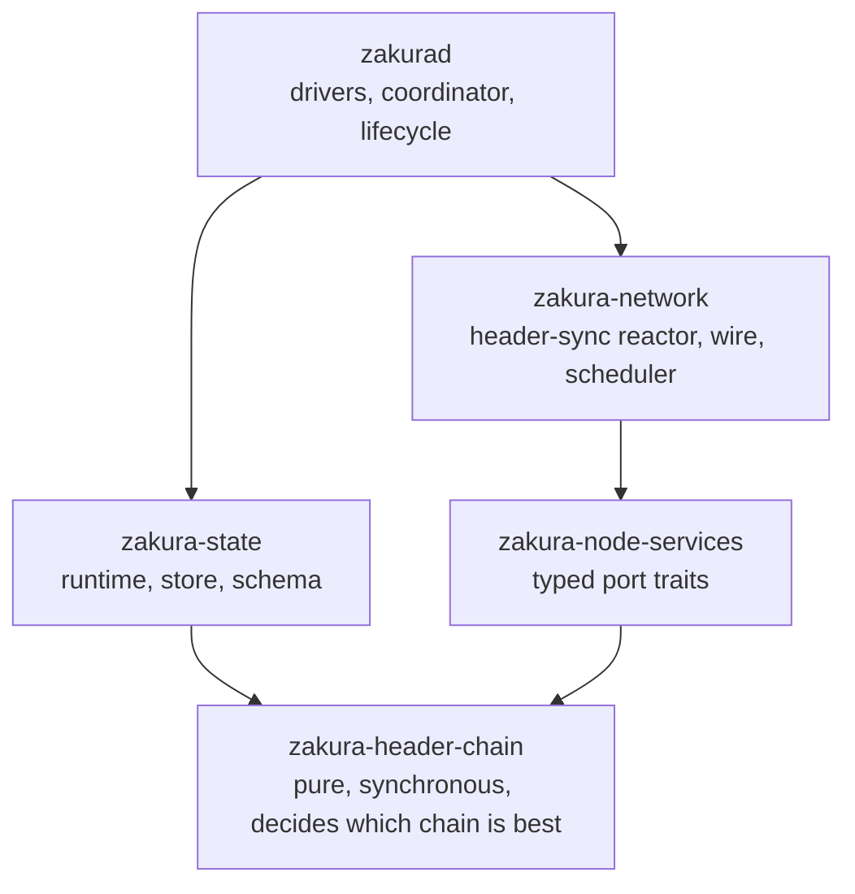

# Production Code in the Fork-Aware Header-Chain Change

Parent: `docs/specs/fork-aware-header-chain-engine.md` (rules cited as `LC-*`).
Source: PR #586, branch `hc/01-engine-model`, merge base `ba9261a73`, measured at
`664607d4f`.

## The problem all of this answers

Four independent sources want the tip to move. Peers deliver headers, full state
verifies bodies, an operator invalidates a branch, and finality advances. If each source
computes the move, the node runs as many fork-choice implementations as it has sources,
and they disagree. Timing breaks it even when they agree: a source that computed its
answer against an old view lands late and overwrites a newer one. That is the production
incident this design replaced.

The answer is one rule. A source states what it observed, and one planner turns that
evidence into every consequence. The five layers below are that rule under five
different constraints: keep the planner pure, keep the network crate unable to reach the
database, make the durable order survive a crash, keep async work from outliving its
authority, and keep two block-apply paths from running at once.

## The abstractions to know first

The file list below assumes this vocabulary.

### The graph, the overlay, and the delta

`MemHeaderStore` in `graph.rs` is the graph. It holds every retained header as a
`HeaderNode` keyed by consensus hash, rooted at the finalized `Frontier`. A `Frontier`
is a height and a hash together, and it is the only way this design names a position on
a chain. A node carries the header, its parent hash, a height from a checked parent
increment, the block work derived from the validated compact target, a
`WorkCoordinate`, a header validation state, an eligibility state, a body validation
state, and its auxiliary delivery ids. Beside the node map the graph keeps three
indexes it can rebuild from the nodes alone: children by parent, hashes by height, and
the set of eligible tips.

Selection reads that graph. `select_best_header_chain` takes the maximum score over the
eligible tips, so permuting arrivals cannot change the answer (LC-SELECT-04). A node is
eligible when its header is valid, it carries no exclusion reason, and no ancestor is
ineligible, which makes ineligibility a set of durable reasons rather than a flag. A
flag is last-writer-wins, and last-writer-wins is arrival order in disguise.

The engine holds the graph and two projections beside it. The selected projection lists
the frontier of every prefix of the best header chain from finality to the tip, and the
verified projection lists the same for the chain full state has verified. A projection
is a list, so a reader answers a height query without walking the DAG.

`GraphOverlay` in `graph/overlay.rs` is a mutable view over a borrowed graph. Reads see
the base plus whatever the overlay staged, writes land in the overlay's own maps, and
the base never changes. `GraphDelta` is what the overlay extracts: a new finalized
frontier when finality moved, the nodes to put, and the nodes to delete. A node the
overlay inserted and then deleted appears in neither list, and a node it wrote back
unchanged appears in neither, so the delta holds the difference and nothing else.

Both types implement `HeaderGraphView` and `HeaderGraphEdit`, so selection, eligibility
propagation, and the invariant checks run one implementation against committed state
and against a staged one. The planner therefore derives a complete transition without
copying the graph and without touching the live one.

`TransitionPlan` is what it derives: the change set the store will write, the private
`GraphDelta` the engine will install, and `before()`, the snapshot it was derived from.

### Work owners, generations, and branches

The reactor issues requests asynchronously, so an answer can arrive after the question
stopped meaning anything. A `BranchId` names the work an answer belongs to by the
anchor it was rooted at and the tip it pursued. It carries no height, because a reset at
the same height passes every height comparison. Three counters move underneath it.
`state_version` increments on every committed transition that changed a durable fact.
`header_generation` increments when selection, header topology, header validation,
eligibility, or finality moved. `verified_generation` increments when the verified
projection moved or finality advanced.

`Gate` in `ownership.rs` judges a response against the current snapshot and returns a
`CompletionDecision`: `Current`, or `Stale` carrying a typed `StaleReason` of
`HeaderGeneration`, `VerifiedGeneration`, `BranchAnchor`, `MissingOwner`, or
`OwnerMismatch`. It reads the generations and the branch anchor, and it ignores
`state_version`, because that counter also moves for transitions on branches the request
never went near, so binding header work to it would cancel in-flight requests faster
than they complete for no correctness gain. The planner repeats the same check as
`TransitionFailure::Stale`, and the scheduler keys its work by `(generation, branch)`.

### Keeping three copies in agreement

The same state exists three times: staged in an overlay, committed in the engine's
graph, and durable in the store. Six rules keep them from diverging.

The overlay never writes to its base, and `GraphDelta`'s fields are private to the
crate, so no caller assembles a partial one.

The delta rechecks itself against whichever graph it lands on. `derive_index_changes`
recomputes each put node's hash, parent link, and work from the compact target, refuses
a delete of a node the base does not hold, refuses a hash that is both put and deleted,
and refuses a finalized frontier that is missing or ineligible. `apply_delta` runs that
check before it mutates, and `validate_delta` runs it without mutating.

`verify_plan` checks the plan against a graph rebuilt from the delta with
`GraphOverlay::from_delta`, not against the overlay the planner mutated, so the verifier
approves the transition the engine will install rather than the one it staged.

`install_committed_transition` compares the live snapshot with the plan's `before()` and
refuses with `StaleSource` when they differ. `plan_transition` takes `&self`, so two
planners can run against one engine; only one of them can install.

Disk leads memory leads observers, and that order is forced. The next restart reads
disk, so a crash in this order leaves disk ahead of memory, which the startup audit
repairs by rehydrating, and a crash in any other order leaves an observer holding a
frontier that is not on disk, which nothing repairs. One transition makes one atomic
`db.write`, so a crash leaves the whole batch or none of it. A failure between the write
and the install fails closed: the runtime returns the store error, publishes nothing,
and the next open rehydrates the engine from disk.

The durable indexes are caches. The authoritative rows are the per-node rows in
`header_node_by_hash` and the singleton in `header_engine_meta`. Children, heights,
eligibility roots, deferrals, and both projections are rebuilt by the startup audit from
the node rows, which is why a crash that leaves disk ahead of memory is repairable and
the reverse order is not.

### When the store is written

Once per committed transition, inside the writer lock, and nowhere else in the steady
state. There is no accumulation and no background flush: the runtime builds one
`DiskWriteBatch` from the change set and calls `db.write` once (LC-TXN-01). What else
lands in that one write depends on which call the state writer made.

| Call | What lands in the one write |
| --- | --- |
| `apply` | the header-chain rows alone |
| `apply_combined` | those rows appended to the block batch the state writer already filled |
| `apply_aux_then_checkpoint_combined` | auxiliary authentication and the checkpoint advance that depends on it, planned into the same batch |
| a no-change plan | the caller's batch alone, with nothing installed and nothing published |
| a `ResourceStalled` plan | an alarm-only batch, discarding the caller's rows, so the state writer stops with its own rows unwritten |

Two more writes happen outside that path. When the startup audit finds repairs, the
runtime commits one repair batch before the engine exists. On first run against a store
that predates the DAG, `migration.rs` builds the initial nodes and the migrated finality
pin in its own write.

One transition starts without any component observing anything. The write loop keeps a
timer for `earliest_deferred()` and submits `ReevaluateDeferred` when it elapses, which
is how a header held for a local future time becomes eligible. It flushes like every
other transition.

### What a header is checked against, and when

Validation runs four times before disk, each pass against more context than the last,
and no pass trusts the one before it.

Off the writer lock, `prepare_header_target` in the driver reads a validation lease for
the common ancestor through the read service, derives `HeaderRules` from that lease, and
runs `prepare_context_free_headers` on a blocking thread. Those are the rules that read
no ancestor: canonical version and hash, checked height inference, commitment structure
for that height, compact-target domain and network limit, hash at or below target, and
Equihash. A header whose time runs more than two hours ahead of the local clock comes
back `DeferredUntil` rather than rejected (LC-VAL-08). The result is a
`PreparedHeaderBatch` sealed with a receipt naming the parent frontier, the network, and
the trust-anchor digest.

Under the writer lock and before planning, the runtime reads the predecessor facts
itself rather than accepting any the caller supplies. It seals the parent's validation
context, the anchor's when finality moved, and the finality rebase path, then wraps the
caller's authority in `StateIssuedAuthority` over exactly the leases it just issued, so
a lease from anywhere else is refused.

In the planner, against the graph, the receipt's parent, network, and trust-anchor
digest must still match the live config, or the transition fails with
`StalePreparation` (LC-VAL-11). The planner then re-derives, per header, the parent
link, the hash, the height increment, and the work from the compact target, and runs
`validate_contextual_difficulty_and_time` against ancestry it reads from the graph and
the lease. A peer's framing height is never evidence.

After planning and before disk, `verify_plan` re-derives the projected result: hashes
and linkage, index round-trips, work coordinates, inherited eligibility, both
projections' contiguity, that `header_best` really is the maximum eligible score, trust
pins, protected nodes, frozen limits, generation increments, and auxiliary provenance.
A disagreement between the planner and the verifier is `InvariantViolation`, and that
batch never reaches disk.

Startup adds a pass that answers to no caller: `audit_store` re-derives what the DAG
determines before the engine exists.

## How this list was cut

The change touches 303 files, adding 88,706 lines and removing 46,587. Most of that is
not the design. Tests and harnesses account for 26,382 added lines, fuzzing for 10,388,
docs and manifests for 1,180, CI, docker, and policy for 1,150, and a lockfile and two
data files for 34. What remains is 152 Rust files of production code, 49,572 lines added
and 23,994 removed.

Twelve of those files are deletions, listed at the end. Sixty-five of the surviving 140
carry the design. The other 75 are integration: a call site moved, a type re-exported, a
service registered. This document lists the 65 by layer, then names the integration
edits and the code the change deletes.

Exclusions applied, in order: `fuzz/`, every `fuzz.rs`, `/tests/` and `tests.rs`,
`testkit/`, the `header_chain/coherence/` model harness, `bench.rs`, `arbitrary.rs`,
`crates/xtask/`, `docs/`, `.github/`, `docker/`, `deploy/`, `qa/`, and lockfiles. Two
excluded files still matter to a reader: `crates/zakura-header-chain/conformance.toml`
(926 lines) is the machine-checked rule manifest, and
`crates/xtask/src/header_conformance.rs` (1,285 lines) is the checker that enforces it.

One caveat on every count below. Rust colocates unit tests, so a file's added-line
figure includes its `#[cfg(test)]` module. In the new crate, 17,176 added lines are
12,360 lines of code and 4,816 lines of colocated tests.

## Five layers

Thirteen commits landed the change. Four introduce the production code, and each of the
first three is one layer. The fourth covers both the reactor and the drivers, because
the port implementation and the facility that calls it have to arrive together. Five
later commits revise that code after review, and the remaining four add tests, fuzzing,
docs, and release plumbing.

| Commit | Adds |
| --- | --- |
| `04ed5f077 feat(header-chain)!: add fork-aware graph model` | the pure crate |
| `dd5b79dd1 refactor(node-services)!: add typed header-sync contracts` | the port |
| `4fefdd266 feat(state)!: persist and recover fork-aware header chains` | runtime, store, schema |
| `ebb60ab2d feat(network)!: add bounded fork-aware header sync` | reactor, wire, drivers |

## Layer 1: `zakura-header-chain`, 34 files, +17,176

A new crate, synchronous and pure. It holds every rule about which chain of headers is
best and performs no effect: no disk, no socket, no clock of its own, no task. Purity is
what makes fork choice testable without a node, replayable from an event list, and
usable by a headers-only client that links no database.

A crate stays pure only if its dependency list does, so the boundary sits where a test
can fail the build. Two architecture tests in `lib.rs` hold it: one fails if the
manifest gains `tokio`, `tower`, `zakura-state`, `zakura-network`, or
`zakura-consensus`, and the other scans the crate's own sources for wallet, FlyClient,
and block-sync surfaces (LC-SCOPE-06).

### Vocabulary: nine files that refuse things

These files name values, but each one exists to make a mistake unrepresentable rather
than to hold data. A `WorkCoordinate` carries the origin hash it accumulated from, so
two coordinates from different origins refuse to compare instead of returning a
plausible number that would silently decide fork choice. Generation counters use
`checked_next` and fail closed at `u64::MAX` rather than wrap. Every error carries an
explicit `Attribution`, so no generic conversion can charge a local disk failure to a
peer.

| File | Added | Role |
| --- | --- | --- |
| `src/lib.rs` | 196 | module list, public re-export surface, the two architecture tests |
| `src/ids.rs` | 443 | identities and generation counters: `HeaderId`, `EvidenceId`, `SourceId`, `BranchId`, `StateVersion`, `FinalityEpoch`, and the work owners and authorities |
| `src/frontier.rs` | 220 | `Frontier`, `ChainScore`, `WorkCoordinate`, `SuffixWork`, and exact chain-work ordering |
| `src/header_node.rs` | 351 | `HeaderNode`, the admitted header record, plus header, body, and eligibility state |
| `src/error.rs` | 412 | `HeaderChainError`, `ErrorCategory`, `RuleId`, and `Attribution`, the peer-blame boundary |
| `src/config.rs` | 669 | `EngineConfig`, `EngineMode`, `TrustedAnchor`, `CheckpointSet`, settled-upgrade pins, and the versioned `_V1` limits |
| `src/locator.rs` | 213 | `HeaderLocator` built from a committed selected path, capped at 13 hashes |
| `src/ownership.rs` | 441 | `PendingOwners` and `Gate`, which decide whether a late response still owns its branch |
| `src/retention.rs` | 582 | `enforce_retention`, the deterministic eviction planner |

Two of the nine hold algorithms rather than types. `ownership.rs` holds the completion
gate described above. `retention.rs` holds the eviction planner, and eviction is the one
place a resource limit could pass for a verdict about a chain. It refuses that twice.
Eviction writes no reason and no body state, so re-inserting the identical header
restores an eligible node. When protected paths alone fill the node bound,
`RetentionPlan` sets `admission_refused` and `resource_stalled` instead of evicting
protected state or synthesizing finality for room (LC-RETAIN-01).

### The DAG: two files split by one question

The question is whether the code may mutate committed state. `graph.rs` owns the queries
and selection over committed state, and holds the two properties that keep arrival order
out of fork choice: selection is `max` over a set, and height comes from a checked
parent increment rather than the height a peer framed. `graph/overlay.rs` holds the
staging types, which is what lets planning be pure. A plan the caller drops leaves
nothing behind, so the durable caller chooses the order of its effects.

| File | Added | Role |
| --- | --- | --- |
| `src/graph.rs` | 2,538 | in-memory DAG, ancestry and height queries, eligibility propagation, selection, tombstones |
| `src/graph/overlay.rs` | 1,443 | `GraphOverlay`, `GraphDelta`, and the copy-on-write staging of one transition |

### The transition: twenty files in refusal order

The split follows the order in which a transition can still be refused for free. Types
constrain what an event may say. Admission decides who may say it. The event effects
derive each event's consequences against a staged projection. Settlement and the write
set turn that projection into a plan. The verifier re-derives that result before disk
can see it. Recovery is the one path that skips all of them, so it is separate.

| File | Added | Role |
| --- | --- | --- |
| `src/transition/mod.rs` | 27 | the module's re-export surface |
| `src/transition/types.rs` | 1,724 | every typed input and output: the twelve events, `TransitionRequest`, `EngineSnapshot`, change sets, `AuxDelivery`, `ValidationLease` |
| `src/transition/planner.rs` | 335 | the phase sequence, `PlanCandidate`, and `TransitionPlan` |
| `src/transition/planner/admission.rs` | 367 | bounded admission, authentication, and header-insertion rebasing |
| `src/transition/planner/projected_state.rs` | 369 | `ProjectedTransitionState`: graph, verified path, and auxiliary deltas as one mutable projection |
| `src/transition/planner/settlement.rs` | 214 | finality, retention, and projection settlement after the event effects run |
| `src/transition/planner/write_set.rs` | 272 | generation policy and durable write-set derivation |
| `src/transition/planner/event_effects/mod.rs` | 95 | the read-only event context and the exhaustive dispatch over the twelve events |
| `src/transition/planner/event_effects/header_admission.rs` | 212 | prepared header insertion and atomic auxiliary delivery admission |
| `src/transition/planner/event_effects/full_state_evidence.rs` | 194 | authoritative full-state conclusions and finality evidence |
| `src/transition/planner/event_effects/header_validation.rs` | 192 | shared retained-context and full-state header validation |
| `src/transition/planner/event_effects/auxiliary_authentication.rs` | 105 | auxiliary delivery authentication and rejection |
| `src/transition/planner/event_effects/body_availability.rs` | 95 | transient body availability and supplier-discovery evidence |
| `src/transition/planner/event_effects/operator_policy.rs` | 73 | operator-driven eligibility and body-retry policy |
| `src/transition/planner/event_effects/deferred_time.rs` | 31 | deferred local-time header reevaluation |
| `src/transition/invariants.rs` | 995 | `verify_plan` and its 14 numbered violations, checked on the projected result |
| `src/transition/engine.rs` | 573 | `HeaderChainEngine`: `from_audited_state`, the pure `plan_transition`, the post-write `install_committed_transition`, `snapshot`, and the two projections |
| `src/transition/recovery.rs` | 1,606 | `audit_store` and `RecoveryPlan`, the startup audit and its deterministic repairs |
| `src/transition/authority.rs` | 55 | `Clock`, `FullStateEvidenceAuthority`, and `TransitionContext` |
| `src/transition/store.rs` | 14 | `StoreError`, with `Incoherent` and `Unavailable` |

`types.rs` is where evidence is kept from asserting an answer. An event carries
identities, hashes, and a stable evidence id, and never a tip, a generation, a prune
list, or a publication request. The fingerprint over its effect-bearing fields turns an
exact resubmission into `NoChange` and a reused key with different effects into a hard
conflict.

The planner is one algorithm in six named phases rather than one function. A request is
admitted, its event's effects are applied to a `ProjectedTransitionState`, finality and
retention settle that projection, and the write set derives the durable rows and the
generation bumps. The result is a `PlanCandidate`, which becomes a `TransitionPlan` only
after the independent verifier accepts it, so the type system carries the distinction
between a projected write set and a verified one.

`event_effects/mod.rs` dispatches on the twelve events with no fall-through arm, so a
new event fails the build rather than defaulting to a no-op. Each of the seven handler
modules owns one evidence domain, which is what keeps a change to operator policy from
touching header admission.

`authority.rs` is 55 lines and holds the whole capability model. It states that an event
cannot supply its own time, so time arrives through `Clock`. It states that only a
caller inside the state writer may vouch for staged full-state evidence, a scheduler
retry, a header completion, or a validation lease. One of the four questions is required
and the other three default to false, so an implementation that forgets an override
refuses evidence instead of admitting it. `TransitionContext` holds the authority as an
`Option`, so a caller outside the writer has no way to vouch at all.

`recovery.rs` is the only path that builds engine state without the planner, so it
decides on its own whether the store still describes one coherent chain. It repairs only
what a DAG can reconstruct, recomputes selection rather than trusting a stored answer,
and fails closed on anything else, with publication disabled until it finishes.

### Validation: three files split by the context a rule reads

The split decides which lock the caller needs, and production takes the context-free
entry point traced above. `prepare_headers` is the other one: it runs parent linkage and
contextual difficulty and time during preparation rather than leaving them to the
planner, so it takes a `ValidationLease` that `is_coherent` re-derives. The tests and
the fuzzer drive it; production does not.

| File | Added | Role |
| --- | --- | --- |
| `src/validation/mod.rs` | 466 | per-header rules: link, encoding, compact target, hash filter, future time, commitment structure |
| `src/validation/prepare.rs` | 691 | the two entry points and the sealed `PreparedHeaderBatch` |
| `src/validation/contextual.rs` | 963 | `AdjustedDifficulty`, ThresholdBits, the ZIP 205 and 208 testnet rule, and median-time-past |

`contextual.rs` moved here from `zakura-state/src/service/check/difficulty.rs`, so one
implementation now decides difficulty for a candidate header and for a block.

## Layer 2: `zakura-node-services`, 2 files, +1,387

This layer exists to make a dependency impossible rather than discouraged.
`zakura-network` needs header-chain state, and `zakura-state` sits above it, so a direct
call would invert the stack and put the database within the reactor's reach. The port is
a trait in a crate below both. The reactor calls seven named operations and can reach
nothing else.

| File | Added | Role |
| --- | --- | --- |
| `src/header_chain.rs` | 693 | the `Port` trait, the `AdapterKey` seal, `PortError`, and the `UnavailablePort` and `InertHeaderChainPort` stand-ins |
| `src/sync_lifecycle.rs` | 694 | `ApplyPhase` and its declared edges, `LifecycleEpoch`, `HeaderRuntimeStatus`, `SyncServiceDemand` |

The seven operations are `continuation_locator`, `vct_repair_context`,
`acquire_header_path`, `read_header_path`, `release_header_path`,
`prepare_header_target`, and `apply_header_target`. `AdapterKey` is what makes the last
two safe as two separate calls: the adapter seals a `PreparedHeaderTarget` on the way
out and is the only holder that can open it on the way back, so nothing can forge or
substitute a prepared batch in between.

`sync_lifecycle.rs` is here for the same reason as the port. `ApplyPhase`, its declared
edges, and `LifecycleEpoch` are shared by state, network, and orchestration, and none of
those three may own them without one of the others depending upward.

## Layer 3: `zakura-state`, 11 files, +10,759 / -1,541

This layer decides what survives a crash. The engine performs no effect, so its durable
caller performs all of them, in the order set out above.

One file dominates. `finalized_state/header_chain.rs` holds `HeaderChainRuntime`, the
sole writer and sole publisher, alongside `HeaderChainStore`, the `Publisher`, the
reader, the retained-path lease registry, the startup report, and four `FaultPoint`s
that let the recovery tests interrupt the sequence at each step and check that the next
startup repairs it.

| File | Added | Removed | Role |
| --- | --- | --- | --- |
| `src/service/finalized_state/header_chain.rs` | 4,349 | 0 | the runtime, the store, the publisher, the reader, leases, fault points |
| `src/service/finalized_state/disk_format/header_chain_values.rs` | 1,825 | 0 | version-one value codecs for the new column families |
| `src/service/finalized_state/disk_format/header_chain.rs` | 492 | 0 | ordered key encodings for children, heights, eligibility roots, deliveries, deferrals, finality |
| `src/service/finalized_state/header_chain/migration.rs` | 424 | 0 | first-run construction of the DAG from authenticated full state |
| `src/service/write.rs` | 1,945 | 727 | the write loop: the only production caller of `apply`, combined batches, the deferred timer |
| `src/service.rs` | 588 | 265 | runtime construction and the read and write service split |
| `src/error.rs` | 376 | 274 | state error taxonomy for the new failures |
| `src/service/finalized_state.rs` | 326 | 117 | opening the store, running the startup audit, wiring the runtime |
| `src/request.rs` | 293 | 146 | new state requests |
| `src/header_chain.rs` | 82 | 0 | the public retained-path contract: `RetainedPathLease`, `RetainedPathPage`, outcomes |
| `src/response.rs` | 59 | 12 | new state responses |

The schema adds fourteen column families, all suffixed `_v1`: `header_node_by_hash`,
`header_child`, `header_height_hash`, `header_candidate`, `header_selected`,
`header_verified`, `header_eligibility_root`, `header_aux_delivery`, `header_deferred`,
`header_finality_history`, `header_validation_context`,
`header_consensus_invalid_tombstone`, `header_body_evidence_authority`, and
`header_engine_meta`. The key encodings are ordered on purpose, so a range scan answers
a query that would otherwise need an index, and every index the schema does keep is a
cache that the startup audit rebuilds from the node rows.

`migration.rs` is the one-time problem. An existing store recorded one chain by height
and never had a DAG, so first run reads the height-indexed header rows and builds a
single selected path with a migrated finality pin. That pin is the reason
`MigratedPinRefutation` exists as an event: an imported pin cannot be rolled back, so
refuting one alarms and fails the node closed.

## Layer 4: `zakura-network`, 14 files, +8,970 / -6,088

This layer keeps its clock and gives up its authority. The reactor still decides when to
ask, whom to ask, and how much to ask for, because those are timing questions and it is
the only component with a timer. Everything else moved below it: whether a header is
valid, which chain is best, whether a late response still counts. The reactor issues
requests against a committed snapshot and reports what it observed through the port.

| File | Added | Removed | Role |
| --- | --- | --- | --- |
| `header_sync/reactor.rs` | 3,834 | 3,207 | the single loop: admission, target selection, issuance, response routing, serving, leases, repair, alarms |
| `header_sync/scheduler/peer_work.rs` | 1,424 | 0 | `PeerWorkQueue`, work priorities and phases, and the shared header-chunk budget |
| `header_sync/wire.rs` | 1,073 | 256 | the four message discriminants and the bounded codec |
| `header_sync/scheduler/retry.rs` | 643 | 0 | branch-owned body-availability retry episodes |
| `header_sync/scheduler/repair.rs` | 503 | 0 | generation- and branch-owned auxiliary VCT repair work |
| `header_sync/events.rs` | 394 | 551 | `HeaderSyncStartup`, the event enum, the handle |
| `header_sync/service.rs` | 393 | 574 | the stream declaration and per-peer session spawn |
| `header_sync/pipe.rs` | 346 | 1,121 | `run_peer`, the per-peer decode loop and its cancelled-response grace window |
| `header_sync/scheduler/completed_targets.rs` | 147 | 0 | generation- and branch-keyed completed targets |
| `header_sync/scheduler/status.rs` | 140 | 0 | `StatusPublisher`, coalescing advertisements behind a one-per-second floor |
| `header_sync/config.rs` | 38 | 130 | `ZakuraHeaderSyncConfig` |
| `header_sync/mod.rs` | 30 | 55 | module surface |
| `header_sync/scheduler/mod.rs` | 5 | 0 | scheduler module list |
| `header_sync/error.rs` | 0 | 194 | reduced to the startup error; the rest became `HeaderChainError` and `PortError` |

Header sync is stream kind 5 at stream version 8, behind capability bit five, with a 2
MiB message cap. The four discriminants are `Status`, `GetHeaders`, `Headers`, and
`HeadersOutcome`, and they are closed: new wire data needs an advertised auxiliary
schema bit or a successor stream version (LC-WIRE-15). The stream version is the
compatibility barrier, so a peer that cannot speak version 8 never negotiates the stream
rather than half-speaking it.

The `scheduler/` split is the shape the sole-writer rule forces on a facility that owns
no state. Work that used to sit in the reactor's own fields now sits in five small
modules, each keyed by generation and branch, so one retirement pass retires exactly the
work a reset invalidated and leaves the rest alive. `completed_targets.rs` is 147 lines
and shows the idea at its smallest: a set whose key is `(generation, branch)`, which
therefore cannot alias across either.

`peer_work.rs` owns the one number the whole facility shares. A response page carries up
to 1,000 headers by default and 4,000 at the cap, and the chunk budget divides that same
4,000 across receiving, preparation, and application on every staged target, so one
target cannot starve the others and the total in flight cannot exceed one transition's
worth.

`pipe.rs` handles the awkward case that follows from cancelling work. A retired request
still gets an honest answer from the peer, so the pipe remembers up to 64 cancelled ids
for 30 seconds and drops those responses instead of scoring them as protocol violations.

## Layer 5: `zakurad`, 4 files, +3,797 / -2,274

This layer is where the abstractions meet one process, and two of its four files answer
a problem no lower layer can see: the node has two paths that apply blocks, and only one
may run at a time.

| File | Added | Removed | Role |
| --- | --- | --- | --- |
| `commands/start/zakura/header_sync_driver.rs` | 1,743 | 1,896 | the `Port` implementation over the state service, plus reactor startup assembly |
| `commands/start/zakura/coordinator.rs` | 939 | 0 | `SyncCoordinator`: apply phases, apply permits, operation records, legacy-fallback leases |
| `commands/start/zakura/block_sync_driver.rs` | 775 | 325 | turns block-sync actions into verified applies that carry a `BodyWorkOwner` |
| `components/sync.rs` | 340 | 53 | legacy syncer changes for the lifecycle handshake |

`header_sync_driver.rs` implements the port. It turns each of the seven operations into
state-service requests and assembles the reactor's startup inputs, and it is the only
file where header-sync policy and the state service know each other's names.

`coordinator.rs` owns apply-phase transitions for the process. It holds the phase, a
watch channel per observer, the in-flight count, a record per block-apply operation, and
a drain notification, so the native and legacy paths hand off rather than overlap. It is
the only new file in this layer with no deletions against it, because nothing like it
existed.

## Integration edits, 75 files, +7,483 / -5,471

These files change because the core changed. None of them holds a rule.

| Area | Files | Added | Removed | Why it changed |
| --- | --- | --- | --- | --- |
| network: block sync | 15 | 2,901 | 446 | consumes committed header snapshots for scheduling, and carries a body work owner |
| network: transport, handler, discovery, trace | 13 | 1,777 | 1,764 | registers the header-sync service and its stream, and reworks the trace tables |
| zakurad: start, trace, inbound | 8 | 1,291 | 1,381 | wiring, driver spawn, and trace plumbing |
| state: adjacent modules | 21 | 902 | 1,764 | difficulty checks moved out, VCT plumbing, database open path |
| consensus | 5 | 253 | 34 | body verification failure classes the engine can act on |
| rpc | 1 | 160 | 7 | header-chain fields on existing methods |
| chain | 10 | 153 | 74 | shared header and difficulty types |
| jsonl trace and node-services re-exports | 2 | 46 | 1 | new trace rows and one re-export line |

The state row removes more than it adds because `service/check/difficulty.rs` lost 375
lines to `zakura-header-chain/src/validation/contextual.rs`, and `zakura_db/block.rs`
lost 738 lines to the runtime and its audit.

## What the change deletes

Twelve production files, 8,620 lines.

| Deleted file | Lines | Replaced by |
| --- | --- | --- |
| `network/header_sync/reactor/trace.rs` | 2,162 | the shared trace tables in `zakura/trace.rs` |
| `network/header_sync/work_queue.rs` | 1,288 | `scheduler/peer_work.rs` |
| `network/header_sync/state.rs` | 1,287 | the committed `EngineSnapshot` and the scheduler modules |
| `network/exchange.rs` | 873 | the header-sync service and its stream |
| `state/zakura_db/block/startup_audit.rs` | 667 | `transition/recovery.rs` and the runtime's audit |
| `zakurad/start/zakura/trace/header_driver.rs` | 666 | reactor trace rows |
| `network/header_sync/range.rs` | 508 | `HeaderLocator` and the selected projection |
| `network/header_sync/validation.rs` | 383 | `zakura-header-chain/src/validation/` |
| `network/header_sync/requester.rs` | 314 | the reactor's issuance path |
| `zakurad/start/zakura/trace/chain_tip_mirror.rs` | 210 | the publisher's watch channel |
| `network/header_sync/header_root_auth.rs` | 143 | `scheduler/repair.rs` and the auxiliary path |
| `network/exchange/trace.rs` | 119 | the shared trace tables |

Each deletion is one place where policy used to sit in the network crate and now sits
below it. Header validity, fork choice, and work ownership left the reactor, which kept
transport, scheduling, and timing.

## Pieces that read well on their own

Each of these is self-contained, and each one settles a question the rest of the design
then assumes.

| File | Lines | The question it settles |
| --- | --- | --- |
| `transition/authority.rs` | 55 | the entire capability model on one screen |
| `frontier.rs` | 220 | why chain work is not a number you compare: only differences are comparable, and a mismatched origin is an error rather than a smaller number |
| `retention.rs` | 582 | why an eviction planner should refuse new data rather than delete protected data |
| `locator.rs` | 213 | why a locator fails on a gap instead of returning a shorter one, which would be a wrong answer that looks like a valid one |
| `graph/overlay.rs` | 1,443 | what pure planning costs in practice once the graph is large |
| `transition/planner/event_effects/mod.rs` | 95 | the twelve events dispatched with no fall-through arm, so a new event fails the build |
| `transition/invariants.rs` | 995 | fourteen numbered violations, each with a comment naming what it caught |
| `transition/recovery.rs` | 1,606 | the only code that decides for itself whether a store still describes one coherent chain |
| `validation/contextual.rs` | 963 | the difficulty adjustment, the ZIP 205 and 208 testnet rule, and median-time-past, in one place |
| `header_chain/migration.rs` | 424 | how to build a fork-aware DAG for a database that only ever stored one chain, and what that costs later |
| `header_sync/wire.rs` | 1,073 | the case for a stream version as a hard compatibility barrier |
| `scheduler/completed_targets.rs` | 147 | branch keying with nothing else in the file to distract from it |
| `scheduler/retry.rs` | 643 | backoff whose jitter is deterministic: seeded from branch, header, and attempt and bounded to ten percent either way, so a test reproduces a retry schedule exactly |
| `scheduler/status.rs` | 140 | coalescing under a one-second floor and a two-second ceiling on delay, the smallest complete example of the reactor owning timing |
| `header_sync/pipe.rs` | 346 | why cancelling work must not turn a peer's honest answer into misbehaviour |
| `coordinator.rs` | 939 | what "only one path may apply blocks" looks like once it is code |
