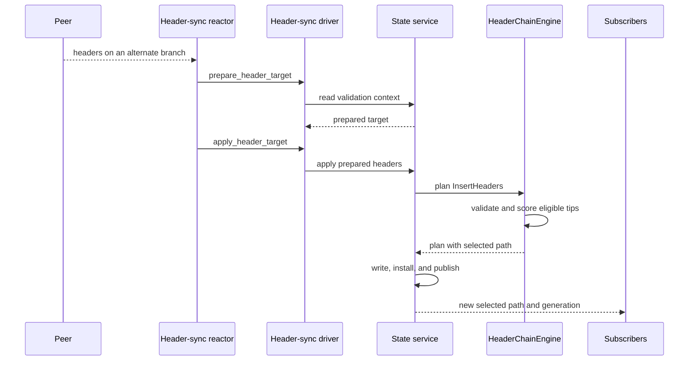
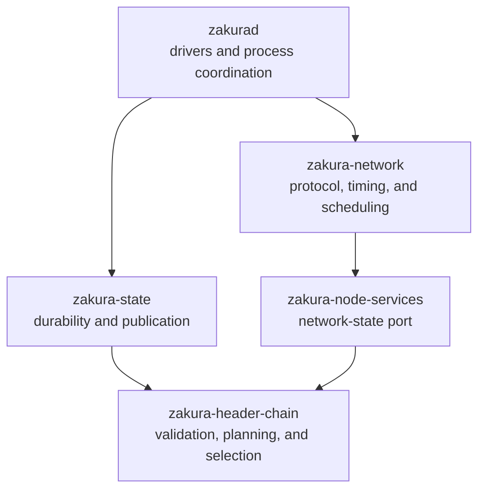

# Fork-aware header-chain implementation

This guide explains how PR #586 implements the
[fork-aware header-chain specification](../../specs/fork-aware-header-chain-engine.md).
Each linked property names the behavior that the code implements. The specification
remains authoritative.

## Single-planner fork choice

Four events can change the selected header chain. Peers add headers. Full state reports
verified blocks and consensus-invalid bodies. A node administrator can exclude or
restore a block through `invalidateblock` and `reconsiderblock`. Finalization moves the
point below which the node will not reorganize.

Separate code paths must not update fork choice independently. They could choose
different tips, or a late result could overwrite a newer result. Each path now reports
what it observed to one planner. The planner alone selects the best eligible tip.

`invalidateblock` makes the named block and its descendants ineligible for selection.
It does not delete them. `reconsiderblock` removes that exclusion, so the branch can
become eligible again unless another reason still excludes it. The code represents
these calls as `OperatorInvalidate` and `OperatorReconsider` events.

## Header-chain state

[`MemHeaderStore`](../../../crates/zakura-header-chain/src/graph/mod.rs) holds every retained
header in a directed acyclic graph (DAG). Each `HeaderNode` is keyed by its consensus
hash and names its parent. The finalized `Frontier` is the graph root. A `Frontier`
contains both height and hash, so it identifies one position on one branch.

The engine keeps two paths through the DAG. The selected path ends at the best eligible
header tip. The verified path ends at the tip whose blocks full state has accepted.
Each path is stored as an ordered list of frontiers, so readers can answer height queries
without walking the graph.

A node is eligible when its header is valid, it has no direct exclusion reason, and its
ancestors are eligible. The graph stores exclusion reasons instead of one boolean flag.
This lets independent causes coexist and lets `reconsiderblock` remove one manual
exclusion without removing a consensus-invalid body result.

Selection takes the maximum score over all eligible tips. This implements
[deterministic selection (`LC-SELECT-04`)](../../specs/fork-aware-header-chain-engine.md#lc-select-04):
the same eligible DAG selects the same tip regardless of header arrival order.

## Header admission and validation

The header-sync driver prepares a downloaded batch before it takes the state writer
lock. It obtains a validation lease for the common ancestor and checks properties that
need no candidate ancestry, including encoding, proof of work, and commitment format.
CPU-heavy checks run on a blocking thread.

A header whose time is more than two hours ahead of the local clock waits until that
time becomes valid. It does not become permanently invalid. This implements
[future-header deferral (`LC-VAL-08`)](../../specs/fork-aware-header-chain-engine.md#lc-val-08).
The state write loop schedules reevaluation, so the peer does not need to send the
header again.

Under the writer lock, `HeaderChainRuntime` reads the parent and finality context from
the durable store. The runtime does not trust ancestry supplied by the caller. It also
checks that the prepared batch still belongs to the current network, trust anchor, and
parent context.

The planner then checks parent linkage, height, work, difficulty, and time against the
staged graph. It admits a header only after every required check passes. This implements
[validation before admission (`LC-VAL-11`)](../../specs/fork-aware-header-chain-engine.md#lc-val-11).
After planning, `verify_plan` independently checks the resulting graph, projections,
generation changes, and protected nodes before the runtime writes anything.

## Transition commit order

`MemHeaderStore` contains the committed graph.
[`GraphOverlay`](../../../crates/zakura-header-chain/src/graph/overlay.rs) reads that graph
and records staged changes without mutating it. Planning extracts those changes as a
`GraphDelta`. The runtime applies the delta to `MemHeaderStore` only after the durable
write succeeds.

```mermaid
sequenceDiagram
  participant W as State writer
  participant R as HeaderChainRuntime
  participant E as HeaderChainEngine
  participant O as GraphOverlay
  participant M as MemHeaderStore
  participant D as Durable store
  participant P as Observers

  W->>R: apply(request)
  R->>E: plan_transition(request)
  E->>O: stage changes
  O->>M: read committed nodes
  M-->>O: committed state
  O-->>E: GraphDelta
  E-->>R: TransitionPlan
  R->>D: write change set atomically

  alt write succeeds
    D-->>R: success
    R->>E: install_committed_transition(plan)
    E->>M: apply GraphDelta
    R->>P: publish snapshot
    R-->>W: success
  else write fails
    D-->>R: error
    R-->>W: error; memory and observers stay unchanged
  end
```

The runtime updates disk first, memory second, and observers last. After a crash,
startup can rebuild memory from disk. Publishing before the write would expose state
that the next restart cannot recover.

A frontier-changing transition follows
[atomic frontier mutation (`LC-TXN-01`)](../../specs/fork-aware-header-chain-engine.md#lc-txn-01):
the runtime commits the DAG changes, metadata, projections, and related indexes in one
RocksDB batch before it publishes the new snapshot.

Startup uses
[`audit_store`](../../../crates/zakura-header-chain/src/transition/recovery/mod.rs) while
publication is disabled. The audit checks the stored source rows and rebuilds derived
indexes and projections. It refuses inconsistencies that it cannot reconstruct.

### Write paths

`apply` commits a header-chain change without a block-state change. Header downloads,
deferred-header reevaluation, and body evidence use this path.

`apply_combined` commits a block-state change and its related header-chain change in one
RocksDB batch. This prevents block state and header metadata from disagreeing.
`apply_combined_expected` adds the expected-state guard used by normal block
verification.

`apply_aux_then_checkpoint_combined` commits verified commitment tree (VCT)
authentication, a dependent checkpoint advance, and the block-state change in one
batch.

A no-change plan still commits the caller's block-state batch when one exists, but it
does not install or publish a header-chain change. A `ResourceStalled` result discards
the caller's block-state rows. It writes a changed header-chain alarm when needed.

## Fork switching

A fork switch changes the selected path. It does not roll back the header DAG.



If the new branch has the best eligible score, the plan replaces the selected path and
records a new header generation. The old branch remains in the DAG with its own tip.
Header-sync and block-sync subscribers read the new path from the published snapshot.
Their completion gates reject late work from the old generation.

Full state then verifies blocks on the new path. It reports a verified-chain reset when
the verified path must move to the other branch. `SyncCoordinator` holds the process-wide
apply permit during that handoff, so the native and legacy block-apply paths cannot run
at the same time.

## VCT evidence and authentication

Peers can provide commitment-tree roots before the node downloads the corresponding
block body. The engine stores each delivery against a header hash instead of a height.
Deliveries from competing branches therefore remain separate.

A delivery starts unauthenticated. The
[state VCT code](../../../crates/zakura-state/src/service/finalized_state/vct.rs) checks it
against the commitment in the next header. The planner accepts the resulting evidence
only when that next header directly follows the target on the same owned branch and the
delivery provenance has not changed. The exact transition checks live in
[`auxiliary_authentication.rs`](../../../crates/zakura-header-chain/src/transition/planner/event_effects/auxiliary_authentication.rs).

Unauthenticated evidence does not affect header validity or fork choice. The
[repair scheduler](../../../crates/zakura-network/src/zakura/header_sync/scheduler/repair.rs)
fetches missing evidence separately for each branch and generation. The full tree design
lives in [Verified commitment trees](../verified-commitment-trees.md).

## Stale work rejection

Header requests can finish after the selected branch has changed. `BranchId` identifies
the anchor and tip that a request belongs to. It deliberately omits height because a
fork switch can replace a branch without changing its height.

When a result returns, `Gate` in
[`completion.rs`](../../../crates/zakura-header-chain/src/work/completion.rs) compares its branch
and generation with the current snapshot. It accepts current work and rejects stale
work. It ignores `state_version` because unrelated transitions increment that counter
and would cancel valid requests. The scheduler uses the same branch and generation to
retire stale work.

## Component boundaries



### `zakura-header-chain`: validation and selection

This crate is synchronous and performs no disk or network I/O. Its
[`transition` package](../../../crates/zakura-header-chain/src/transition/) admits an
event, applies it to staged state, settles finality and retention, derives the write set,
and verifies the result. This boundary implements
[block-sync concerns excluded (`LC-SCOPE-06`)](../../specs/fork-aware-header-chain-engine.md#lc-scope-06):
unrelated block-sync policy cannot affect header fork choice.

[`retention.rs`](../../../crates/zakura-header-chain/src/transition/planner/retention.rs) protects the
selected and verified paths. When protected state fills the node limit, the engine
refuses admission instead of deleting either path. This implements
[fork and node limits (`LC-RETAIN-01`)](../../specs/fork-aware-header-chain-engine.md#lc-retain-01).

[`conformance.toml`](../../../crates/zakura-header-chain/conformance.toml) lists the
machine-checked rules. The
[`header_conformance` checker](../../../crates/xtask/src/header_conformance.rs) enforces
that manifest.

### `zakura-node-services`: the network-state port

[`header_chain.rs`](../../../crates/zakura-node-services/src/header_chain.rs) defines the
port between the network reactor and state. The port prevents `zakura-network` from
reaching the database. `AdapterKey` seals prepared header work so no caller can replace
it between preparation and application.

### `zakura-state`: durability and recovery

[`HeaderChainRuntime`](../../../crates/zakura-state/src/service/finalized_state/header_chain.rs)
is the sole header-chain writer and publisher. The runtime builds one durable batch,
installs the committed transition, and publishes the new snapshot in that order.

The header-chain column families use a `_v1` suffix, so a future incompatible encoding
can use a new family instead of reinterpreting existing data. The
[`migration`](../../../crates/zakura-state/src/service/finalized_state/header_chain/migration.rs)
builds an initial DAG when an existing database stores only one chain.

### `zakura-network`: protocol timing and branch-owned work

The network component decides when to request data, which peer to ask, and how much work
to keep in flight. It cannot validate headers or select a chain. The
[`scheduler`](../../../crates/zakura-network/src/zakura/header_sync/scheduler/) keys work
by branch and generation, so a fork switch retires only stale work.

The header-sync stream uses its version as a compatibility boundary. This implements
[immutable schema evolution (`LC-WIRE-15`)](../../specs/fork-aware-header-chain-engine.md#lc-wire-15):
changing a message schema requires a new schema identifier or stream version. The
[`pipe`](../../../crates/zakura-network/src/zakura/header_sync/pipe.rs) briefly remembers
cancelled request IDs, so a late valid response does not count as peer misbehavior.

### `zakurad`: process coordination

`zakurad` implements the state-service adapter and uses
[`SyncCoordinator`](../../../crates/zakurad/src/commands/start/zakura/coordinator.rs) to
prevent the native and legacy block-apply paths from running at the same time.
