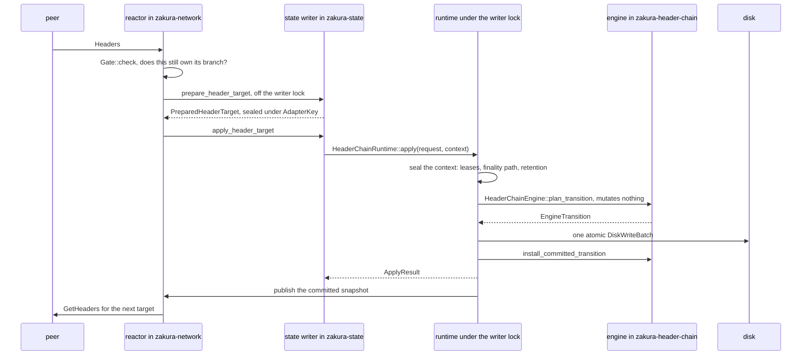

# Header-Chain Request Lifecycle

This guide follows one delivery of headers from a peer socket to fork choice and back. It
explains why that path crosses four layers, what problem each boundary between them solves,
and which types hold the rule at each boundary.

Read the [fork-aware header-chain implementation guide](production_code_header-chain.md)
first. That guide maps the specification onto the crates, modules, and files that implement
it. This guide assumes that map and follows one request through it. The
[fork-aware header-chain specification](../../specs/fork-aware-header-chain-engine.md)
remains authoritative, and rules appear here as `LC-*` citations that name the property the
specification gives each rule.

## The Problem

Four sources can move the chain tip.

- Peers deliver headers.
- Full state verifies block bodies.
- The RPC service handles `invalidateblock`, which excludes a block and its descendants from
  selection, and `reconsiderblock`, which removes that exclusion.
- Finality advances and moves the anchor that every retained branch roots at.

Each source observes something different, and each observation can change which chain the
node calls best. The direct design lets every source compute the new tip from what it
observed. That design fails in two ways.

It fails first because the node then runs one fork-choice implementation per source. Two
implementations can read the same directed acyclic graph (DAG) and pick different tips.

It fails second on ordering, even when every implementation agrees. Each source computes its
answer against the state it read, and a slow source can land its answer after a faster source
has already moved the tip. The late answer then overwrites the newer one. The specification
names that failure directly: a driver or state-response task must not publish the raw result
of a range commit (single frontier publisher, LC-GEN-05).

## One Planner

The node runs one fork-choice implementation.
[`HeaderChainEngine::plan_transition`](../../../crates/zakura-header-chain/src/transition/engine/mod.rs)
is the only code that decides which chain is best, and this guide calls that code the
planner.

```rust
// crates/zakura-header-chain/src/transition/engine/mod.rs
pub fn plan_transition(
    &self,
    input: TransitionInput,
    context: &TransitionContext<'_>,
) -> Result<EngineTransition, TransitionFailure>
```

`input` is authenticated evidence of what happened, never a consequence the caller wants. That
is the mechanism the design rests on. The peer path reports the headers it received. Full state
reports the bodies it verified. The RPC path reports the exclusion an operator asked for. None
of them names a tip, and the planner derives every consequence from what they report: which
headers the node admits, which chain is best, how far finality moves, what the node retains,
and which rows the store writes. The documentation on `TransitionRequest` states the rule in
one line: callers never submit desired consequences.

`&self` means the call mutates nothing, so a plan is a value the caller can inspect, commit, or
drop. The planner runs six phases in order: it authenticates and admits the evidence, binds
replay and freshness, projects the evidence onto staged state, derives finality and retention,
assembles the write set, and verifies the result against the invariants. The same evidence
against the same state produces the same plan.

## Four Layers

One planner stays one planner only while no other layer can restate the decision in its own
terms. A layer restates it by reading the database and deciding what the rows mean, by
publishing a frontier of its own, or by choosing the history the planner validates the
evidence against. Each of those is a fork-choice decision under another name, and the node
would hold two planners again.

The design therefore gives each layer one decision and denies it the rest.

| Layer | Crate | Decides | Cannot |
| --- | --- | --- | --- |
| Reactor | `zakura-network` | when to ask, whom to ask, and how much to ask for | reach the database, run a selection, or publish a frontier |
| State writer | `zakura-state` | when a transition runs and what else lands in the same write | decide what a transition means |
| Runtime | `zakura-state`, under the writer lock | which history the planner judges the evidence against | invent a fact the store does not hold |
| Engine | `zakura-header-chain` | which chain is best | perform any effect, including committing its own answer |

The reactor's prohibition is not a convention. The `Port` trait in
[`zakura-node-services`](../../../crates/zakura-node-services/src/header_chain.rs) lists every
operation the reactor may call, and none of them names the database, so the reactor has no
method that reaches it.

A type carries each of the remaining boundaries. The value that crosses a boundary cannot
express the mistake the boundary prevents, so a reader checks the rule by reading the type
rather than by trusting a convention. The sections after the round trip take the boundaries
in order. Each states the problem the boundary solves, shows the interface, and lists those
types.

## The Round Trip

A peer answers a request on the header-sync stream. The reactor asks whether that answer
still belongs to the branch it was requested for, and then hands it to the state writer in
two calls: one that validates and seals the batch off the writer lock, and one that applies
the sealed batch under it. Under the lock, the runtime reads the history the batch needs from
its own store, the planner derives the transition, and the runtime writes it. The reactor
learns the outcome from the published snapshot and schedules the next request.



The reactor learns what happened from the publisher rather than from the value its own call
returned. Every frontier it schedules against is therefore already on disk.

## Peer to Reactor

The delivery arrives as
[`HeaderSyncMessage::Headers`](../../../crates/zakura-network/src/zakura/header_sync/wire.rs) on
the header-sync stream. Peers are not trusted. Authenticating a peer's key establishes who sent
the message, and it says nothing about whether the contents are true, so every field in the
message is a claim. If the reactor derived a chain fact from that claim, the peer would take
part in fork choice.

So the reactor derives none. It decides when to ask, whom to ask, and how much to ask for.
Those are timing questions, and the reactor holds the only timer. Lower layers decide whether
a header is valid, which chain is best, and whether a late response still counts. The height
a peer attaches to a header never becomes evidence, because height comes from a checked
parent increment further down.

Message framing, schema evolution, and the per-message limits that stop a peer from exhausting
the node belong to the wire protocol rather than to this path. A separate specification for
message expectations and DoS resistance will cover them.

The reactor owns one decision about a response it has already accepted: whether the response
still belongs to the branch that was requested.

```rust
// crates/zakura-header-chain/src/work/completion.rs
pub fn check<O: CompletionOwner>(
    current: &EngineSnapshot,
    pending: &PendingOwners<O>,
    source: SourceId,
    owner: &O,
) -> CompletionDecision  // Current, or Stale(StaleReason)
```

The reactor holds no chain state of its own. Its scheduler keys every unit of work by
generation and branch, so one retirement pass retires exactly the work a reset invalidated
and leaves the rest alive.

| Type | Location | Unrepresentable mistake |
| --- | --- | --- |
| `BranchId` | [`identity/keys.rs`](../../../crates/zakura-header-chain/src/identity/keys.rs) | naming a branch by height. It is `(anchor_hash, target_tip_hash)` and carries no height field, so a reset to a different chain of equal height cannot pass for the same branch |
| `Gate` | [`work/completion.rs`](../../../crates/zakura-header-chain/src/work/completion.rs) | a response acting before anyone asked whether it still owns its branch. It is the sole decision point over `PendingOwners` |
| `PendingOwners` | [`work/completion.rs`](../../../crates/zakura-header-chain/src/work/completion.rs) | an owner surviving its peer's reconnect. The key is `(SourceId, request_id)` and the owner carries the session id, so a reply on a new session for an old request is `OwnerMismatch` |

### Late Responses

`Gate::check` compares the durable coordinates first: the branch anchor, `header_generation`,
and, for body-authorized work, `verified_generation`. It then consults the registry and
returns `Current` or a typed stale reason.

It deliberately ignores `state_version`. That counter advances on every committed transition
that can affect a frontier, including transitions on branches a given request never touches.
Binding header work to it would cancel in-flight requests faster than they complete, and it
would gain no correctness.

A stale decision produces no frontier, coverage, retry, repair, scheduling, publication,
body-task, or peer-score effect (stale-result rejection, LC-GEN-04; zero stale-generation
effects, LC-ACCEPT-03). A peer that answered honestly a moment too late is not misbehaving.
This gate only avoids wasted work. The planner repeats the same comparison against the
pre-transition snapshot with `validate_header_sync_owner`, and that check is the authority.

## Reactor to State Writer

Validating a header takes the database, and the reactor must not touch the database.
Validation also costs CPU, because Equihash and the hash and target checks run per header.
The writer lock serializes every write in the node, so running that work under the lock
stalls every other writer.

The port splits the work in two. Preparation runs off the lock, on a blocking thread, and runs
exactly the rules that read no ancestor.

- The header's own encoding: canonical version, hash, and commitment structure.
- Its height, inferred from the parent and checked.
- Its proof of work: the compact-target domain and Equihash.

Preparation takes the rules in force at that height from a validation lease that the port
obtains through the read service, so the reactor still touches no database. Every remaining
rule needs history, and every one of them waits for the lock. The prepared result comes back
sealed, and only the adapter that issued it can open it.

```rust
// crates/zakura-node-services/src/header_chain.rs
pub trait Port: Send + Sync + 'static {
    /// Validate and seal a complete target outside the serialized state writer.
    fn prepare_header_target(
        &self,
        request: PrepareHeaderTarget,
    ) -> HeaderChainFuture<'_, PrepareHeaderTargetReply>;

    /// Atomically apply a sealed target.
    fn apply_header_target(
        &self,
        target: PreparedHeaderTarget,
    ) -> HeaderChainFuture<'_, ApplyHeaderTargetReply>;

    // Path retention, path reads, locators, and auxiliary repair context
    // are the trait's other operations. None of them names the database.
}
```

The driver in `zakurad` implements the port, and it is the only place that names both
header-sync policy and the state service. The reactor cannot forge or substitute a prepared
batch between the two calls. A header whose time runs more than two hours ahead of the local
clock comes back as `DeferredUntil` rather than rejected (future-header deferral, LC-VAL-08),
so local clock skew never becomes a peer fault.

Preparation off the lock weakens nothing, because the planner trusts no conclusion
preparation reached. Once the lock is held, the planner rechecks the receipt against the live
config, and a batch prepared under a config that has since moved fails with
`StalePreparation` (validation before admission, LC-VAL-11).

| Type | Location | Unrepresentable mistake |
| --- | --- | --- |
| `AdapterKey` | [`zakura-node-services/src/header_chain.rs`](../../../crates/zakura-node-services/src/header_chain.rs) | a prepared batch substituted between the two calls. The adapter seals the target on the way out and is the only holder that can open it on the way back, so two calls are as safe as one |
| `PreparedHeaderBatch` and its receipt | [`transition/types/preparation.rs`](../../../crates/zakura-header-chain/src/transition/types/preparation.rs) | a result that does not say what it was prepared against. The receipt names the parent frontier, the network, and the trust-anchor digest, all three rechecked in the planner |

## State Writer to Runtime

A block and the header node it depends on must not disagree after a crash. Two transitions
running at once would also derive two plans from the same state, and the second to commit
would overwrite the first.

One runtime holds the store, the engine, and the publisher, and every production call to it
is in [`service/write.rs`](../../../crates/zakura-state/src/service/write.rs). Nothing outside
`zakura-state` holds a runtime, so transitions serialize by construction. One committed
transition makes one `db.write` (atomic frontier mutation, LC-TXN-01), with no accumulation
and no background flush. Three call shapes differ only in how much goes into that one write.

```rust
// crates/zakura-state/src/service/finalized_state/header_chain.rs
// Header-chain rows alone.
pub fn apply(
    &self,
    request: TransitionRequest,
    context: &TransitionContext<'_>,
) -> Result<ApplyResult, HeaderChainStoreError>

// Those rows appended to the block batch the state writer already filled.
pub(in crate::service) fn apply_combined<M: FnOnce()>(
    &self,
    request: TransitionRequest,
    context: &TransitionContext<'_>,
    full_state_batch: DiskWriteBatch,
    memory_swap: M,
) -> Result<ApplyResult, HeaderChainStoreError>

// Auxiliary authentication and the checkpoint advance that depends on it,
// planned into that same batch.
pub(in crate::service) fn apply_aux_then_checkpoint_combined<M: FnOnce()>(
    &self,
    first_request: TransitionRequest,
    first_context: &TransitionContext<'_>,
    checkpoint_request: TransitionRequest,
    checkpoint_context: &TransitionContext<'_>,
    full_state_batch: DiskWriteBatch,
    memory_swap: M,
) -> Result<ApplyResult, HeaderChainStoreError>
```

`apply_combined` answers the crash case: one batch is the only way to guarantee that a block
and its header node agree after a restart (full-block integration, LC-INT-03).

Three kinds of caller reach that file. The reactor arrives through `ApplyHeaderChainInsert` on
the write task's channel. The state writer itself submits block commits, body outcomes,
auxiliary results, verified-chain changes, finality, and the exclusion changes from
`invalidateblock` and `reconsiderblock`. The write loop's timer submits `ReevaluateDeferred`
when the deadline from `earliest_deferred()` elapses, which is the one transition no component
observed.

The state writer decides when a transition runs and what else lands in the same write. It does
not decide what the transition means, and it cannot publish: the reactor holds no runtime, and
the runtime is the sole publisher (single frontier publisher, LC-GEN-05).

The range of widths is also why the engine hands its write set back instead of performing it.
The engine cannot open the batch, because the batch spans full-state column families in a crate
the engine must not link. It cannot close the batch either, because the runtime may still add a
second transition.

Two writes sit outside this path, both before the engine exists: the startup repair batch and
the migration batch that builds the initial nodes.

| Type | Location | Unrepresentable mistake |
| --- | --- | --- |
| `HeaderChainRuntime` | [`finalized_state/header_chain.rs`](../../../crates/zakura-state/src/service/finalized_state/header_chain.rs) | a second writer or a second publisher. It holds the store, the engine mutex, the publisher, and the lease registry, and nothing outside the crate holds one |
| `ApplyResult` | [`transition/types/outcome.rs`](../../../crates/zakura-header-chain/src/transition/types/outcome.rs) | an ambiguous outcome. `Committed`, `NoChange`, `Stale`, and `ResourceStalled` are distinct, so `FullStateResourceStalled` is a case the writer must handle rather than a success it can assume |

## Runtime to Engine

A header is not valid or invalid by itself. Zcash derives expected difficulty from
`MedianTime(height) - MedianTime(height - PoWAveragingWindow)`. Checking one header therefore
takes the 17 headers of the averaging window plus the 11 of the median span, 28 blocks in
total. That window also fixes the median-time-past that bounds the header's own timestamp, and
the height decides which rules apply at all. One header is therefore valid below one branch and
invalid below another. Validity is a claim about a header and a stretch of history together.

The node must choose that history, and the source that supplied the header must not choose it.
A peer that also chose the 28 predecessor facts would choose the difficulty for its own header,
and a fabricated but well-formed window would pass.

So the runtime chooses it. Under the lock that will commit the transition, the runtime reads
the parent and the predecessors below it from its own committed store, and seals them with the
network policy and the trust-anchor digest into one validation lease. The engine fetches
nothing, so a gap in the facts is a refusal rather than a default the planner invents.

```rust
// crates/zakura-header-chain/src/transition/engine/input.rs
pub enum TransitionInput {
    InsertHeaders {
        /// What the peer delivered, already prepared and authenticated.
        event: Box<InsertHeaders>,
        /// The history the runtime read for it: predecessor leases plus,
        /// when finality moved, the durable records to rebase against.
        facts: HeaderInsertionFacts,
    },
    // One variant per event. Each carries exactly the facts that event
    // may consume, so unrelated store facts are unrepresentable.
}
```

The runtime supplies a second thing, because finality moves that history while requests are in
flight. Advancing `finalized` moves the anchor, so a batch authorized below the old anchor no
longer roots anywhere. `validate_finality_rebase_path` walks the durable finality history back
from the current anchor to the owner's original one, all or nothing. A second lease for the
pre-transition anchor travels with it, so the planner re-roots only after that walk proves the
move (atomic finalization transition, LC-FINAL-01). The runtime supplies retention third:
merged serving-lease references stop the eviction of a page a peer is reading (snapshot-bound
path serving, LC-WIRE-05).

The division is the same for every event. The caller supplies what it observed, and the runtime
supplies the history the planner judges that observation against.

| Type | Location | Unrepresentable mistake |
| --- | --- | --- |
| `ValidationLease` | [`transition/types/preparation.rs`](../../../crates/zakura-header-chain/src/transition/types/preparation.rs) | predecessor facts arriving loose. The runtime seals the parent, the predecessor facts, the network policy, and the trust-anchor digest under one `context_digest`, and `is_coherent` re-derives that digest and re-walks the backward hash links (post-anchor validation context, LC-ANCHOR-03) |
| `StateIssuedAuthority` | [`finalized_state/header_chain.rs`](../../../crates/zakura-state/src/service/finalized_state/header_chain.rs) | a lease from anywhere but this call. It wraps the caller's authority over exactly the leases the runtime just issued |
| `FullStateEvidenceAuthority` | [`transition/authority.rs`](../../../crates/zakura-header-chain/src/transition/authority.rs) | an implementation that admits evidence by omission. Every method except `authorizes_full_state` defaults to `false`, and the transition context holds the authority as an `Option`, so absent authority has no representation but `TransitionFailure::Authority` |

### Note-Commitment Roots

One kind of evidence does not fit in a lease. Peer-supplied note-commitment roots depend on no
fixed number of predecessors, and nothing below the last checkpoint verifies the header
commitment field they feed. Authenticating one root takes a running ZIP-221 history tree over
the committed body tip and every selected header above it. That history has no bound, so no
lease can seal it.

The state writer authenticates that evidence outside the lease instead. Its sweep in
[`vct_authentication_sweep.rs`](../../../crates/zakura-state/src/service/write/vct_authentication_sweep.rs)
walks the selected path above the committed body tip, keeps a running history tree over that
prefix, and checks each delivery against the commitment the next selected header carries. An
attributable failure becomes a rejection, an ambiguous one a dispute, and either asks for
replacement metadata at once. Each verdict returns as ordinary auxiliary evidence, and until
one arrives the delivery drives no validity and no fork choice (unauthenticated metadata
isolation, LC-AUX-02; cryptographic metadata authentication, LC-AUX-04). The committer
authenticates every delivery it folds, so the sweep shortens the window a wrong root survives
rather than moving the trust boundary.
[`header-sync-vct-root-authentication.md`](../header-sync-vct-root-authentication.md) carries
that design in full.

### History Requirements by Event

What the runtime must prove about the past sorts the events into three groups.

- **A sealed window.** `InsertHeaders` alone, the only event that admits material from an
  untrusted source.
- **One sealed predecessor.** The verified-chain events, each leased against a different
  frontier, plus a pin refutation. The refutation takes a durable row instead, and only when
  the store holds that pin as migrated.
- **Nothing.** Every other event, whose evidence is self-contained. `FullStateFinalized` sits
  here despite doing the most: it moves the anchor and prunes every non-descendant while
  reading nothing, because the caller hands over the verified ancestry with it.

## Engine Planning

Fork choice has to be reproducible, and a plan that mutated live state could not be dropped.
The engine therefore reaches no disk, no socket, no task, and no clock of its own. Time arrives
through `Clock` and durable rows through the facts types, so the engine observes nothing it was
not handed.

Purity here has its usual meaning: same inputs, same output, no effect the caller did not ask
for. The engine hides no state, because the caller passes it in. Planning the same event against
the same state twice returns the same plan, and dropping a plan leaves no write, no publication,
and no change in the engine. A test can reproduce fork choice from a graph, a config, a clock,
and an ordered event list, without running a node.

Planning runs against an overlay rather than the graph itself. Selection reads and writes the
graph through `HeaderGraphView` and `HeaderGraphEdit`, which the overlay and the committed graph
both implement, so one implementation of fork choice serves staged and committed state alike.
Selection cannot behave one way on staged state and another way on committed state.

```rust
// crates/zakura-header-chain/src/transition/planner/plan.rs
impl EngineTransition {
    pub const fn change_set(&self) -> &ChangeSet;              // rows the store will write
    pub const fn snapshot_before_commit(&self) -> &EngineSnapshot;  // state it was derived from
    pub fn snapshot_after_commit(&self) -> EngineSnapshot;     // state to publish once written
    pub const fn domain(&self) -> TransitionDomain;
    pub const fn effect(&self) -> TransitionEffect;
    pub fn is_no_change(&self) -> bool;
}
```

That is the whole caller surface. The graph delta the engine will install stays private, and
`from_verified` is the only constructor.

| Type | Location | Unrepresentable mistake |
| --- | --- | --- |
| `GraphOverlay`, `GraphDelta` | [`graph/overlay.rs`](../../../crates/zakura-header-chain/src/graph/overlay.rs) | planning that touches the live graph, or a hand-assembled difference. Reads see the base plus what the overlay staged, writes land in the overlay's own maps, and the delta's fields are crate-private |
| `EngineTransition` | [`transition/planner/plan.rs`](../../../crates/zakura-header-chain/src/transition/planner/plan.rs) | a batch reaching disk that the planner did not derive, or one that reached disk unverified. `from_verified` is its only constructor and takes a `PlanCandidate` that `verify_candidate` has already passed |
| `snapshot_before_commit()` and `StaleSource` | [`transition/engine/mod.rs`](../../../crates/zakura-header-chain/src/transition/engine/mod.rs) | installing a plan against state it was not derived from. `plan_transition` takes `&self`, so two planners can race, and only one can install |
| `Frontier` | [`graph/frontier.rs`](../../../crates/zakura-header-chain/src/graph/frontier.rs) | naming a position on a chain by height alone. It is a height and a hash together, and it is the only way this design names a position |
| `WorkCoordinate` | [`graph/frontier.rs`](../../../crates/zakura-header-chain/src/graph/frontier.rs) | comparing accumulated work across origins. It carries the origin hash, so a mismatched pair raises an error instead of yielding a smaller number that decides fork choice with nothing logged |
| `RetentionPlan` | [`transition/planner/retention.rs`](../../../crates/zakura-header-chain/src/transition/planner/retention.rs) | a resource limit passing for a verdict about a chain. When protected paths alone fill the node bound it sets `admission_refused` and `resource_stalled` rather than evicting protected state or synthesizing finality for room (fork and node limits, LC-RETAIN-01) |
| eligibility as durable reasons | [`graph/header_node.rs`](../../../crates/zakura-header-chain/src/graph/header_node.rs) | fork choice depending on arrival order. Ineligibility is a set of reasons rather than a flag, and a flag would make eligibility depend on update order |

### Validation Passes

Validation runs four times before disk, each pass against more context than the last.

1. **Off the writer lock**, `prepare_headers` runs the rules that read no ancestor and seals
   the result under a receipt.
2. **Under the lock, before planning**, the runtime reads the predecessor facts itself rather
   than accepting any the caller supplies, and seals them into leases.
3. **In the planner, against the graph**, the receipt's parent, network, and trust-anchor digest
   must still match the live config. The planner then re-derives, per header, the parent link,
   the hash, the height increment, and the work from the compact target. It runs the contextual
   difficulty and time check against ancestry it reads from the graph and the lease.
4. **After planning and before disk**, `verify_candidate` re-derives the projected result:
   linkage and hashes, index round-trips, work coordinates, inherited eligibility, both
   projections' contiguity, that `header_best` really is the maximum eligible score, protected
   nodes, generation increments, and auxiliary provenance.

No pass trusts the one before it. The fourth checks the plan against the graph
`GraphOverlay::from_delta` projects from the delta, not against the overlay the planner mutated.
That projection binds to the graph revision the delta was derived from, so a delta built against
a graph that has since moved fails as `StaleDelta` instead of validating against the wrong base.
The verifier therefore approves the transition the engine will install rather than the one it
staged. A disagreement between the planner and the verifier is an `InvariantViolation`, and that
batch never reaches disk. Startup adds one more pass that no caller triggers: `audit_store`
re-derives what the DAG determines before the engine exists.

## Commit Order

A crash can land between the write, the in-memory install, and the notification. Only one order
leaves a state that startup can repair.

The runtime writes disk, then memory, then observers. Disk is what the next restart reads. A
crash in that order leaves disk ahead of memory, which the startup audit repairs by rehydrating
from the authoritative node rows. In any other order a crash can leave an observer holding a
frontier that is not on disk, and nothing repairs that.

The schema makes the order repairable, not the code path. The authoritative rows are the
per-node rows in `header_node_by_hash_v1` and the singleton in `header_engine_meta_v1`. Children,
heights, eligibility roots, deferrals, and both projections are caches the startup audit rebuilds
from those node rows.

`apply_combined_inner` is that path, and every call shape reaches it. It refuses on a
`migrated_pin_refuted` alarm before any effect, and checks a combined caller's staged headers
against the projected DAG before the write. Three outcomes then leave early.

- A no-change plan commits the caller's batch alone and publishes nothing.
- A `ResourceStalled` plan commits its alarm-only change set with a fresh batch, so the state
  writer maps that outcome to `FullStateResourceStalled` and stops rather than treating its own
  rows as written (fork and node limits, LC-RETAIN-01).
- A plan carrying `migrated_pin_refuted` commits and installs, then returns without publishing,
  so the node fails closed on the alarm it just made durable (mode and finality provenance,
  LC-FINAL-04).

A failure between the write and the install fails closed: the runtime returns the store error,
publishes nothing, and the next open rehydrates the engine from disk.

| Type | Location | Unrepresentable mistake |
| --- | --- | --- |
| `FaultPoint` | [`finalized_state/header_chain.rs`](../../../crates/zakura-state/src/service/finalized_state/header_chain.rs) | an untested crash window. Ordered fault points let the recovery tests interrupt each step and check that reopening finds the complete before state or the complete after state (durable deterministic frontiers, LC-ACCEPT-02; deterministic startup reconstruction, LC-RECOVER-02) |
| `audit_store`, `RecoveryPlan` | [`transition/recovery/`](../../../crates/zakura-header-chain/src/transition/recovery/) | startup trusting a stored answer. It re-derives what the DAG determines, recomputes selection, and repairs only reconstructible categories, and it fails closed with publication still disabled on a store that is not one coherent chain (startup integrity audit, LC-RECOVER-01) |
| `install_committed_transition` | [`transition/engine/mod.rs`](../../../crates/zakura-header-chain/src/transition/engine/mod.rs) | memory disagreeing with disk. It is the only mutator, and it refuses a transition whose `snapshot_before_commit()` no longer matches |

## Publication and Retirement

The loop closes here, and this is where the ordering failure from the first section would return.
A component that publishes a commit result it did not obtain from the serialized writer can
announce a frontier derived from work whose branch was already reset, and that obsolete
completion undoes the reset.

So the runtime publishes, and nothing else may (single frontier publisher, LC-GEN-05). It
publishes a committed snapshot on a latest-value watch channel, and `snapshot()` and
`subscribe()` are the entire published surface.

```rust
// crates/zakura-state/src/service/finalized_state/header_chain.rs
impl Publisher {
    /// Return the latest durable snapshot.
    pub fn snapshot(&self) -> EngineSnapshot;

    /// Subscribe to the latest durable snapshot without replay dependence.
    pub fn subscribe(&self) -> watch::Receiver<EngineSnapshot>;
}
```

The reactor therefore learns what committed from the publisher. Every frontier it acts on is one
the writer committed, in the order the writer committed them.

A committed transition also returns `RetiredWork`: the two generation-changed flags plus the exact
owners retired for narrower causes. The reactor applies retirement before it schedules any forward
work for the new branch (generation-scoped forward work, LC-WORK-01; branch-scoped VCT repair,
LC-AUX-03). Retiring afterwards would either cancel a just-scheduled request or leave a dead one
alive. The reactor then schedules from committed state alone, because a projected value escaping
the read surface would put peers to work on a frontier that may never commit.

| Type | Location | Unrepresentable mistake |
| --- | --- | --- |
| `Publisher` | [`finalized_state/header_chain.rs`](../../../crates/zakura-state/src/service/finalized_state/header_chain.rs) | a published frontier that is not on disk. It is a latest-value channel fed only from inside the writer lock, so a published snapshot is by construction one the writer committed |
| `RetiredWork` | [`transition/types/outcome.rs`](../../../crates/zakura-header-chain/src/transition/types/outcome.rs) | a reset that leaves dead work alive, or a retirement that cancels a just-scheduled request. It names the generation flags and the exact owners |
| `HeaderLocator` | [`discovery/mod.rs`](../../../crates/zakura-header-chain/src/discovery/mod.rs) | a locator built from anything but committed state. It builds from the committed selected projection and fails with `StoreError::Incoherent` on a gap |
| cancelled-id window | [`header_sync/pipe.rs`](../../../crates/zakura-network/src/zakura/header_sync/pipe.rs) | an honest answer to a cancelled request scored as misbehavior. The pipe drops recently cancelled ids for a short grace window instead |
