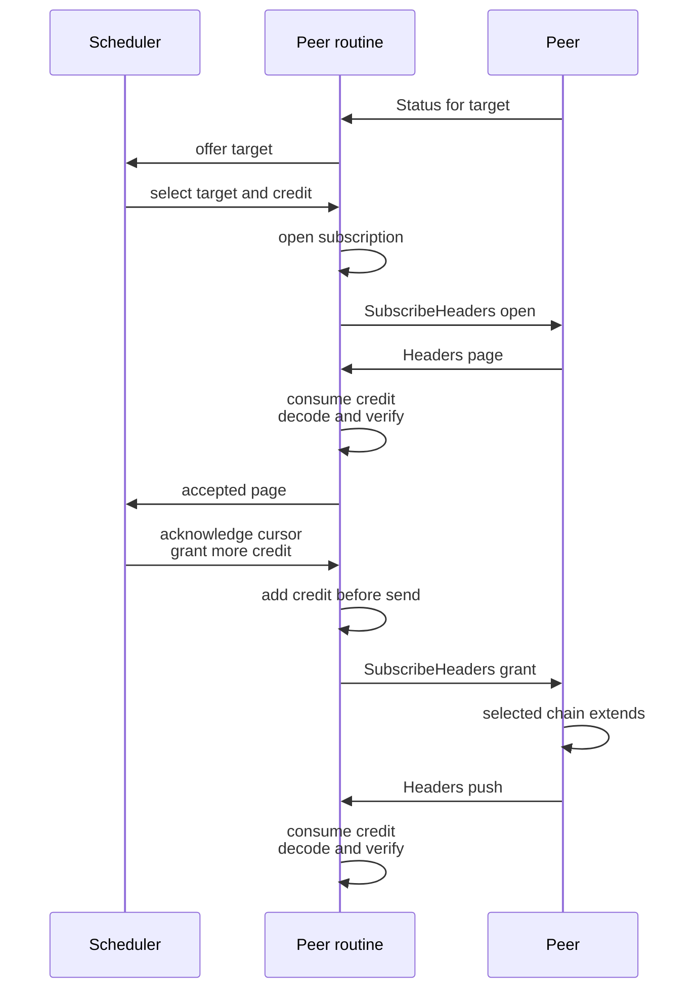

# Zakura peer message regulation: design

> **Status: first draft.** Companion to the
> [peer message regulation specification](../specs/peer-message-regulation.md), which states the
> rules. This document gives the reasons and the shape of the implementation. Scope is the three
> Zakura native reactors: discovery, header sync, block sync.

## Problem

Zakura must be able to fully utilize each p2p connection without letting a peer overwhelm the node.
A byte limit cannot achieve both goals because equal-sized messages can cause very different CPU,
memory, disk, lock, and response costs. Zakura therefore bounds work instead.

Before Zakura handles an inbound message, it applies every filter required by that message's role:

1. **Safe** — Frame checks and bounded decoding run before allocation or expensive verification.
2. **Authorized** — A response must match a live reservation created by a request we sent.
3. **Useful** — The message must be relevant and not repeat work we already handled.
4. **Budgeted** — The message must stay within the bound selected for its role.

The message role selects the work bound. Announcements use a declared cadence. Requests pay
according to the work needed to answer them. Responses consume the reservation created by our
request. A subscription is a reservation that allows several responses within subscriber-issued
header and byte credit. Legal but useless messages are dropped after they consume a cadence token,
reservation, or separate drop budget.

Only bounded announcement metadata may arrive without a reservation. A strict cadence bounds that
metadata. Headers, blocks, and other application objects require a one-shot reservation, range
reservation, or subscription.

A gate may disconnect a peer only for behavior that a conformant sender cannot produce. Every
inbound rule therefore has a matching outbound obligation with a safety margin. Local scheduling
decisions never create peer violations. A reservation remains live until its response arrives or
the connection ends.

These message rules do not address a peer that follows the protocol but wastes a connection slot.
Peer-set policy handles that case separately.

## Design

Each message type declares its byte cap, applicable filters, and filter bounds. The peer routine
calls `admit` once before dispatching the message to its handler. `admit` returns `Continue`, `Drop`,
`Delay`, `Disconnect`, or `LocalFault`.

Only applicable filters run. The implementation orders them by one rule: a filter runs before the
work that it bounds.

```text
frame check
  → cadence check
  → reservation lookup
  → bounded decode and verification
  → uniqueness and relevance
  → work charge
  → handler
```

This order varies by message role. Announcements pay their cadence before verification. Responses
find a reservation before decode because the reservation supplies their decode bounds. Requests pay
their estimated response cost before the handler serves them. The work budget charges the upper
bound at admission and refunds unused work after the response completes.

Header sync demonstrates every message role:

| Message | Role | Filters | Result when a filter stops it |
| --- | --- | --- | --- |
| `Status` | Announcement | Frame, Decode, Relevant, Cadence | Disconnect on a broken cadence; drop a status that cannot affect a receiver decision |
| `SubscribeHeaders` | Request | Frame, Decode, Reservation, Work | Disconnect an invalid subscription update; delay a credit grant when the work budget is empty |
| `Headers` | Response | Frame, Decode, Verify, Reservation | Disconnect a page outside its subscription |
| `HeadersOutcome` | Response | Frame, Decode, Reservation | Disconnect an unsolicited or invalid outcome |

A header subscription turns push into an authorized response stream. The subscriber opens a
subscription from an accepted base to one advertised target. It supplies a locator, an auxiliary
schema, and header and byte credit. The publisher first pushes the path to that target. The same
subscription then authorizes direct descendants as the publisher's selected chain grows. Each page
must extend the subscription cursor and consume both credits.

The subscriber renews the subscription by acknowledging an accepted cursor and adding credit. The
publisher keeps a bounded ring of sent cursors until the subscriber acknowledges them. A close
update stops new pages. The publisher then sends a terminal `HeadersOutcome` after every page
already queued unless it already queued a terminal response.

The initial locator states which bases the subscriber has. An acknowledgement states which later
cursor the subscriber accepted. A conformant publisher may rely on those statements. The publisher
may also send a child after it queues the parent earlier on the same ordered stream. Existing credit
must cover both headers. Merely sending a header does not create more credit.

The protocol treats a locator or acknowledgement as authorization, not proof of application state.
A subscriber can lie about what it accepted. That lie can spend only the Work budget assigned to
that peer. Peer-set policy handles a peer that consumes a connection without advancing sync.

The subscription records the initial target, response identity, decode bounds, receive cursor, and
remaining credit. It remains live until a terminal outcome or the connection ends. The subscriber
updates the subscription before it sends an open or credit-grant message, so a fast response always
finds its bounds.

The publisher may push a new header immediately when its selected chain extends the subscription
cursor and credit remains. It does not need to send another `Status`. If its selected chain no
longer extends that cursor, it must stop pushing and send a terminal `SubscriptionSuperseded`
outcome. It announces the new target under the strict `Status` cadence. The subscriber opens
another subscription if it selects that target.

The publisher also owes progress. While credit remains and its own `Status` advertises a tip
beyond the subscription cursor, it must push within a declared deadline. A quiet subscription is
therefore either honestly idle or a violation. Without this rule a peer could advertise work,
never serve it, and hold the subscription slot forever.

The scheduler may retire or reassign the underlying work without changing the reservation. A later
response still consumes the reservation, passes bounded verification, and reaches its handler. We
asked for it, so we take it. A response without a reservation disconnects the peer.

The subscriber authorizes only work it wants when it grants credit. Another peer, a reorganization,
or finality may arrive before an in-flight page does. The subscriber keeps the subscription long
enough to admit that page and admits it. Outstanding credit bounds this race. The subscriber
withholds the next grant instead of discarding a page it already paid for.



Block sync currently destroys reservations when it retires work. Its unmatched-response exceptions
compensate for that error. Preserving reservations removes those exceptions and makes
unsolicited-response handling unconditional.

Budgets bound inbound work; the outbound direction needs its own bound. The work refund and refill
regenerate admission tokens, not delivery, so a peer that requests responses and never reads them
would grow the send buffer without limit. The receiver therefore bounds unsent response bytes per
peer, blocks only that peer's path at the bound, and may disconnect a peer that stops draining.

## Testing and introspection

Four test layers keep declarations, codecs, gate state, and runtime behavior aligned:

| Layer | Required properties |
| --- | --- |
| **Declaration tests** | Every message handler has one declaration. Every declaration has one handler. Every message declares a byte cap and work bound. |
| **Property tests** | Legal messages have one canonical encoding and fit within their declared caps. Generated gate-event sequences preserve reservation, budget, and state-size invariants. A conformant sender never produces `Disconnect`. |
| **Fuzz tests** | The decoder never panics on arbitrary frames. It rejects trailing bytes and bounds every allocation before decode. |
| **Panic isolation** | A panic in a decoder, handler, or port operation is caught at its boundary. The process survives, other peers keep running, and the work returns to the scheduler. |
| **Trace tests** | Declared unique keys appear at most once. Honest regtest nodes never produce a `Disconnect` verdict. |

Each gate emits a structured decision to `regulation.jsonl`. Production records non-`Continue`
decisions. The regtest harness records every decision and checks the full trace with
`trace_oracle.py`.

Reservation handling uses a model-based property test. A generator opens, grants, and closes
subscriptions. It also reassigns work, advances finality, delivers responses and duplicates, and
closes connections. A small reference model checks that each admitted response consumes live header
and byte credit. It also checks that local scheduler actions never remove reservations and that
subscription state never exceeds its declared bounds.

Each message verifier has no I/O, locks, or shared state. This makes every verifier an independent
fuzz target. The regtest corpus provides the initial fuzz inputs.

## Adoption order

Implement the design in five steps:

1. Declare all 14 target message types. Add declaration drift tests and replace `PipeShape`.
2. Build one cadence budget per `(peer, message type)` from the message declarations.
3. Preserve block-sync reservations until a response arrives or the connection ends. Then remove
   the unmatched-response exceptions.
4. Give each peer an independent processing path. This must land before any `Drop` becomes `Delay`.
5. Replace `GetHeaders` with `SubscribeHeaders`. Price each credit grant by its byte credit and add
   the subscription reservation.

Only the final step adds header push and a work bound that Zakura lacks today. The earlier steps
create the structure needed to enforce both safely.

Message priority and stream layout remain out of scope. They require a separate specification and
design.
