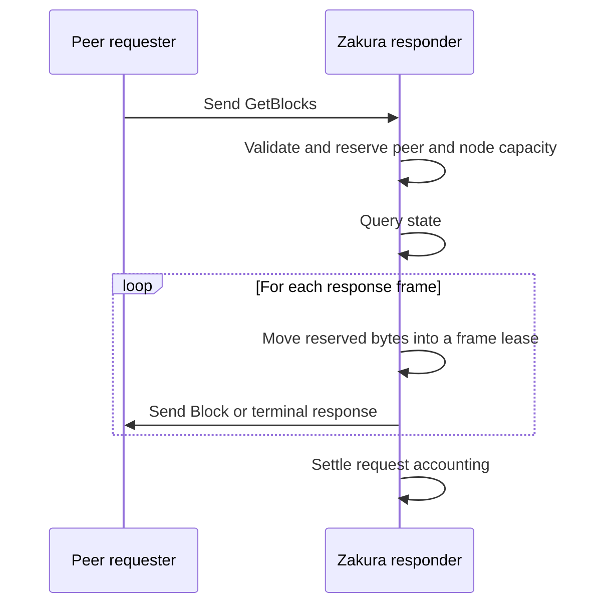
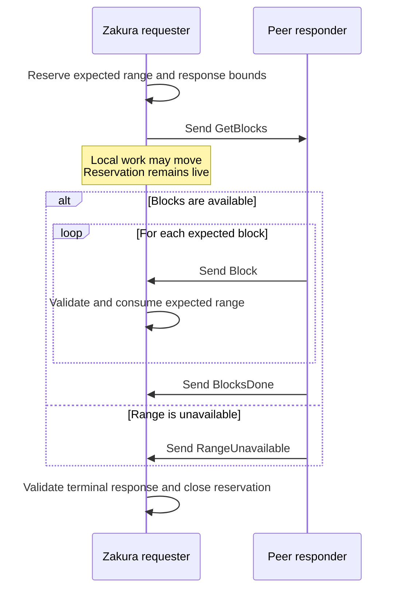

# Native P2P message regulation: design

> **Status: proposal.** The
> [message-regulation specification](../specs/native-p2p/regulation.md)
> defines the required behavior. This document explains why the controls are
> separate and how they compose. The
> [property-testing design](property-testing.md) defines how that behavior is
> tested.

Message regulation is traffic control for Zakura's native P2P services. It
decides how much peer-caused work may enter the node, how long that work owns
capacity, and what happens at a limit. Property testing is one way to verify
those decisions; it is not the regulation itself.

## Problem

Per-message validation prevents malformed input, but valid messages can still
consume too much CPU, memory, disk, state work, or outbound bandwidth. A
per-peer limit alone is not sufficient because one operator can create many
peer identities. A node-wide limit alone allows one peer to consume the whole
node.

Before Zakura acts on an inbound message, it answers four questions:

1. **Safe** — Can it frame, allocate, decode, and validate the message within
   fixed bounds?
2. **Expected** — If it is a response, does it match a live request or
   reservation?
3. **Actionable** — If it is valid but stale or unable to affect Zakura's state,
   should it be ignored without penalizing the peer?
4. **Affordable** — Can the peer and node admit all work and response bytes
   caused by the exchange? Otherwise, use the contract's declared wait, reject,
   or drop outcome.

For a request, Zakura accounts for the whole exchange, not just the inbound
frame. Its work and response bytes remain bounded through pending queues,
service handoffs, and outbound buffers, and are released when the exchange
completes or ends early.

Message regulation controls traffic from connected peers; it does not choose
those peers. A peer can follow the protocol without contributing useful work,
which is handled separately by peer-selection policy.

## How regulation applies in each direction

Every node protects itself from messages it receives. A message has one of
three roles:

- An **announcement** is an update the peer sends without being asked, such as
  `Status`. Zakura limits its size, cadence, and state effects.
- A **request** asks Zakura to perform work and reply, such as `GetBlocks`.
  Zakura limits the request and all work and response bytes it can cause.
- A **response** answers a request Zakura previously sent, such as `Block`.
  Zakura accepts it only when it is valid and matches the request.

### When a peer requests data from Zakura

When a peer sends `GetBlocks`, Zakura is the responder. The request reserves
peer and node capacity for the state query and every response frame before the
work starts. Those frames spend the request's reserved capacity rather than
being charged as separate exchanges.



#### Inside Zakura: admitting the request

The checks depend on the request, but the serving path follows this order:

```text
frame header and per-message cap
  → bounded decode and wire validation
  → peer/session and protocol prerequisites
  → provisional resource admission
  → reactor or service handoff
  → committed handler work
  → leased response frames
  → settlement
```

The frame header identifies the message before Zakura allocates its payload.
The transport rejects a payload above that message's cap at that point. A
stream-wide maximum remains a final ceiling, not a substitute for the
message-specific cap.

Validation that needs no shared state runs before expensive work. Local
availability and lifecycle checks must distinguish peer behavior from races
created by replacement, finality, or scheduling. Zakura disconnects only when a
conformant sender could not have produced the input.

This is the serving direction implemented by GetBlocks regulation. It protects
Zakura from request floods and from response work accumulating in memory.

### When Zakura requests data from a peer

When Zakura sends `GetBlocks`, Zakura is the requester. Before sending it,
Zakura records the expected range and response bounds. Every incoming response
must match and consume that reservation. Wire and message validity checks still
apply, so the peer cannot use a valid reservation to send an oversized or
invalid payload.



Charging serving work to the request does not remove the response contracts.
`Block`, `BlocksDone`, and `RangeUnavailable` still need their own wire and
receiving-side rules when Zakura receives them.

## Life of a regulated request

The design covers both directions, but each requires different controls. The
rest of this document follows the first regulated request path, where Zakura
serves `GetBlocks`. Zakura reserves capacity for the whole exchange, follows a
declared overload outcome when capacity is unavailable, carries ownership with
the work, and releases the capacity on every exit. Responses Zakura receives
remain governed by their own message contracts.

### 1. Reserve capacity for the whole exchange

A request can consume several resources over its lifetime:

| Control | What releases it | Purpose |
| --- | --- | --- |
| Rate bucket | Time and permitted refunds | Bounds bursts and sustained throughput |
| Outstanding budget | Work completion or cancellation | Bounds admitted work that remains resident |
| Response backlog | Transport write or frame drop | Bounds response bytes owned by one session |
| Concurrency ledger | Terminal request settlement | Bounds active request count |
| Pending-input bound | Admission progress or session end | Bounds decoded requests waiting to be admitted |

A refilling rate bucket cannot bound stalled work. If unfinished requests stay
resident while tokens refill, outstanding work can grow forever. Conversely,
an outstanding budget alone does not bound sustained throughput. Regulated
requests therefore use both.

The same distinction applies at two scopes:

- **Peer controls** isolate identities and sessions.
- **Node controls** cap aggregate work even when an attacker uses many peers.

The node controls are the security boundary. Peer controls provide isolation
and fairness within it. Every configured per-peer collection must also have an
aggregate bound at the maximum connection count.

### 2. Follow the declared overload outcome

If capacity is unavailable, the message contract decides whether the request
waits, is rejected, or is dropped. A waiting request must not reach the handler
or be charged twice when retried. It waits only on the resource that blocked
it.

Waiting for one peer must not hold shared locks, writers, or handler permits.
Other peer routines remain independently runnable. Without an explicit
scheduler policy, regulation promises isolation rather than a fixed fairness or
latency bound. Native tests may report observed latency under a named topology,
but that measurement is not a protocol guarantee.

Stopping all reads is the smallest backpressure mechanism on a one-way stream.
On a bidirectional ordered stream it can also trap responses to requests Zakura
sent. A contract may therefore use bounded demultiplexing while one admission
waits, provided it defines:

- which message classes may continue;
- the per-session and aggregate pending-input bound;
- the outcome when that bound is full; and
- a full-duplex progress property.

#### GetBlocks choice

`GetBlocks` uses bounded demultiplexing so block responses can pass a delayed
serving request on the same stream. Its pending-input capacity allows one active
admission plus the advertised in-flight count queued behind it; requests beyond
that pre-reactor capacity are dropped without a peer score. The separate
committed-request ledger rejects excess admitted requests with the response
declared by the GetBlocks contract. That contract must validate aggregate
pending-input memory at the maximum connection count and confirm that required
response traffic continues to make progress.

After a GetBlocks request commits, a full output queue drops the unsent frame,
settles the request ownership, and keeps the session connected. A closed or
otherwise failed output queue ends the session and settles the same ownership,
cancelling it if it remains registered when the failure is observed. Neither
local failure scores the peer or promises a terminal frame over the unavailable
output path.

### 3. Carry ownership with the work

Resource ownership follows the work instead of relying on matching refund calls:

```text
admission attempt → committed request permit → frame leases → released
```

An admission attempt holds provisional peer and node charges. Dropping it
before commit restores all of them. Commit occurs only after the receiving
service confirms that the originating session still owns the peer.

The committed permit is bound to the service's request identity. Its fixed
request overhead remains spent. Unused response capacity is refundable.

When the handler queues a response, capacity transfers from the permit into a
lease carried with that frame. Reserving the queue slot happens before the
transfer, so a failed enqueue moves no accounting. The lease ends when the
transport accepts the write or drops the frame.

QUIC may retain bytes after the application write completes. Its send-window
envelope is a separate transport bound and must be included in slow-reader
tests.

### 4. Release capacity on every exit

Completion, rejection, channel failure, cancellation, disconnect, and
replacement all settle the same owned permit exactly once. A stale or
mismatched completion must not release another request's resources.

Session-owned resources, including response backlog and queued frames, end with
the session rather than transferring to its replacement. A rate bucket may
instead follow an authenticated identity across reconnects so reconnecting does
not grant a fresh burst.

Any inactive identity cache must be bounded. It may discard a fully refilled
entry because recreating it grants no additional work. An eviction policy must
state the maximum allowance a prematurely evicted identity can regain, and it
must not evict an active or permit-referenced account.

## Operating the controls

### Validate configuration

All charge arithmetic uses checked operations and local configuration. Startup
validation ensures that the largest legal request fits every applicable burst,
outstanding, and backlog capacity, so a valid request cannot wait forever
because it can never fit.

### Make decisions observable

Operators need to distinguish peer behavior, expected overload, and local
failure. Regulation records:

- the exchange and peer;
- the bound that delayed or rejected work;
- requested, reserved, transferred, used, and refunded units; and
- the terminal reason.

Metrics use bounded labels. Peer identities belong in trace rows, not metric
labels. A shared regulation log is unnecessary until more than one service
needs it.

## Extending regulation to other messages

The first exchange should validate generic primitives without forcing every
message through a speculative framework:

1. Specify the exchange and its load properties.
2. Build generic rate, outstanding, and frame-lease primitives.
3. Compose message-specific attempt and permit types beside the service.
4. Validate logical accounting, native load, slow readers, and honest progress.
5. Compare the second regulated exchange with the first before extracting a
   shared declaration API.

Cadence, response reservations, and verification filters should move into a
common facade only when a second implementation demonstrates the same shape.
The production design must remain understandable without the property-test
model.

Message priority, connection-slot policy, Sybil-resistant peer selection, and
stream layout are outside this design.
