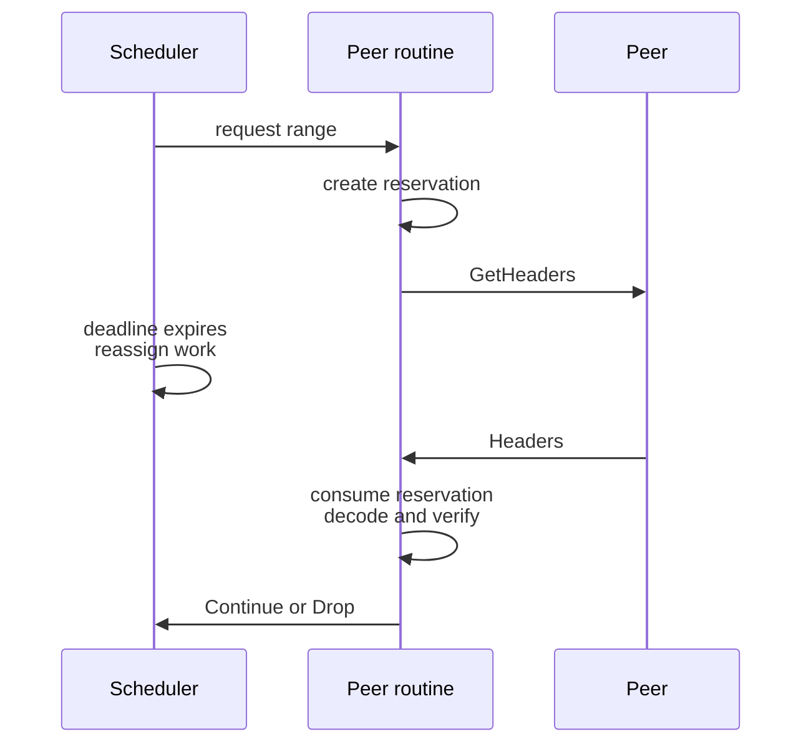

# Zakura peer message regulation: design

> **Status: first draft.** Companion to [`final_draft_spec.md`](./final_draft_spec.md), which states
> the rules. This document gives the reasons and the shape of the implementation. Scope is the three
> Zakura native reactors: discovery, header sync, block sync.

## Problem

Zakura must be able to fully utilize each p2p connection without letting a peer overwhelm the node. A byte limit cannot achieve
both goals because equal-sized messages can cause very different CPU, memory, disk, lock, and
response costs. Zakura therefore bounds work instead.

Before Zakura handles an inbound message, it applies every filter required by that message's role:

1. **Safe** — Frame checks and bounded decoding run before allocation or expensive verification.
2. **Authorized** — A response must match a live reservation created by a request we sent.
3. **Useful** — The message must be relevant and not repeat work we already handled.
4. **Budgeted** — The message must stay within the bound selected for its role.

The message role selects the work bound. Announcements use a declared cadence. Requests pay
according to the work needed to answer them. Responses consume the reservation created by our
request. Legal but useless messages are dropped and charged to a bounded drop budget.

A gate may disconnect a peer only for behavior that a conformant sender cannot produce. Every
inbound rule therefore has a matching outbound obligation with a safety margin. Local scheduling
decisions never create peer violations. A reservation remains live until its response arrives or
the connection ends.

These message rules do not address a peer that follows the protocol but wastes a connection slot.
Peer-set policy handles that case separately.

## Design

Each message type declares its byte cap, applicable filters, and filter bounds. The peer routine
calls `admit` once before dispatching the message to its handler. `admit` returns `Continue`, `Drop`,
`Delay`, `Disconnect`, or `LocalFault`.

Only applicable filters run. The implementation orders them by one rule: a filter runs before the
work that it bounds.

```text
frame check
  → cadence check
  → reservation lookup
  → bounded decode and verification
  → uniqueness and relevance
  → work charge
  → handler
```

This order varies by message role. Announcements pay their cadence before verification. Responses
find a reservation before decode because the reservation supplies their decode bounds. Requests pay
their estimated response cost before the handler serves them. The work budget charges the upper
bound at admission and refunds unused work after the response completes.

Header sync demonstrates every message role:

| Message | Role | Filters | Result when a filter stops it |
| --- | --- | --- | --- |
| `Status` | Announcement | Frame, Decode, Relevant, Cadence | Disconnect on a broken cadence; drop an unchanged tip |
| `GetHeaders` | Request | Frame, Decode, Unique, Work | Disconnect a forbidden repeat; delay when the work budget is empty |
| `Headers` | Response | Frame, Decode, Verify, Reservation, Relevant | Disconnect an unsolicited or invalid response; drop a valid response if its work is gone |
| `HeadersOutcome` | Response | Frame, Decode, Reservation, Relevant | Disconnect an unsolicited or invalid outcome; drop a valid outcome if its work is gone |

A reservation represents the protocol exchange, not the scheduler's current interest in the work.
We create the reservation before sending a request. The reservation records the expected response
identity and decode bounds. It remains live until the response arrives or the connection ends.

The scheduler may retire or reassign the underlying work without changing the reservation. A later
response still consumes the reservation and passes bounded verification. The relevance filter then
drops it if the scheduler no longer needs it. A response without a reservation disconnects the peer.



Block sync currently destroys reservations when it retires work. Its unmatched-response exceptions
compensate for that error. Preserving reservations removes those exceptions and makes
unsolicited-response handling unconditional.

## Testing and introspection

Four test layers keep declarations, codecs, gate state, and runtime behavior aligned:

| Layer | Required properties |
| --- | --- |
| **Declaration tests** | Every message handler has one declaration. Every declaration has one handler. Every message declares a byte cap and work bound. |
| **Property tests** | Legal messages have one canonical encoding and fit within their declared caps. Generated gate-event sequences preserve reservation, budget, and state-size invariants. A conformant sender never produces `Disconnect`. |
| **Fuzz tests** | The decoder never panics on arbitrary frames. It rejects trailing bytes and bounds every allocation before decode. |
| **Trace tests** | Declared unique keys appear at most once. Honest regtest nodes never produce a `Disconnect` verdict. |

Each gate emits a structured decision to `regulation.jsonl`. Production records non-`Continue`
decisions. The regtest harness records every decision and checks the full trace with
`trace_oracle.py`.

Reservation handling uses a model-based property test. A generator creates requests, reassigns or
retires work, advances finality, delivers responses and duplicates, and closes connections. A small
reference model checks that each admitted response consumes exactly one live reservation. It also
checks that local scheduler actions never remove reservations and reservation state never exceeds
our inflight bound.

Each message verifier has no I/O, locks, or shared state. This makes every verifier an independent
fuzz target. The regtest corpus provides the initial fuzz inputs.

## Adoption order

Implement the design in five steps:

1. Declare all 14 message types with current behavior. Add declaration drift tests and replace
   `PipeShape`.
2. Build one cadence budget per `(peer, message type)` from the message declarations.
3. Preserve block-sync reservations until a response arrives or the connection ends. Then remove
   the unmatched-response exceptions.
4. Give each peer an independent processing path. This must land before any `Drop` becomes `Delay`.
5. Price requests by the work needed to answer them.

Only the final step adds a work bound that Zakura lacks today. The earlier steps create the
structure needed to enforce it safely.

Message priority and stream layout remain out of scope. They require a separate specification and
design.
