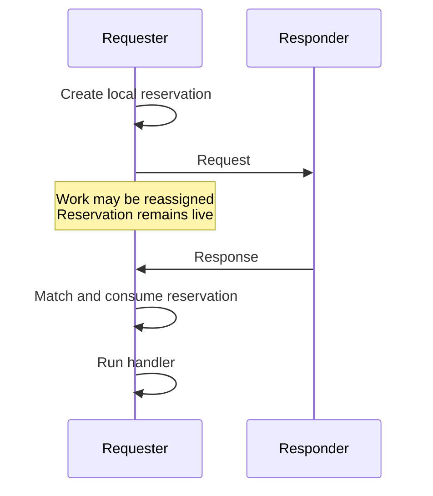
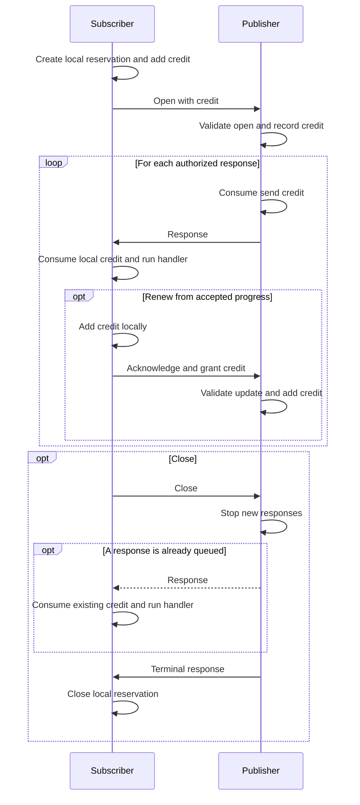

# Zakura peer message regulation: design

> **Status: first draft.** Companion to the
> [peer message regulation specification](../specs/peer-message-regulation.md), which states the
> rules. This document gives the reasons and the shape of the implementation. Scope is the three
> Zakura native reactors: discovery, header sync, block sync.

## Problem

Zakura must fully utilize each p2p connection without letting a peer overwhelm the node. Denial of
service exhausts finite resources, so Zakura prices messages by the work they can cause across multiple dimensions. Each message role has a bound for its CPU, memory, disk, lock, and response costs.

Before Zakura handles an inbound message, it applies every filter required by that message's role:

1. **Safe** — Frame checks and bounded decoding precede allocation and expensive verification.
2. **Authorized** — Each response matches a live reservation created by a request Zakura sent.
3. **Useful** — The message is relevant and does not repeat completed work.
4. **Budgeted** — The message fits the work bound for its role.

Only bounded announcement metadata may arrive without a reservation, and a strict cadence limits
it. Requests pay for the work needed to answer them. Responses consume one-shot, range, or
subscription reservations. A subscription allows several responses within header and byte credit
issued by the subscriber. Legal but useless messages consume their cadence token, reservation, or
drop budget before Zakura drops them.

A gate disconnects a peer only for behavior that a conformant sender cannot produce. Each inbound
rule therefore has a matching outbound obligation with a safety margin. Local scheduling decisions
do not create peer violations.

These message rules do not address a peer that follows the protocol but wastes a connection slot.
Peer-set policy handles that case separately.

## Design

The implementation has two layers: message declarations and peer routines.

Each message declaration builds an admission path from reusable filters and message-specific
configuration. The declaration selects the message role, the applicable filters, and their bounds
and keys. The filters implement the shared admission behavior. The declaration contains the policy
that differs between messages.

Each peer routine creates the configured admission paths and owns their filter state for one
connection. It passes each inbound message to its admission path before it calls the message
handler. `admit` applies the configured filters and returns `Continue`, `Drop`, `Delay`,
`Disconnect`, or `LocalFault`. The peer routine dispatches only `Continue` messages and handles
every other result at the connection boundary.

```text
message declaration
  → filters and message-specific configuration
  → peer routine with per-connection filter state
  → admit inbound message
  → handler or connection action
```

An illustrative API could keep both layers small:

```rust
let headers = MessageDeclaration::response::<Headers>()
    .with(Frame::max_bytes(MAX_HEADERS_BYTES))
    .with(Decode::bounded())
    .with(Verify::using(prepare_headers))
    .with(Reservation::subscription());

let mut admission = Admission::new(Declarations::new().with(headers));

while let Some(frame) = peer.recv().await? {
    match admission.admit(frame).await {
        Continue(message) => handlers.dispatch(message).await?,
        result => handle_result(peer, result).await?,
    }
}
```

This sketch shows the division of responsibility, not a proposed API.

The admission path applies each filter before the work that it bounds. The exact filters and their
order depend on the message role. The specification defines that order and each filter's
configuration.

`Delay` does not require another request scheduler. The peer routine keeps the current request at
the admission boundary and stops reading further frames from that peer's ordered stream until Work
becomes available. The existing bounded application and QUIC queues then apply flow control to the
peer. This may delay later messages on the same ordered stream, but it does not block another peer
or service stream.

A one-shot reservation has this lifecycle:



Header sync demonstrates every message role:

| Message | Role | Filters | Result when a filter stops it |
| --- | --- | --- | --- |
| `Status` | Announcement | Frame, Decode, Relevant, Cadence | Disconnect on a broken cadence; drop a status that cannot affect a receiver decision |
| `SubscribeHeaders` | Request | Frame, Decode, Reservation, Work | Disconnect an invalid subscription update; delay a credit grant when the work budget is empty |
| `Headers` | Response | Frame, Decode, Verify, Reservation | Disconnect a page outside its subscription |
| `HeadersOutcome` | Response | Frame, Decode, Reservation | Disconnect an unsolicited or invalid outcome |

Header sync uses a credit-based subscription to make pushed headers authorized and bounded. The
subscriber selects an advertised target, supplies a locator, and grants header and byte credit. The
subscription first authorizes the path to that target. It then authorizes direct descendants as the
publisher's selected chain grows. Only the subscriber can add credit.

The peer routine creates or updates the subscription reservation before it sends an open or grant
message. The reservation supplies the response identity, decode bounds, accepted cursor, and
remaining credit. A bounded cursor history lets the publisher validate later acknowledgements
without retaining unbounded state.

Outstanding credit remains valid until the publisher consumes it or the subscription ends.
Scheduler reassignment, another peer's response, finality, or a reorganization does not revoke that
credit. The subscriber admits a matching in-flight page and stops granting credit when it no longer
wants more work.

The publisher must advance an eligible subscription within the protocol deadline. It sends a
terminal outcome when the subscription closes or its selected chain stops extending the accepted
cursor. Locators and acknowledgements authorize work; they do not prove application state. Per-peer
work budgets bound dishonest claims, while peer-set policy handles peers that make no useful
progress.

A subscription renews the reservation and drains in-flight responses before it closes:



Block sync currently destroys reservations when it retires work. Its unmatched-response exceptions
compensate for that error. Preserving reservations removes those exceptions and makes
unsolicited-response handling unconditional.

Budgets bound inbound work; the outbound direction needs its own bound. The work refund and refill
regenerate admission tokens, not delivery, so a peer that requests responses and never reads them
would grow the send buffer without limit. The receiver therefore bounds unsent response bytes per
peer, blocks only that peer's path at the bound, and may disconnect a peer that stops draining.

## Testing and introspection

Four test layers keep declarations, codecs, gate state, and runtime behavior aligned:

| Layer | Required properties |
| --- | --- |
| **Declaration tests** | Every message handler has one declaration. Every declaration has one handler. Every message declares a byte cap and work bound. |
| **Property tests** | Legal messages have one canonical encoding and fit within their declared caps. Generated gate-event sequences preserve reservation, budget, and state-size invariants. A conformant sender never produces `Disconnect`. |
| **Fuzz tests** | The decoder never panics on arbitrary frames. It rejects trailing bytes and bounds every allocation before decode. |
| **Panic isolation** | A panic in a decoder, handler, or port operation is caught at its boundary. The process survives, other peers keep running, and the work returns to the scheduler. |
| **Trace tests** | Declared unique keys appear at most once. Honest regtest nodes never produce a `Disconnect` verdict. |

Each gate emits a structured decision to `regulation.jsonl`. Production records non-`Continue`
decisions. The regtest harness records every decision and checks the full trace with
`trace_oracle.py`.

Reservation handling uses a model-based property test. A generator opens, grants, and closes
subscriptions. It also reassigns work, advances finality, delivers responses and duplicates, and
closes connections. A small reference model checks that each admitted response consumes live header
and byte credit. It also checks that local scheduler actions never remove reservations and that
subscription state never exceeds its declared bounds.

Each message verifier has no I/O, locks, or shared state. This makes every verifier an independent
fuzz target. The regtest corpus provides the initial fuzz inputs.

## Adoption order

Implement the design in five steps:

1. Declare all 14 target message types. Add declaration drift tests and replace `PipeShape`.
2. Build one cadence budget per `(peer, message type)` from the message declarations.
3. Preserve block-sync reservations until a response arrives or the connection ends. Then remove
   the unmatched-response exceptions.
4. Give each peer an independent processing path. This must land before any `Drop` becomes `Delay`.
5. Replace `GetHeaders` with `SubscribeHeaders`. Price each credit grant by its byte credit and add
   the subscription reservation.

Only the final step adds header push and a work bound that Zakura lacks today. The earlier steps
create the structure needed to enforce both safely.

Message priority and stream layout remain out of scope. They require a separate specification and
design.
