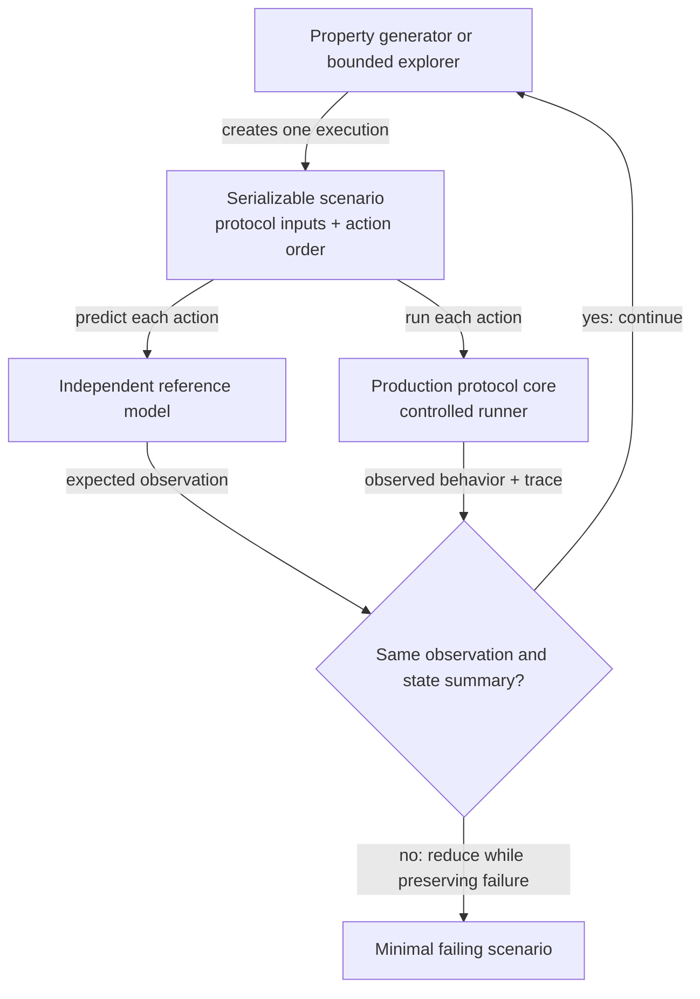

# Property testing

> **Status: first draft.** The [peer message regulation design](peer-message-regulation.md) and
> [specification](../specs/peer-message-regulation.md) define correct protocol behavior. This
> document defines the property-testing architecture that checks that behavior. The
> [`GetBlocks` property-testing infrastructure](property-testing-block-sync-infrastructure.md)
> defines the message-level prototype and planned stateful checks.

TL;DR: Property testing runs production protocol code through generated executions and searches
for counterexamples to required properties. Bounded model exploration checks every reachable state
in a deliberately small protocol model. Neither technique replaces real transport, load, or fault
tests.

## Motivation

Zakura already tests codecs, validators, and handlers in isolation. A complete asynchronous
exchange adds another class of failures. The result can depend on when bytes arrive, when a deadline
fires, or which peer advances first. Example tests cover only the cases that developers select, and
the live runtime can make a failure difficult to reproduce.

Property testing represents one execution as data. A generated scenario describes the peers,
protocol inputs, failures, time, and action order. The production runner follows the scenario while
it runs the production protocol code. One test then reaches input and timing combinations that no
developer wrote by hand.

When a scenario fails, the property-testing framework reduces it to a minimal failing test case.
Property-testing libraries call this process _shrinking_. The action strategy interprets each
shrunk choice from the current reference-model state. This keeps generated actions applicable
without a custom shrinking framework. The strategy can reduce a long execution to a partial length
prefix followed by a timeout. The runner serializes the minimized scenario so it can replay the
exact actions after strategies or backend implementations change.

## Claim strength

Generated tests and coverage-guided fuzzing search a large but finite set of executions. A passing
run provides evidence for a property, but it does not prove that the property holds for every
execution. This documentation uses _check_ for those claims.

Bounded model exploration can establish a stronger claim. If the explorer visits every reachable
state in a finite model, a passing run establishes the property for that model and its stated
bounds. It does not establish that the model matches production. The production runner must replay
model counterexamples and compare production behavior with the model after every action.

## Implementation discipline

Use the existing testing stack unless a required property exposes a measured gap:

- `proptest` generates and shrinks choices
- `serde` and `serde_json` serialize confirmed regression scenarios
- Tokio test time and `TestClock` control time at existing seams
- the Zakura testkit provides synthetic peers, trace capture, and reactor integration

Zakura adds only protocol-specific code: actions, reference state, transitions, invariants,
observations, and the production adapter. A small bounded explorer may enumerate the finite
reference model after that model works under generated tests.

This design does not require a general model-checking framework, symbolic executor, concurrency
testing framework, task scheduler, artifact service, testing support crate, or custom Proptest
`ValueTree`. Add one only when a measured limitation blocks a named property.

## One-message flow

Each message starts with checks that need no protocol history. `GetBlocks` provides the first
example:

```text
declaration -> legal value -> production encode -> cap check -> production decode
            -> value equality -> canonical re-encode

declaration -> bounded payload -> production decode -> error or canonical re-encode

declaration -> one declared rule -> one-rule mutation -> production boundary
            -> exact expected result
```

1. Its declaration supplies the 9-byte payload cap, zero decode allocation, legal count and height
   ranges, deterministic boundary values, and a legal-value strategy.
2. For each legal value, the test calls the production encoder, checks the payload cap, calls the
   production decoder, compares the decoded value with the input, and checks that re-encoding
   produces the same bytes.
3. For each generated payload of at most 9 bytes whose first byte identifies `GetBlocks`, the test
   calls the production decoder. An accepted payload must re-encode to the same bytes. A rejected
   payload must return an error without a panic or an allocation above the declaration.
4. For each declared rule, the test starts from a legal value and violates only that rule. It then
   checks the exact rejection class. The deterministic suite executes every rule at least once.
5. Because `GetBlocks` is a request, the test also checks its response bound and Work equation from
   independently written arithmetic.

These checks cover the message in isolation. `Delay`, concurrency-slot ownership, handler dispatch,
and terminal refunds depend on prior state and later events. The stateful flow below checks those
properties with action sequences.

## Stateful message flow

One serializable scenario drives two independent paths. A reference model predicts the required
behavior. The production protocol core runs with the scenario's protocol inputs and action order.
The property test compares their observations after every action. This comparison identifies the
first divergence and prevents later transitions from hiding compensating errors.



### Components

| Component | Responsibility | Why it matters |
| --- | --- | --- |
| Proptest strategy | Generate a shrinkable choice sequence and interpret each choice from the current model state | Generated conformant scenarios satisfy sender preconditions and use Proptest's existing shrinking machinery |
| Scenario | Describe one execution as versioned serializable data | Replay the exact actions without reconstructing random calls |
| Reference model | Predict protocol observations and state changes | Provide an expected result independent of production transitions |
| Bounded explorer | Visit every reachable state in the configured finite model | Check small state spaces without relying on random selection |
| Production runner | Apply one scenario to the production protocol core | Exercise the code Zakura ships |
| Controlled runtime | Apply the scenario's byte chunks, monotonic time advances, and action order | Reach timing-dependent behavior repeatably |
| Observation comparison and execution trace | Compare expected and production observations after every action and record the first difference | Detect transient and compensating errors |
| Real transport check | Run selected scenarios through the production transport adapter | Detect integration errors below the controlled boundary |

### Runtime boundary

The generated scenario owns every test choice before execution starts. The production adapter
applies the scenario's byte chunks, monotonic time advances, and action order. It does not replace
protocol framing, decoding, validation, state transitions, or resource accounting.

The admission adapter controls observable admission events. It does not control every Tokio task
choice. A property that depends on a task choice needs an explicit task action or a real-runtime
test. Real-transport tests retain production scheduling.

The test boundary follows the property. A framing or decode property starts with payload bytes and
calls the production frame reader or decoder. A reservation or cleanup property may start with an
already decoded message and call the production admission boundary. The latter cannot support a
claim about partial reads, payload caps, or decode allocation.

### Reference model

The reference model describes only the protocol states and effects needed to predict a result. It
does not call the production state transitions that it checks. Otherwise, the same defect could
make both paths agree.

The model avoids duplicating unrelated production logic. It may receive a decoded message when the
property concerns scheduling or resource cleanup. That starting point makes no claim about framing
or decoding; the one-message flow checks those behaviors from payload bytes.

The generator uses model state only to select actions whose protocol preconditions hold. The
production runner, not the generator, must preserve reservation, Work, slot, and state-capacity
invariants.

### Stepwise comparison

The model and production runner each return an `Observation` after an action. This normalized record
contains only protocol effects that the property compares:

- admission verdict
- reservation and credit changes
- Work charge or refund
- concurrency-slot acquisition or release
- queued response-byte changes
- handler dispatch or completion
- connection state

The property test compares the two observations after every action. It also compares a bounded
state summary after every action. The state summary omits backend identifiers and internal ordering
that cannot affect protocol behavior.

### Deterministic replay

The scenario and execution trace use protocol concepts instead of backend types, task identifiers,
or wall-clock timestamps. A trace names peers, streams, ranges, and messages by scenario-assigned
identifiers, and records:

- protocol phase changes
- framing, decoding, and validation decisions
- injected failures and action order
- deadlines and time advancement
- resource acquisition and release
- terminal outcomes

Stable inputs and observations let Zakura replay a failure after a backend change. They also let
controlled and real-transport runs compare the same protocol behavior. The runner executes a
scenario twice before it trusts the result. Unequal observations or final resource states mean the
boundary missed a source of nondeterminism.

The failure output contains the generation seed, test profile, and first divergent observation. A
confirmed regression scenario is one JSON value with a schema version, suite, model bounds, and
minimized action list. The suite keeps that scenario in addition to any seed that Proptest persists.
A strategy change can map an old seed to a different scenario.

## Test layers

The architecture combines four layers because no single layer provides input coverage, exhaustive
small-state coverage, controlled concurrency, and transport confidence.

| Layer | Role |
| --- | --- |
| Pure properties and fuzzing | Explore codecs, validation, raw framing, and structured action mutations |
| Bounded model exploration | Check every reachable state in a small abstract protocol model |
| Controlled system tests | Exercise production protocol logic under generated failures and action orders |
| Real transport checks | Validate the production adapter, transport boundary, backpressure, and runtime behavior |

## Regulation properties

The regulation suite separates conformant scenarios from adversarial scenarios. A conformant
generator creates only actions that satisfy the sender obligations in the specification. No action
in that suite may produce `Disconnect`. An adversarial generator violates one declared rule and
checks the verdict for that rule. A later mixed-adversary profile may combine violations after the
single-violation suite identifies each verdict unambiguously.

The action strategy keeps a scenario in its original suite. It interprets a shrunk conformant
choice sequence from the initial model state, so every resulting action remains applicable. An
adversarial scenario stores its selected violation separately from its conformant prefix. Shrinking
can shorten the prefix but cannot replace one adversarial violation with another.

### Message addition contract

The implementation must make the compiler enforce this inventory equation:

```text
wire variants = message kinds = declarations = handler arms = reference-model arms
```

The equation uses sets of message kinds. It does not compare a fixed message count. A new protocol
version can add or remove messages without weakening the check.

Each protocol defines one closed `MessageKind` inventory. One macro invocation or an equivalent
compiler-generated implementation defines both the enum and `MessageKind::ALL`. Developers must
not maintain `ALL` as a separate array. The wire message enum exposes `kind()` through an exhaustive
match. The declaration lookup, handler dispatch, and reference-model transition also use exhaustive
matches without wildcard arms. Adding a wire variant or message kind then leaves a compile error at
every required integration point.

Each declaration must provide these property inputs:

- a legal-value strategy
- deterministic minimum and maximum legal values
- the payload cap
- allocation bounds for every variable-length field
- a closed inventory of message-specific rules
- an explicit state effect or an explicit `NoStateEffect` marker

Each message-specific rule must provide a conformant precondition, one strategy that violates only
that rule, the expected admission result, and the matching outbound obligation. The reference model
must compute the expected transition independently. It must not call the production admission or
handler decision that the property checks.

The property harness iterates over `MessageKind::ALL`. It runs the common codec, framing,
allocation, and dispatch properties for each kind. It also runs every declared message-specific
rule. The harness records a hit for each message kind, boundary value, and rule. The test fails when
any required hit remains zero. Random case counts can then increase exploration, but they cannot
decide whether the suite covers a message or rule at least once.

The declared role selects additional mandatory properties. An announcement exercises its cadence
boundary and matching sender rate. A request exercises its Work charge, `Delay` boundary,
concurrency slot, response bound, and every terminal refund path. A response exercises matching,
consumption, duplicate, mismatch, reordering, and connection-close behavior for its reservation.
The harness applies these properties from the role. A message author cannot opt out of them.

The resulting change formula is:

```text
add a message
  = add its wire variant and discriminator
  + complete its declaration and legal boundary values
  + implement its codec and handler arm
  + define each adversarial rule and outbound obligation
  + implement its independent reference-model transition
```

The change is incomplete while any term is missing. `cargo test --no-run` catches missing
exhaustive arms. The deterministic closure test catches a missing strategy output, boundary value,
or rule execution. The generated and bounded suites then search combinations and state sequences.

This contract prevents mechanical omission. It cannot prove that a strategy explores every useful
value or that the reference model states the correct policy. Reviewers must still compare each new
declaration, rule, and model transition with the protocol specification.

Each message declaration supplies its wire bounds and valid-value strategy. The property harness
must not maintain a second list of message caps. It checks these codec properties separately:

- decoding an encoded legal message returns the same message
- every encoded legal message fits its declared frame cap
- decoding rejects noncanonical encodings and trailing bytes
- encoding an accepted canonical payload returns the same canonical payload
- every payload within the wire cap returns a decode result without panicking

Each message declaration also supplies explicit allocation bounds for variable-length fields. The
allocation property checks requested allocation and retained decoded state against those bounds.
The wire cap does not serve as an allocation bound.

The stateful suite checks these protocol properties after every action:

- every admitted response consumes exactly one live reservation or one unconsumed range part
- scheduler reassignment, finality changes, and local interest changes do not remove reservations
- Work, refunds, outstanding charges, and available capacity satisfy the declared conservation
  equation
- each concurrency slot has one owner and every terminal path releases that slot once
- per-peer filter, reservation, delayed-frame, and queued-response state stays within its declared
  capacity
- two runs of the same scenario produce the same observations and final resource state

Metamorphic properties compare related executions without using the reference model:

- splitting one frame at different byte boundaries preserves its semantic result
- renaming peers preserves observations after applying the same renaming to those observations
- swapping independent actions from different peers preserves their final resource states
- translating every monotonic timestamp by the same duration preserves verdicts and resource deltas

Each Work implementation defines its conservation equation from the same declaration values that
compute charges and refunds. A typical form is:

```text
initial capacity + refills + refunds
    = available Work + outstanding charges + consumed Work
```

The suite expresses progress as a bounded property. If another peer or service stream remains
runnable, and the runner schedules every runnable participant within `N` steps, that participant
must produce an observable transition within `M` steps. Each stateful suite states `N`, `M`, and its
fairness assumption. An unbounded statement such as “one peer never stops another” does not define
a finite test condition.

The initial stateful model does not need a general task scheduler. It represents only observable
admission actions: receive a frame or frame fragment, advance monotonic time, refill or refund Work,
complete or fail a handler, reassign work, and close a connection. Add explicit task choices when a
property depends on their order.

## CI profiles

Fast feedback and broad exploration need different case counts, so property tests run under three
profiles:

- A developer profile runs a small generated set and replays every checked-in regression scenario.
- Pull requests replay regression scenarios, run a stable seed set, add one deterministic seed
  derived from the CI run, and run the bounded explorer.
- A scheduled job explores many seeds and reports minimized scenarios for new failures.

Each protocol suite sets its case counts and exploration bounds from measured runtime. CI reports
action and transition coverage so a passing run cannot hide a generator that never reaches a
required state.

## Rollout

Start with the closed message inventory and pure declaration and codec properties for every current
message. Next, implement the
[`GetBlocks` property-testing infrastructure](property-testing-block-sync-infrastructure.md). It
models the existing block-sync version 2 range exchange from `GetBlocks` through its terminal
response. The bounded model uses two peers, one request type, ranges of at most three blocks, at
most two in-flight responses, and small queues.

The model checks Work, range reservations, duplicate and out-of-order bodies, reassignment, terminal
validation, timeout, connection closure, and cleanup without depending on the planned header
subscription. Two peers support isolation and bounded-progress checks.

Run minimized block-sync scenarios through the existing synthetic-peer adapter and selected cases
through the real transport after the model and production admission state agree. Add the header
subscription only after its version 9 wire contract is final.

Keep the exhaustive model small. Expand generated property tests independently to variable peer
counts, more simultaneous ranges, task choices, partitions, and crash recovery when a named
property requires them. This split provides multi-peer property coverage without making exhaustive
state exploration intractable.
