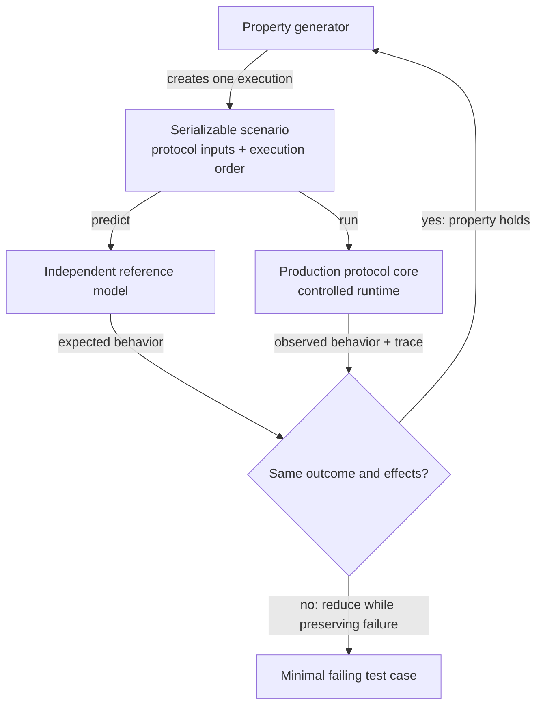

# Property testing

> **Status: first draft.** The [peer message regulation design](peer-message-regulation.md) and
> [specification](../specs/peer-message-regulation.md) define correct protocol behavior. This
> document defines the property-testing architecture that exercises that behavior.

TL;DR: Property testing speeds the path to production by running production protocol code through
many generated executions and checking that its required properties hold.

## Motivation

Zakura already tests codecs, validators, and handlers in isolation. A complete asynchronous
exchange adds another class of failures. The result can depend on when bytes arrive, when a deadline
fires, or which peer advances first. Example tests cover only the cases that developers select, and
the live runtime can make a failure difficult to reproduce.

Property testing represents one complete execution as data. A generated scenario describes the
peers, protocol inputs, failures, time, and execution order. A controlled runtime follows the
scenario while it runs the production protocol code. One test then reaches input and timing
combinations that no developer wrote by hand.

When a scenario fails, the property-testing framework reduces it to a minimal failing test case. It
removes actions and simplifies values while preserving the failure. Property-testing libraries call
this process *shrinking*. It can reduce a long execution to a partial length prefix followed by a
timeout. The runner can replay that test case exactly and preserve it as a regression test.

## Architecture

One serializable scenario drives two independent paths. A reference model predicts the required
behavior. The production protocol core runs with the scenario's protocol inputs and execution
order. The oracle compares their outcomes and effects. Because both paths evaluate the same
scenario, a mismatch points to a behavioral difference instead of different input or timing.

### Components

| Component | Responsibility | Why it matters |
| --- | --- | --- |
| Generator | Create executions from protocol ranges and reduce failures | Explore more combinations and produce minimal failing test cases |
| Scenario | Describe one complete execution as serializable data | Replay the same execution without reconstructing random calls |
| Reference model | Predict protocol outcomes and visible effects | Provide an expected result independent of production state transitions |
| Runner | Apply one scenario to the model and production protocol core | Keep both paths under the same conditions |
| Controlled runtime | Control byte delivery, time, randomness, and task scheduling | Reach timing-dependent behavior quickly and repeatably |
| Oracle and execution trace | Compare results and record the first semantic divergence | Explain failures without backend-specific noise |
| Real transport check | Run selected cases through the production transport adapter | Detect integration errors below the controlled boundary |

### Runtime boundary

The controlled runtime replaces only capabilities that can change an execution. The boundary
usually covers byte delivery, deadlines, randomness, and task scheduling. Protocol framing,
decoding, validation, state transitions, and resource accounting remain above it so the test runs
the code Zakura ships.

The boundary must stay narrow. An adapter that delivers decoded messages would make partial reads
and length limits impossible to test. A general runtime abstraction would add production structure
before a protocol slice proves that the structure is useful.

### Reference model

The reference model describes only the protocol states and effects needed to predict a result. It
does not call the production state transitions that it checks. Otherwise, the same defect could
make both paths agree.

The model also avoids duplicating unrelated production logic. For example, it can use a decoded
message when the property concerns scheduling or resource cleanup. Codec properties and fuzzing
remain responsible for raw byte behavior.

### Deterministic replay

The scenario and execution trace use protocol concepts instead of backend types, task identifiers,
or wall-clock timestamps. A trace names peers, tasks, streams, and messages by their
scenario-assigned identifiers, and records:

- protocol phase changes
- framing, decoding, and validation decisions
- injected failures and task execution order
- deadlines and time advancement
- resource acquisition and release
- terminal outcomes

Stable inputs and observations let Zakura replay a failure after a backend change. They also let
deterministic and real-transport runs compare the same protocol behavior. The runner executes a
scenario twice before it trusts the result. Unequal outcomes, traces, or final resource states mean
the boundary missed a source of nondeterminism, and a replay artifact from that scenario would fail
intermittently.

## Test layers

The architecture combines three layers because no single layer provides fast input coverage,
controlled concurrency, and transport confidence.

| Layer | Role |
| --- | --- |
| Pure properties and fuzzing | Explore codecs, validation, and raw framing |
| Deterministic system tests | Exercise production protocol logic under generated failures and schedules |
| Real transport checks | Validate the production adapter and transport boundary |

## CI profiles

Fast feedback and broad exploration need different case counts, so property tests run under three
profiles:

- A developer profile keeps local iteration fast and persists any failure it finds
- Pull requests use fixed seeds, so every revision faces the same larger case set
- A scheduled job explores many seeds and keeps minimized artifacts for failures outside the
  pull-request set

Each slice sets its own case counts from measured runtime.

## Rollout

The native control handshake will provide the first protocol slice. It includes two peers, framing,
deadlines, shared state, and resource cleanup without the topology and reservation state of a
reactor. This scope can validate the architecture before Zakura commits to a deterministic backend.

The next slice will add one regulated reactor message. It will test whether the same scenario,
model, oracle, and trace contracts extend beyond connection setup. Later work can add more peers,
links, contention, partitions, and crash recovery only when a property requires them.
