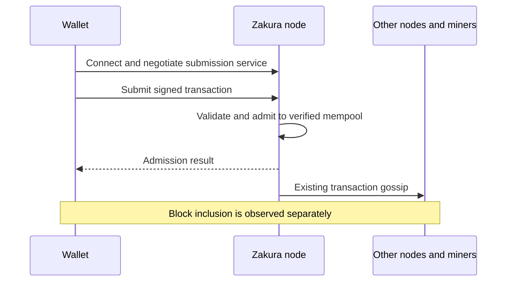

# Direct wallet transaction submission over P2P v2

Wallets should be able to deliver a signed transaction directly to the Zcash
network. Today, [Vizor][vizor-providers] and [Zodl][zodl-providers] send through lightwalletd, and their Mainnet
defaults depend on just two providers: **Stardust and Zec.rocks**. Vizor defaults
to Stardust; Zodl defaults to Zec.rocks. Regional endpoints improve availability,
but several endpoints operated by the same provider still share an operator.
Concentrating submissions among a few operators gives those operators broad
visibility into wallet activity, including IP addresses, transaction identifiers,
and submission times. It also makes wallets dependent on their availability and
willingness to relay payments.

This design makes submission a native Zakura peer-to-peer (P2P) v2 service.
A wallet discovers participating Zakura nodes through P2P discovery, selects
one, sends its completed transaction, and receives an admission result. The node
validates the transaction and propagates it through the existing network.

The first implementation uses native P2P v2. An HTTP endpoint is a separate
follow-on for Tor, whose TCP transport cannot carry the current direct QUIC
connection. It is not required for ordinary direct submission.

Status: **Proposed**, September 5, 2026. Not implemented or deployed.

## 1. Motivation and scope

Submitting through lightwalletd is a wallet architecture choice, not a Zcash
consensus requirement. The wallet has already constructed and authorized the
transaction before it reaches the provider. A full node can receive those same
bytes over P2P, validate them, and relay them to its peers.

The goal is to let any participating Zakura operator offer that entry point
without also running a wallet indexing service. Wallets discover suitable nodes
through the network instead of depending on a small provider list. Submission
then becomes an ordinary capability of the node network.

Goals:

- Submit already signed transactions from a lightweight wallet client.
- Use P2P v2's existing service negotiation, streams, and discovery.
- Return a useful admission result while preserving normal node validation.
- Support discovery, bounded retries, and independent node operators.
- Preserve the wallet's chosen privacy policy during initial sends and retries.

Non-goals:

- Replacing lightwalletd's other roles, such as serving compact blocks for wallet
  scanning, commitment tree data for witness construction, and transaction data
  for confirmation tracking.
- Guaranteeing inclusion in a block or anonymity over direct QUIC.
- Adding HTTP, onion endpoint discovery, or a new Tor transport in phase one.

## 2. How a wallet submits without syncing a node

The distinction is between preparing a payment and delivering it. The wallet
needs chain information to find spendable funds and construct a valid payment.
Once it has the complete signed transaction, broadcasting it does not require
the wallet to repeat the full node's chain sync or validation work.

For example, a user presses Send in Vizor:

1. Vizor constructs, signs, and persists the transaction through its existing
   wallet flow.
2. A small submission client selects a Zakura node that advertises the service.
3. It opens an outbound P2P v2 connection and confirms the network, chain, and
   service version. It does not request blocks or headers.
4. It sends the signed transaction bytes. The receiving node checks them against
   its own chain state and mempool policy.
5. If admitted, the transaction enters the node's verified mempool, its pool of
   valid transactions awaiting mining. Existing gossip announces it to peers.
6. The wallet records the node's result and continues tracking confirmation
   through its existing chain observation path.



The node must have the chain context needed to validate the transaction. The
wallet only needs an outbound connection; it does not advertise a public
listening address or serve chain data. An acceptance response means this node
accepted the transaction. It does not mean a miner has included it in a block.

## 3. Native integration with P2P v2

### 3.1 A normal negotiated service

Introduce `zakura.tx_submit.v1` as a built-in request/response service in
`zakura-network`. Allocate a new capability bit and stream kind through the
existing protocol definitions, without reusing retired values. Use the existing
`p2p-v2/1` handshake and `StreamMode::RequestResponse`.

The service has two operations:

| Operation | Contract |
| --- | --- |
| `GetInfo` | Return bounded readiness and policy metadata, including the maximum accepted transaction size and supported transaction formats. |
| `Submit` | Receive one complete serialized transaction and return one bounded admission result. |

The handshake binds the connection to the intended network and genesis chain
identity. Metadata is advisory: the node checks readiness and policy again when
admitting a transaction. A wallet does not need to synchronize to the node's
reported tip before calling `Submit`.

Zakura already has the [service traits and registry][service-traits] needed for
inbound dispatch. The outbound requester still initializes a
[legacy-specific response validator][outbound-requester]. Complete that generic
requester so each service owns its response decoding and validation. Shared
transport code owns framing, correlation, size limits, deadlines, and
cancellation. Submission must not become a special case in legacy message
handling.

### 3.2 One admission path

The submission service calls Zakura's existing mempool directly, using the same
validation, insertion, and gossip pipeline as other incoming transactions.

The wallet needs to know whether its transaction passed validation and entered
the mempool. A response that only confirms it was received or queued cannot
answer that. The node also needs to track which peer submitted the transaction
so it can enforce per-peer resource limits while processing it.

The current mempool API provides these capabilities separately:

- [`Queue`][queue-api] lets the caller wait for the admission result, but does
  not identify the submitting peer.
- `QueueFromPeer` identifies the submitting peer so its queue limit can be
  enforced, but does not return a per-transaction admission result to the caller.

Extend the shared mempool API with an admission operation that does both. It
must retain the submitting peer's identity while processing the transaction and
return the result after the verified mempool insertion decision. Define this
contract in `zakura-node-services` and implement it in the existing mempool.
The submission service can then report acceptance to the wallet while preserving
the node's per-peer limits.

Existing [post-admission gossip][gossip] handles
propagation, including the [bridge to legacy peers][legacy-bridge] on dual-stack
nodes. Existing miners do not need to implement the submission service.

Keep the RPC's existing retry retention policy separate. An unsolicited remote
submission must not automatically acquire the background retry behavior used by
[`sendrawtransaction`][rpc-submission].

### 3.3 A client that does not act as a full node

Expose a small reusable Rust client with only the shared handshake, discovery,
and submission dependencies. It takes signed transaction bytes, the intended
network, and a routing policy. It does not take spending keys, viewing keys, or
partially signed transactions, and does not initialize node state or sync.

Use the existing distinction between services a peer **seeks** and **provides**.
The wallet seeks submission and discovery; it does not claim to provide block
serving or gossip. Support peer sampling by a non-advertising client without
weakening the validation of addresses advertised by actual serving nodes.

Share protocol encoders and transport machinery with the node. Do not copy
handshake implementations into each wallet or wrap the full node startup path
in a wallet-specific mode.

## 4. Results and retry rules

The wire response uses stable result and reason codes:

| Result | Meaning |
| --- | --- |
| `Accepted` | This node inserted the submitted transaction into its verified mempool. |
| `AlreadyPresent` | This node already holds the same authorized transaction in its verified mempool. |
| `Rejected` | This node rejected it, with a reason distinguishing transaction validity, expiry, and local policy. |
| `RetryLater` | The node is busy, not ready, or missing temporary validation context. |

Responses identify the request and, when the transaction can be decoded, its
transaction identity. Include bounded tip context for admission decisions.
Reason codes are part of the protocol; internal error strings are not.

These are observations from one node, not proof of network agreement. A node
can be mistaken or dishonest, and an admitted transaction can later be evicted
or affected by a reorg. The wallet confirms inclusion from chain data. It must
not release reserved inputs solely because a remote node reports a rejection.

If the connection closes or times out without a valid response, the outcome is
**unknown**, not rejected. The node may already have admitted and relayed the
transaction. Persist that state and retry the exact same bytes with bounded
backoff. Cancellation cannot recall a transaction after transmission.

Deduplicate verification using Zakura's full unmined transaction identity. For
v5, this includes the authorizing data commitment as well as the transaction ID,
as specified by [ZIP 239][zip-239]. Matching only `txid` is insufficient. An
in-progress candidate is not `AlreadyPresent`; attach a bounded waiter to its
completion or return `RetryLater`.

For dependent transactions, submit parents before children to a node that
accepted the parents. On failover, replay required ancestors in order. Preserve
partial acceptance and unknown outcomes; a group of transactions is not an
atomic network submission.

## 5. Discovery and connection policy

Advertise `zakura.tx_submit.v1` in the existing [signed node records][node-records].
Use their chain identity, sequence, expiration, and direct addresses. Phase one
does not need a new HTTP directory or a new endpoint record format.

The client starts with several independently operated bootstrap nodes,
user-configured nodes, and cached records. It learns additional candidates from
bounded peer samples. Bootstrap nodes provide introductions, not an authoritative
allowlist. Define record refresh and recovery from expired caches so a wallet
can continue discovering peers after a bootstrap outage.

Validate discovered destinations before dialing. Peer advertisements must not
direct the wallet to private or local network services. Explicit user-configured
local nodes remain a separate supported case.

A signature proves which key advertised an endpoint, not that its operator is
honest or independent. Prefer candidates from different discovery sources and
network groups, using operator diversity where known. Start with a small bounded
fanout, with two entry nodes as an initial policy to measure. More acknowledgments
are not a consensus quorum and expose the transaction to more first-hop peers.

Direct QUIC encrypts the connection but exposes the wallet's IP to each entry
node. Use ephemeral client identities and omit wallet or account identifiers.
This reduces persistent identity linkage; it does not provide source anonymity.
The client must honor an explicit route policy, including during discovery and
retries. Failure must not silently change a Tor request into a direct connection.

## 6. Integration with message regulation

Transaction submission will build on Zakura's shared
[message regulation framework](https://github.com/zakura-core/zakura/pull/747).
The submission service defines the limits appropriate to transaction verification
and uses the framework to enforce them. Resource reservations remain attached to
verification work until it completes, including when the submitting wallet
disconnects.

The [GetBlocks regulation work](https://github.com/zakura-core/zakura/pull/892)
provides an initial implementation using the shared
[resource accounting primitives][regulation]. Its budgets are specific to block
serving. Transaction submission needs its own policy covering:

- Bytes retained for incoming and queued transactions, including parsing
  allocations.
- Verification work and concurrency, integrated with existing mempool limits.
- Pending response capacity, including callers waiting for the same transaction's
  admission result.

Reserve capacity before dispatching the work. Enforce aggregate submission limits
across peers, with source-group and per-peer limits providing fairness. Creating
a new peer identity must not reset the aggregate limits.

Connection allocation remains a separate peer-set policy concern. Bound transient
wallet connections and their idle lifetimes so submission clients cannot occupy
all the connection slots needed for block sync and normal relay. A claimed wallet
role must not grant extra capacity.

Enforce the node's configured individual transaction size policy before large
allocations or cryptographic work, accounting for envelope overhead. The
[current default is 250,000 bytes][size-policy]; this is local mempool policy,
not a change to block consensus limits. Return `RetryLater` when capacity is
unavailable instead of displacing block validation.

## 7. Wallet integration

Wallets adopting Zakura submission retain their configured lightwalletd endpoints
as a fallback:

- **Without Tor:** Try submission through discovered Zakura nodes first. If no
  suitable nodes are reachable or submission times out after bounded retries,
  fall back to the existing lightwalletd submission path.
- **With Tor:** Continue submitting through Tor to lightwalletd until the
  Tor-compatible Zakura follow-on is complete. Do not attempt direct P2P v2
  submission in this mode.

Initial sends and background retries follow the same routing policy. Fallback
submits the same signed transaction bytes, preserving the retry rules in section 4.

## 8. Follow-on: an HTTP endpoint for Tor

### 8.1 Why another transport is needed

Zakura's current native connection uses QUIC over UDP, with
[iroh relays disabled][direct-endpoint]. Tor carries
[TCP streams, not UDP][tor-transport]. The wallet therefore cannot send the
current native P2P v2 connection through its ordinary Tor route.

Tor requires a compatible transport, not HTTP specifically. A narrow HTTPS
adapter over TCP is the proposed follow-on because wallets can use it through
Tor while Zakura keeps the same submission contract. Use HTTP/1.1 or HTTP/2;
HTTP/3 would reintroduce the QUIC transport problem. A general TCP version of the
P2P stack is a larger, separate design.

### 8.2 What the endpoint does

Each participating node can expose the same `GetInfo` and `Submit` operations
over HTTPS. The adapter calls the same source-aware admission operation and
shares the native service's limits and result codes.

```text
Wallet -> Tor -> Zakura HTTPS adapter -> shared admission -> existing gossip
```

This endpoint is hosted by the receiving Zakura node. It does not require a
central gateway or a lightwalletd deployment. It exposes only this narrow public
service, not Zakura's general administrative or compatibility RPC surface.

The follow-on must also design discovery over Tor. Current node records contain
socket addresses, not HTTPS authorities or onion addresses. Specify a compatible,
signed endpoint advertisement that binds those addresses and their authentication
to the node identity. Support bounded discovery sampling through the same Tor
route; a central directory must not become the new submission dependency.

Discovery, DNS, metadata, submission, and retries must all obey the Tor policy.
Use isolated connections for unrelated submissions and never fall back to direct
QUIC on a Tor failure. Validate that behavior under failures before enabling this
path. HTTP implementation, endpoint advertisement extensions, and these privacy
tests belong to the follow-on, not the native service's launch requirements.

## 9. Delivery and acceptance criteria

### Phase one: native submission

1. Finalize wire encoding, capability and stream allocations, reason codes,
   policy metadata, and source-aware admission contracts. Set explicit frame,
   queue, timeout, and fanout limits before implementation is enabled.
2. Implement shared admission, the generic requester, the native service, and
   the lightweight client. Reuse existing verification and gossip.
3. Integrate wallet submission and persisted retries. Validate locally and on
   testnet, then enable opt-in service nodes across independent operators.
4. Expand direct wallet adoption after measuring mobile behavior, provider
   diversity, and propagation to the wider network.

Required evidence:

- A client with no node database or block/header sync submits a valid transaction;
  another node receives it through gossip and it is mined in regtest. Cover native
  and mixed native/legacy topologies.
- Results distinguish verified insertion, pending duplicates, policy rejection,
  missing context, and overload. Cover authorizing-data identity, reorgs, size
  limits, and eviction after acceptance.
- Lost responses, cancellation, app restart, and parent/child failover preserve
  wallet state and bounded retries of the original bytes.
- Discovery recovers from bootstrap outages and cache expiration without a
  lightwalletd dependency. Test stale records and unsuitable destinations.
- Controlled capacity tests preserve block validation and peer connectivity
  while submission stays within its aggregate budgets.
- iOS and Android tests cover network changes, suspension, latency, binary size,
  and energy use. Tor-required routes do not initiate native connections.

Mainnet currently [defaults to legacy P2P][mainnet-default]. Source support alone
does not establish a usable service fleet. Participating deployments must enable
v2 and demonstrate a working gossip path to the wider network before wallets
rely on them.

### Phase two: Tor-compatible HTTP submission

Implement section 8 after the native service and wallet route interface exist.
Require equivalent admission behavior across both transports, shared resource
limits under combined load, and privacy tests showing no direct DNS or QUIC
traffic from Tor discovery, submission, or retries, including failure cases.

## Source references

Zakura implementation references use commit
`f3ad1288a91d6910880c8ee815b6a3e54747a514`. Wallet references are pinned to the
revisions inspected for this proposal. Proposed API names and contracts above
describe work to be implemented.

[vizor-providers]: https://github.com/chainapsis/vizor-wallet/blob/4ecdfa4cb748d7b37dd893acc295d81e6de87807/lib/src/core/config/rpc_endpoint_config.dart#L64-L150
[zodl-providers]: https://github.com/zodl-inc/zodl-ios/blob/7cb54efd696bf78a3a135a4d50d52ad80c33ee94/secant/Sources/Dependencies/ZcashSDKEnvironment/ZcashSDKEnvironmentInterface.swift#L19-L112
[service-traits]: https://github.com/zakura-core/zakura/blob/f3ad1288a91d6910880c8ee815b6a3e54747a514/crates/zakura-network/src/zakura/transport/service.rs#L362-L466
[outbound-requester]: https://github.com/zakura-core/zakura/blob/f3ad1288a91d6910880c8ee815b6a3e54747a514/crates/zakura-network/src/zakura/handler.rs#L4569-L4654
[queue-api]: https://github.com/zakura-core/zakura/blob/f3ad1288a91d6910880c8ee815b6a3e54747a514/crates/zakura-node-services/src/mempool.rs#L135-L150
[gossip]: https://github.com/zakura-core/zakura/blob/f3ad1288a91d6910880c8ee815b6a3e54747a514/crates/zakurad/src/components/mempool/gossip.rs
[legacy-bridge]: https://github.com/zakura-core/zakura/blob/f3ad1288a91d6910880c8ee815b6a3e54747a514/crates/zakura-network/src/zakura/legacy_gossip.rs#L1946-L1969
[rpc-submission]: https://github.com/zakura-core/zakura/blob/f3ad1288a91d6910880c8ee815b6a3e54747a514/crates/zakura-rpc/src/methods.rs#L1437-L1501
[zip-239]: https://github.com/zcash/zips/blob/e753a6a301912cf77202db8f0d840f4796f5cca1/zips/zip-0239.rst#L28-L37
[node-records]: https://github.com/zakura-core/zakura/blob/f3ad1288a91d6910880c8ee815b6a3e54747a514/crates/zakura-network/src/zakura/discovery/protocol.rs#L220-L299
[regulation]: https://github.com/zakura-core/zakura/blob/f3ad1288a91d6910880c8ee815b6a3e54747a514/crates/zakura-network/src/zakura/regulation/mod.rs
[size-policy]: https://github.com/zakura-core/zakura/blob/f3ad1288a91d6910880c8ee815b6a3e54747a514/crates/zakurad/src/components/mempool/config.rs#L81-L82
[direct-endpoint]: https://github.com/zakura-core/zakura/blob/f3ad1288a91d6910880c8ee815b6a3e54747a514/crates/zakura-network/src/zakura.rs#L199-L209
[tor-transport]: https://support.torproject.org/relays/legal-and-abuse/ddos/
[mainnet-default]: https://github.com/zakura-core/zakura/blob/f3ad1288a91d6910880c8ee815b6a3e54747a514/crates/zakura-network/src/config.rs#L126-L141
