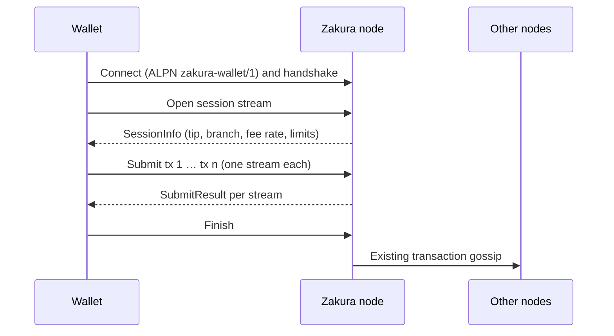

# Direct wallet transaction submission

Wallets should be able to hand a signed transaction to any participating Zakura
node. Today [Vizor][vizor-providers] and [Zodl][zodl-providers] send every
transaction through lightwalletd, and their Mainnet defaults depend on two
providers: **Stardust and Zec.rocks**. Those operators see each wallet's IP
address, transaction IDs, and send times. Wallets also depend on their
availability and willingness to relay payments.

In this design, a wallet connects to a Zakura node and sends a short burst of
signed transactions. The node returns one admission result per transaction. The
node validates each transaction and relays it through normal gossip. Wallets
keep their existing chain queries, transaction construction, and confirmation
tracking. They also keep lightwalletd as a fallback.

Status: **Proposed**. Not implemented or deployed. The
[specification](../specs/wallet-transaction-submission.md) is authoritative for
wire formats, limits, and required behavior.

## 1. A submission session

1. The wallet picks a node from its endpoint list. Each entry pins the node's
   identity key.
2. The wallet dials the node with the wallet ALPN, `zakura-wallet/1`, and
   completes the native P2P v2 handshake.
3. The wallet opens the session stream. The node answers with `SessionInfo`:
   readiness, chain tip, next consensus branch ID, minimum fee rate, supported
   transaction formats, and session limits.
4. The wallet checks `SessionInfo`. If the node is behind, on another branch, or
   would refuse the transaction, the wallet closes without uploading anything.
5. The wallet sends each transaction on its own stream, up to `K` at a time. The
   node verifies each transaction and returns one result on its stream.
6. The wallet sends `Finish` after its last transaction. The node returns the
   remaining results and closes.

```mermaid
sequenceDiagram
    participant W as Wallet
    participant Z as Zakura node
    participant N as Other nodes
    W->>Z: Connect (ALPN zakura-wallet/1) and handshake
    W->>Z: Open session stream
    Z-->>W: SessionInfo (tip, branch, fee rate, limits)
    W->>Z: Submit tx 1 … tx n (one stream each)
    Z-->>W: SubmitResult per stream
    W->>Z: Finish
    Z->>N: Existing transaction gossip
```

A session lasts at most 30 seconds. No wallet state outlives its session.

## 2. One limit bounds wallet state

The node has one wallet limit: `W`, the maximum number of concurrent wallet
sessions. Every piece of wallet state is a fixed amount per session or per
running verification. The node therefore guarantees one invariant: **with at
most `W` sessions, wallet state stays inside a computed bound.**

Three rules keep the invariant true:

- **A session keeps its slot until its work ends.** The node frees a slot only
  after the connection closes and the session's verification jobs exit. Work
  that outlives a disconnect stays counted.
- **Transactions stay serialized until verification starts.** A queued
  transaction costs its wire size. The node decodes a transaction only when one
  of `V` verification permits becomes free, so decoded memory scales with `V`,
  not `W`. A decoded `S`-byte transaction takes at most `11 × S + 4 KiB`, plus
  the spent outputs loaded from state. Spec section 6.3 gives the measurement.
- **Nothing persists per wallet.** The node keeps no bans, history, or cached
  decisions. A protocol violation closes the session. A validation or policy
  failure never penalizes the wallet. Wallet transactions never feed the mempool
  misbehavior score.

CPU follows the same shape. One session submits at most `Nsession`
transactions of at most `Btx` bytes each. One session's verification cost is
therefore at most `Nsession` times the cost of verifying a maximum-size
transaction. `V` bounds how many verifications run at once. Benchmarks supply
the per-byte constants.

With the provisional profile (`W = 2,048`, 256 KiB in flight per session,
`V = 32`), worst-case wallet memory is about 1.3 GiB. The bound scales linearly
with `W`. An honest visit submits one to three transactions of 2–20 KB, far
below the bound.

## 3. Wallets get their own ALPN, not their own port

QUIC grants flow-control credit during the handshake, before the node knows
who is connecting. Main grants every connection a 32 MiB receive window and
1,024 streams, and QUIC cannot revoke credit. At that size, 2,048 wallet
sessions could pin 64 GiB.

The wallet ALPN fixes this on the existing port. The wallet names its ALPN in
the first QUIC packet. The node reads it there with `Incoming::decrypt()`,
before any handshake work. For the wallet ALPN, the node checks `W` and the
per-source share. It then accepts with a small transport profile through
`Incoming::accept_with`: a receive window of one in-flight budget plus control
overhead, and `K + 2` streams. Full peers keep `p2p-v2/2` and their current
profile. Wallet sessions never take one of the 256 peer connection slots.

Two alternatives were rejected:

- A second listener also works, but adds a port that operators must open and
  advertise.
- Starting every connection with small credit and raising it after the
  handshake fails for full peers. noq can raise a connection's window and stream
  count, but not its per-stream window, which block sync needs.

## 4. Results

| Result | Meaning | Wallet action |
| --- | --- | --- |
| `Accepted` | The transaction is in this node's verified mempool. | Record acceptance and track confirmation. |
| `Rejected` | Verification or local policy refused the transaction, with a reason. | Confirm validity claims locally. Try another node after a policy rejection. |
| `NotAdmitted` | The node started no work: busy, not ready, or out of session allowance. | Back off or try another node. |
| `Indeterminate` | Work started, but the node cannot state the outcome. | Treat the outcome as unknown. Retry the same bytes elsewhere. |

A missing result is also unknown, never a rejection. One node's answer is an
observation, not network agreement, so a remote rejection never releases
reserved inputs.

## 5. Wallet side

- **Endpoint list, no discovery.** The wallet keeps a finite list of endpoints,
  each with a pinned node identity. The protocol does not distribute the list.
  This choice removes peer sampling, record caches, and bootstrap rules from the
  wallet, at the cost of curating a list.
- **One queue per endpoint.** The wallet sends to at most two endpoints at once.
  A slow endpoint never blocks another. The first acceptance cancels unsent
  copies, and a later error never overrides it.
- **Fallback.** If native submission fails within its budget, the wallet sends
  the same bytes through lightwalletd.
- **Tor.** Native submission is QUIC over UDP, and Tor carries only TCP. Tor
  users keep the lightwalletd path. A Tor route never falls back to a direct
  connection.

## 6. Code map

| Piece | Location | Work |
| --- | --- | --- |
| ALPN classification | `zakura-iroh` [`Router`][router] incoming filter | Add an outcome that accepts with a caller-supplied `ServerConfig`, so the filter can apply `Incoming::accept_with`. |
| Wallet transport profile | `zakura-network` [`transport_config_builder`][transport-config] | Add a second profile with wallet windows and stream count. |
| Wallet service | `zakura-network` | Session stream, `SessionInfo`, request-ID bitmap, deadlines, and `W` slot accounting. |
| Admission | `zakura-node-services` [mempool requests][mempool-requests], `zakurad` mempool | `AdmitTransaction` returns the verified-insertion result and marks the commit point. A new `QueueSource::Wallet` never reaches [`mempool_misbehavior_score`][misbehavior]. |
| Client | New small crate in the workspace | Shared handshake and codec, endpoint list, per-endpoint queues. No node state. |

Existing [post-admission gossip][gossip] relays accepted transactions,
including the [bridge to legacy peers][legacy-bridge]. Miners need no changes.

[vizor-providers]: https://github.com/chainapsis/vizor-wallet/blob/4ecdfa4cb748d7b37dd893acc295d81e6de87807/lib/src/core/config/rpc_endpoint_config.dart#L64-L150
[zodl-providers]: https://github.com/zodl-inc/zodl-ios/blob/7cb54efd696bf78a3a135a4d50d52ad80c33ee94/secant/Sources/Dependencies/ZcashSDKEnvironment/ZcashSDKEnvironmentInterface.swift#L19-L112
[router]: https://github.com/zakura-core/iroh/blob/zakura-iroh-v1.1.0-rc.1/iroh/src/protocol.rs#L462-L475
[transport-config]: https://github.com/zakura-core/zakura/blob/4127aa19644a5a7a4aa91f82088929624bdd7c20/crates/zakura-network/src/zakura/handler.rs#L505-L525
[mempool-requests]: https://github.com/zakura-core/zakura/blob/4127aa19644a5a7a4aa91f82088929624bdd7c20/crates/zakura-node-services/src/mempool.rs#L55-L64
[misbehavior]: https://github.com/zakura-core/zakura/blob/4127aa19644a5a7a4aa91f82088929624bdd7c20/crates/zakurad/src/components/mempool.rs#L182
[gossip]: https://github.com/zakura-core/zakura/blob/4127aa19644a5a7a4aa91f82088929624bdd7c20/crates/zakurad/src/components/mempool/gossip.rs
[legacy-bridge]: https://github.com/zakura-core/zakura/blob/4127aa19644a5a7a4aa91f82088929624bdd7c20/crates/zakura-network/src/zakura/legacy_gossip.rs
